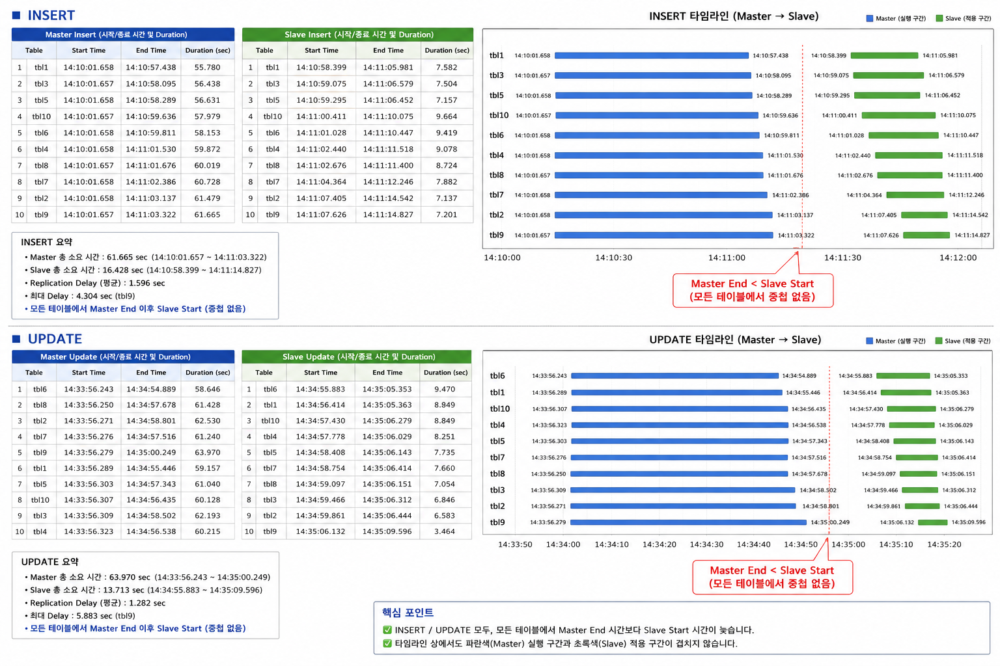

# Parallelization Profile

`develop` profile과 동일 환경에서 수행한 실험 결과.

## 빌드 버전

`CUBRID-11.5.0.2197-72099e6-Linux.x86_64`

## 환경 설정

```
double_write_buffer_size = 0
data_buffer_size         = 5G
log_buffer_size          = 5G
log_volume_size          = 1G
checkpoint_interval      = 30min
```

- 실험 전 `csql -u dba --sysadm`으로 접속해 `;checkpoint` 수행
- `addvoldb`로 기본 데이터 볼륨 100GB 추가
- `addvoldb`로 temp 볼륨 512MB 추가

## 워크로드별 결과

- [1.insert_csql/result.md](1.insert_csql/result.md) — INSERT CSQL 마스터/슬레이브 타이밍
- [2.update_csql/result.md](2.update_csql/result.md) — UPDATE CSQL 마스터/슬레이브 타이밍



## 요약

병렬성도 보이고 속도도 빨라진 것 같지만, **(develop 혹은 소수 워커 수행시간 대비) 워커 단일 수행시간은 늘어남**.
