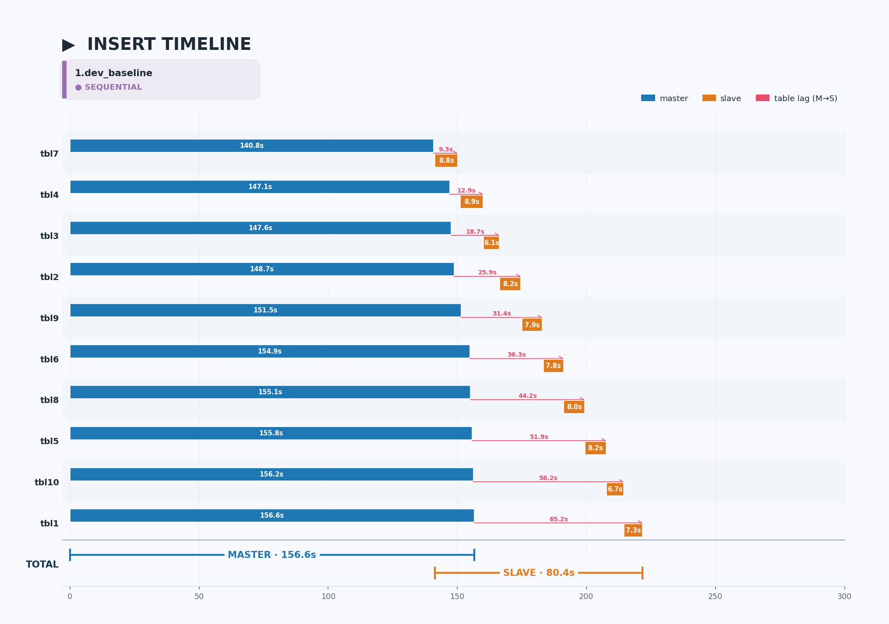
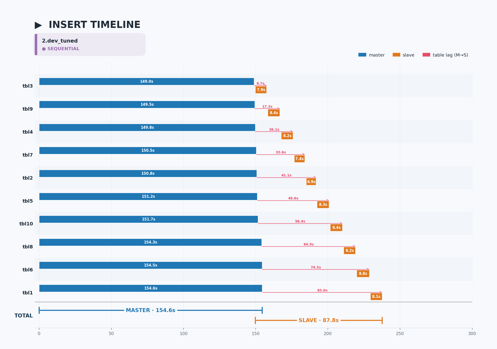
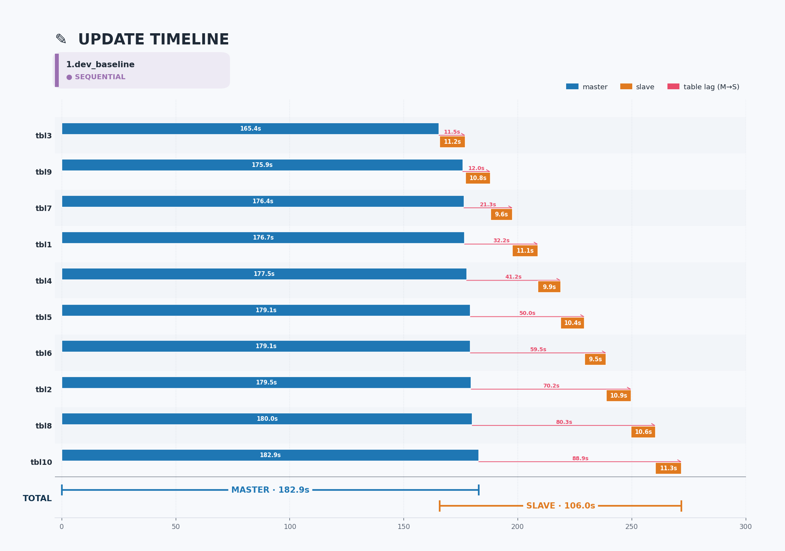
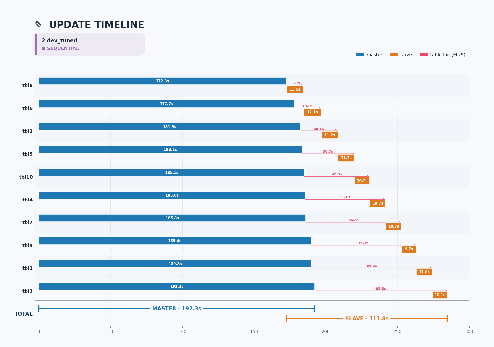

# Report 1 — Develop branch: Config Tuning 효과

## 한 줄 요약

develop branch의 sequential applier에서는 master DML config tuning이 slave 복제 시간에 거의 영향을 주지 않는다 (오히려 약간 느려짐).

## 비교 대상

| 실험 | Config |
|---|---|
| **1.dev_baseline** | default (addvoldb 100G 만) |
| **2.dev_tuned** | dwb=0, data_buffer=5G, log_buffer=5G, log_volume_size=1G, checkpoint_interval=30min, addvoldb temp |

> `2.dev_tuned` 의 config는 `6.poc_buf5g_dwb0` 와 **동일**합니다. 두 실험은 build branch (develop vs POC) 만 다르므로, 1번 vs 6번을 보면 같은 tuning을 적용했을 때 sequential applier vs parallel applier 의 효과 차이를 직접 비교할 수 있습니다.

## 시간 비교

> **지표 정의**
> - `Slave Elapsed`: 첫 slave apply → 마지막 slave apply 까지의 wall-clock
> - `Slave/worker` (평균): `Slave Sum / 10` (테이블당 평균 처리 시간, Slave Sum = 모든 테이블 slave 시간 합)
> - `eff.par`: `Slave Sum / Slave Elapsed` (평균 동시 활성 워커 수, 이론 최대 = 10)
>
> Sequential applier에서는 `Slave/worker`, `eff.par` 지표가 의미 없으므로 `-` 로 표기 (워커가 1개 = 작업이 순차 직렬화).

### Insert

| 실험 | 총 (Slave Elapsed) | 평균 (Slave/worker) | eff.par |
|---|---:|---:|---:|
| 1.dev_baseline | 80.4s | - | - |
| 2.dev_tuned | 87.8s | - | - |

### Update

| 실험 | 총 (Slave Elapsed) | 평균 (Slave/worker) | eff.par |
|---|---:|---:|---:|
| 1.dev_baseline | 106.0s | - | - |
| 2.dev_tuned | 111.8s | - | - |

## Timeline

### Insert
**1.dev_baseline** · *dwb=default · buffer=default · (no extra tuning)*

**2.dev_tuned** · *dwb=0 · buffer=5G · full tuning*

### Update
**1.dev_baseline** · *dwb=default · buffer=default · (no extra tuning)*

**2.dev_tuned** · *dwb=0 · buffer=5G · full tuning*

## 분석

- 두 실험 모두 **SEQUENTIAL** slave (한 번에 한 테이블씩 적용)
- Config tuning 적용 후 slave 총 시간이 **오히려 약간 증가** (Insert 80.4 → 87.8s, Update 106.0 → 111.8s)
- master DML 시간 변화도 작음 (156.6 → 154.6s Insert, 182.9 → 192.3s Update)

## 결론

**Sequential applier 환경에서 master config tuning은 복제 성능 개선에 무력하다.**
slave가 한 번에 한 테이블씩 처리하는 구조적 병목이 buffer 크기·dwb 같은 다른 효과를 모두 가린다. 진정한 개선은 slave applier의 병렬화에서 와야 함 → [Report 2](2.poc_config_impact.md) 참조.
