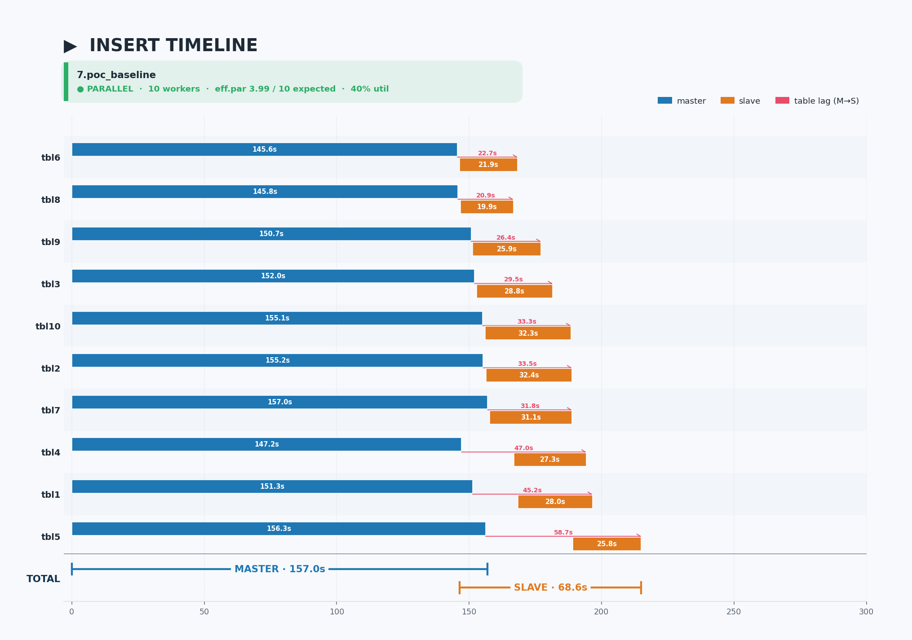
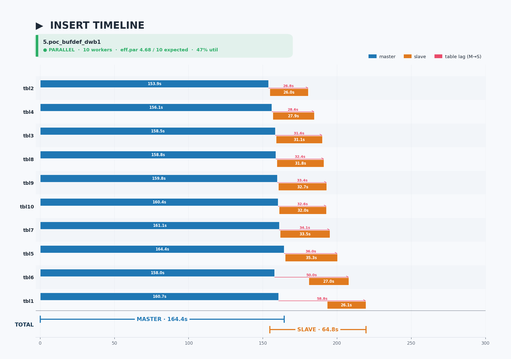
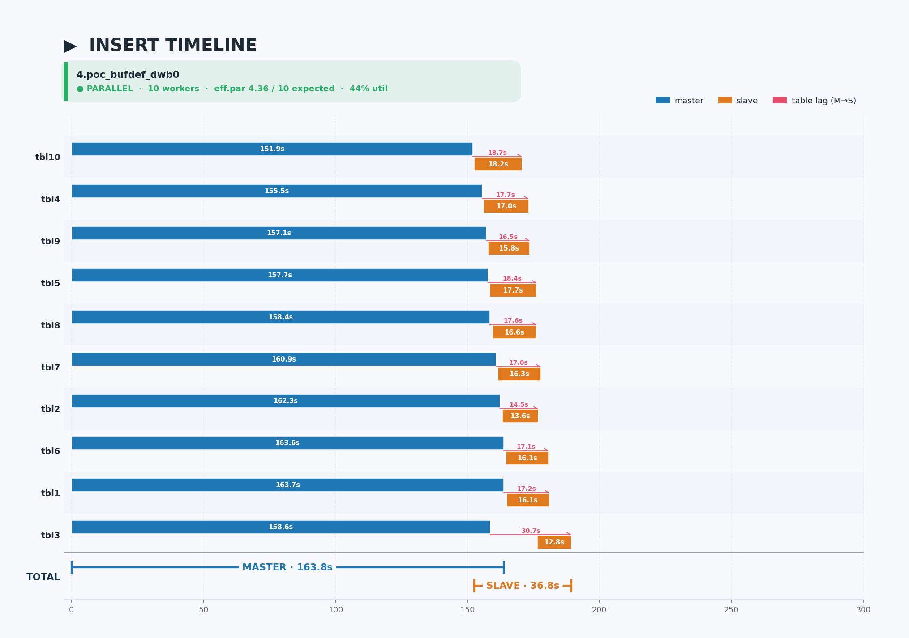
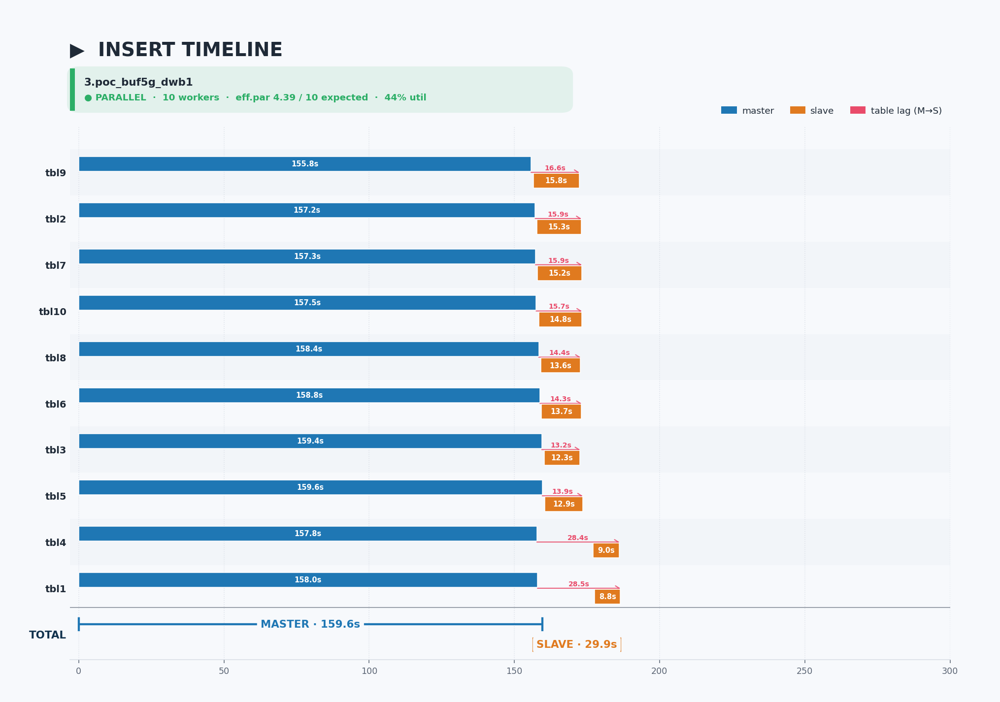
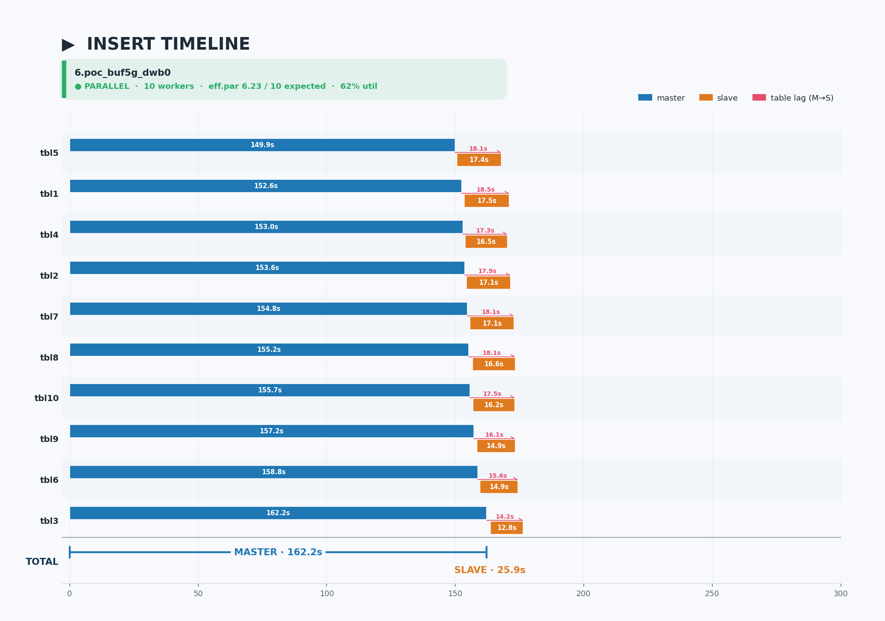
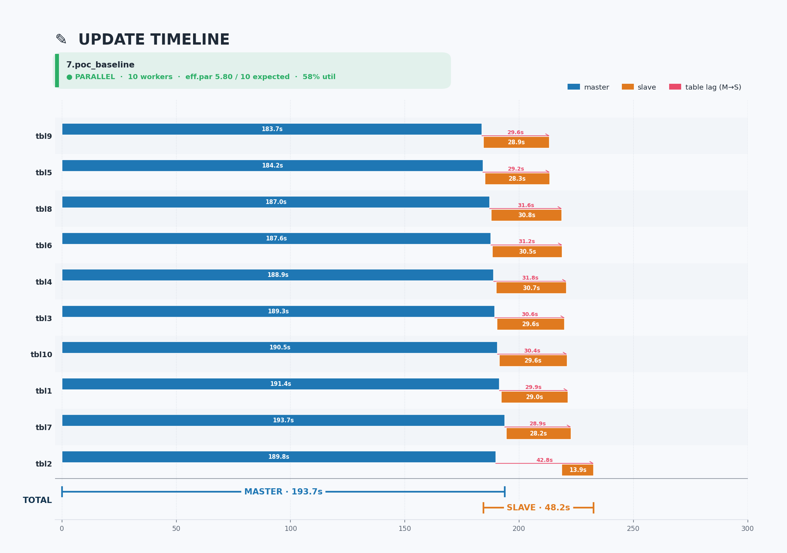
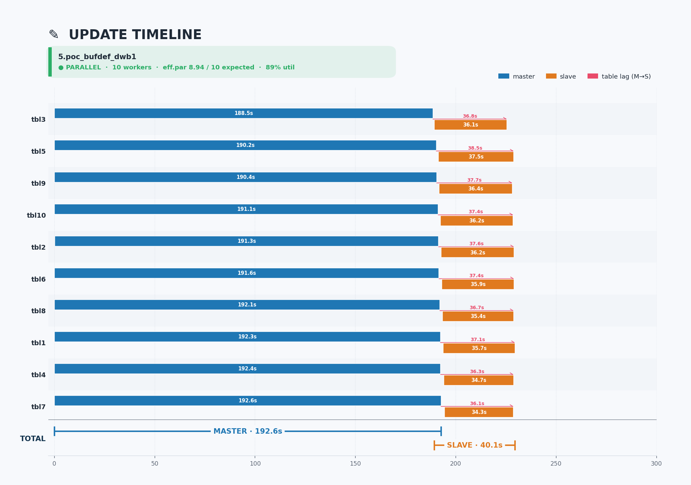
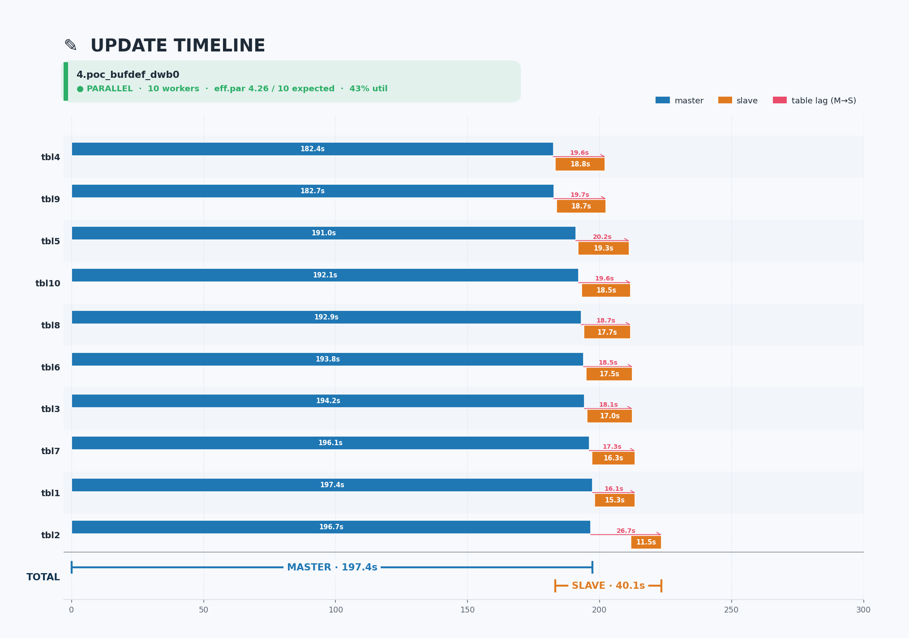
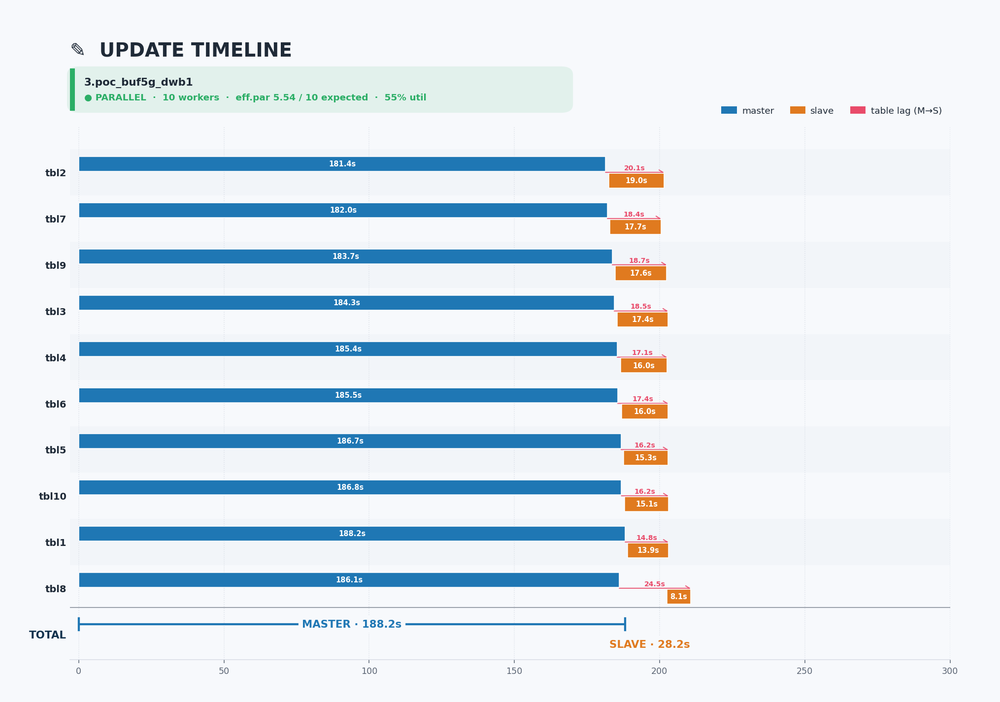
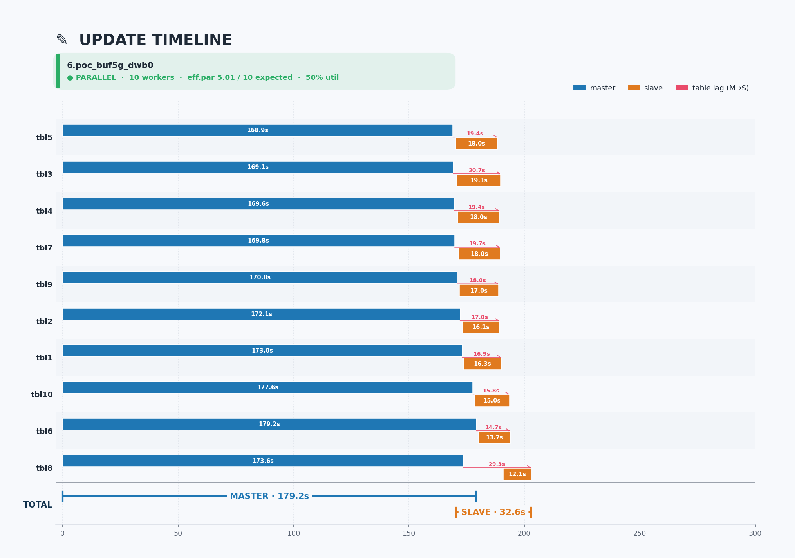

# Report 3 — POC: dwb / data_buffer 요인 분석

## 한 줄 요약

POC 환경에서 **data_buffer 5G가 압도적 효과** (워커당 30s → 13s, −57%), dwb=0은 small buffer에서만 큰 효과 (5G 환경에선 미미 또는 역효과). full tuning(`6.poc_buf5g_dwb0`)이 wall-clock 최단.

## 비교 대상

5개 실험을 변경 요인별로 분류해서 단독 효과/상호작용을 분리:

| 순서 | 실험 | dwb | data_buffer | 역할 |
|---|---|---|---|---|
| 1 | **7.poc_baseline** | default(=1) | default(512MB) | baseline (튜닝 0) |
| 2 | **5.poc_bufdef_dwb1** | 1 | default(512MB) | 보조 tuning¹ 추가 (dwb·buffer는 baseline과 동일) |
| 3 | **4.poc_bufdef_dwb0** | **0** | default(512MB) | dwb 단독 변경 효과 |
| 4 | **3.poc_buf5g_dwb1** | 1 | **5G** | buffer 단독 변경 효과 |
| 5 | **6.poc_buf5g_dwb0** | **0** | **5G** | full tuning (둘 다 변경, `2.dev_tuned`와 동일 config) |

¹ 보조 tuning = `log_buffer=5G`, `log_volume_size=1G`, `checkpoint_interval=30min`, `addvoldb temp`

## 시간 비교

> **지표 정의**
> - `Slave Elapsed`: 첫 slave apply → 마지막 slave apply 까지의 wall-clock
> - `Slave/worker` (평균): `Slave Sum / 10` (테이블당 평균 처리 시간, Slave Sum = 모든 테이블 slave 시간 합)
> - `eff.par`: `Slave Sum / Slave Elapsed` (평균 동시 활성 워커 수, 이론 최대 = 10)

### Insert

| 실험 | 총 (Slave Elapsed) | 평균 (Slave/worker) | eff.par |
|---|---:|---:|---:|
| 7.poc_baseline | 68.5s | 27.3s | 3.99 |
| 5.poc_bufdef_dwb1 | 64.8s | 30.3s | 4.68 |
| 4.poc_bufdef_dwb0 | 36.8s | 16.0s | 4.36 |
| 3.poc_buf5g_dwb1 | 29.9s | **13.1s** | 4.39 |
| 6.poc_buf5g_dwb0 (tuned) | **25.9s** | 16.1s | **6.23** |

### Update

| 실험 | 총 (Slave Elapsed) | 평균 (Slave/worker) | eff.par |
|---|---:|---:|---:|
| 7.poc_baseline | 48.2s | 28.0s | 5.80 |
| 5.poc_bufdef_dwb1 | 40.1s | 35.9s | 8.94 |
| 4.poc_bufdef_dwb0 | 40.1s | 17.1s | 4.26 |
| 3.poc_buf5g_dwb1 | **28.2s** | **15.6s** | 5.54 |
| 6.poc_buf5g_dwb0 (tuned) | 32.6s | 16.3s | 5.01 |

## Timeline

### Insert

**7.poc_baseline** · *dwb=default(POC=1) · buffer=default · (no extra tuning)*

**5.poc_bufdef_dwb1** · *dwb=1 · buffer=default(512MB) · 보조 tuning*

**4.poc_bufdef_dwb0** · *dwb=0 · buffer=default(512MB) · 보조 tuning*

**3.poc_buf5g_dwb1** · *dwb=1 · buffer=5G · 보조 tuning*

**6.poc_buf5g_dwb0 (tuned)** · *dwb=0 · buffer=5G · full tuning*


### Update

**7.poc_baseline** · *dwb=default(POC=1) · buffer=default · (no extra tuning)*

**5.poc_bufdef_dwb1** · *dwb=1 · buffer=default(512MB) · 보조 tuning*

**4.poc_bufdef_dwb0** · *dwb=0 · buffer=default(512MB) · 보조 tuning*

**3.poc_buf5g_dwb1** · *dwb=1 · buffer=5G · 보조 tuning*

**6.poc_buf5g_dwb0 (tuned)** · *dwb=0 · buffer=5G · full tuning*


## 단독 효과 분리 (Insert 기준)

5개 실험을 페어로 묶으면 각 요인의 단독 효과를 깨끗하게 측정 가능:

| 비교 페어 | 변경 요인 | 워커당 평균 변화 | Slave Elapsed 변화 | 해석 |
|---|---|---|---|---|
| `7.poc_baseline` → `5.poc_bufdef_dwb1` | 보조 tuning 추가 | 27.3 → 30.3s (+11%) | 68.5 → 64.8s (−5%) | 보조 tuning 자체는 효과 미미 |
| `5.poc_bufdef_dwb1` → `4.poc_bufdef_dwb0` | **dwb 1 → 0** (small buffer) | 30.3 → 16.0s (**−47%**) | 64.8 → 36.8s (**−43%**) | small buffer 환경에서 **dwb=0 효과 큼** |
| `5.poc_bufdef_dwb1` → `3.poc_buf5g_dwb1` | **buffer default → 5G** (dwb=1) | 30.3 → 13.1s (**−57%**) | 64.8 → 29.9s (**−54%**) | **5G buffer 효과 압도적** |
| `3.poc_buf5g_dwb1` → `6.poc_buf5g_dwb0` | dwb 1 → 0 (5G buffer) | 13.1 → 16.1s (**+23%**) | 29.9 → 25.9s (−13%) | 5G 환경에선 dwb=0 워커당 오히려 느려짐 (자원 경합), wall-clock은 단축 |
| `4.poc_bufdef_dwb0` → `6.poc_buf5g_dwb0` | buffer default → 5G (dwb=0) | 16.0 → 16.1s (~0%) | 36.8 → 25.9s (−30%) | 5G 효과가 dwb=0 환경에선 워커당이 아니라 동시성으로 발현 |

### 핵심 발견

1. **`data_buffer 5G`가 가장 강력한 단일 요인** — 단독 적용 시 워커당 −57%
2. **`dwb=0`의 효과는 buffer 크기에 의존**:
   - small buffer: 워커당 −47% (확실한 개선)
   - 5G buffer: 워커당 +23% (오히려 약간 느려짐) — but wall-clock은 단축
3. **두 요인의 상호작용**: 5G buffer를 적용하면 dwb 효과가 거의 사라짐 → buffer가 dominant bottleneck이었음을 시사

## 보충: eff.par 와 워커 속도의 trade-off

`3.poc_buf5g_dwb1 → 6.poc_buf5g_dwb0` 구간에서 헷갈리는 현상이 보임:

- 6번이 wall-clock은 빠른데 (29.9s → 25.9s) **워커당 처리는 오히려 느림** (13.1s → 16.1s)
- 각 테이블에 동일하게 10만 row를 insert하므로 작업량 자체는 같음. 그럼 왜 워커당 시간이 늘어났을까?

### 원인: 동시 실행 워커 수에 따른 자원 경합

| 실험 | eff.par (동시 활성 워커) | 워커당 wall-clock |
|---|---:|---:|
| 3.poc_buf5g_dwb1 | 4.39 (timeline 보면 8개 첫 배치 + 2개 후속 배치) | 13.1s |
| 6.poc_buf5g_dwb0 | 6.23 (10개 워커 모두 첫 배치에 풀팩) | 16.1s |

10개가 동시에 돌면 디스크 I/O 대역폭 / lock / CPU 코어를 더 많이 공유 → **개별 워커의 wall-clock이 길어짐**. 하지만 그래도 총 wall-clock은 짧음 → 병렬화의 throughput 승리.

### 수식으로 확인

```
3.poc_buf5g_dwb1 :  4.39 워커 × 13.1s = 29.9s elapsed   (경합 적음, 워커 빠름)
6.poc_buf5g_dwb0 :  6.23 워커 × 16.1s = 25.9s elapsed   (경합 큼, 워커 느림, 총시간 우세)
```

### dwb 설정과 스케줄링의 관계 (추정)

dwb=1일 때 스케줄러가 워커를 8개로 제한한 이유 추정:
- dwb=1: 모든 write가 double-write buffer flush 지점에서 직렬화 → 스케줄러가 동시 워커 수를 줄여서 flush 경합 회피
- dwb=0: 직렬화 병목 없음 → 10개 워커 모두 동시 launch 가능

→ **dwb=0의 진짜 효과는 "워커 속도"가 아니라 "스케줄러가 더 많은 워커를 동시에 띄울 수 있게 함"**. 정확한 검증은 CUBRID 슬레이브 applier 스케줄링 / dwb flush 코드 확인 필요.

### 시사점

- `eff.par`는 "속도"가 아니라 "동시성"을 측정. 워커가 느려도 동시성이 높으면 wall-clock 승리 가능.
- 워커당 평균 처리 시간이 빠른 것이 곧 좋은 config는 아님. **두 지표를 함께 봐야 함**:
  - 워커당 시간 ↓ + eff.par ↑ → 가장 좋음
  - 워커당 시간 ↑ + eff.par ↑ → trade-off, wall-clock 비교 필요
  - 워커당 시간 ↓ + eff.par ↓ → 가능 (#3 Update가 이 경우)

## 결론

- **`data_buffer = 5G` 가 핵심 개선 요인** — 단독 적용 시 워커당 −57%, Slave Elapsed −54%
- **`dwb = 0` 의 효과는 buffer 크기에 의존**:
  - small buffer + dwb=0 (`4.poc_bufdef_dwb0`): 워커당 −47% (의미 있는 개선)
  - 5G buffer + dwb=0 (`6.poc_buf5g_dwb0` tuned): 워커당 영향 없거나 약간 느려짐, but wall-clock 단축 (스케줄러가 더 많은 워커 launch)
- POC tuning 시 적용 우선순위:
  1. **`data_buffer_size = 5G`** (필수, 최대 효과)
  2. `double_write_buffer_size = 0` (보조, 5G 환경에선 marginal but 여전히 wall-clock 단축에 기여)
