# Final Test Report — v2 (Slave-only timelines)

이 리포트는 `report.md` 의 슬레이브 전용 버전입니다. 각 timeline 그림에서 master bar 를 제거하고 slave 동작만 표시 (t₀ = 첫 slave apply 시점). 병렬화/순차의 동작 패턴을 슬레이브 관점에서 집중해서 보고 싶을 때 사용. Master 와 함께 보는 full timeline 은 [`report.md`](report.md).

> **Note**: `2.dev_tuned` 와 `6.poc_buf5g_dwb0` 의 config는 **동일**합니다 (dwb=0, data_buffer=5G, log_buffer=5G, addvoldb temp 등). 두 실험의 차이는 오직 **build branch** (develop vs POC) 뿐이며, 따라서 같은 tuning 적용 시 sequential applier(develop) vs parallel applier(POC) 의 효과를 가장 깨끗하게 비교할 수 있는 페어입니다.

## Configs

### 1.dev_baseline
- addvoldb 100G

### 2.dev_tuned
- double_write_buffer_size=0
- data_buffer_size=5G
- log_buffer_size=5G
- log_volume_size=1G
- checkpoint_interval=30min
- csql>; checkpoint 수행
- addvoldb 100G
- addvoldb temp

### 3.poc_buf5g_dwb1
- double_write_buffer_size=1
- data_buffer_size=5G
- log_buffer_size=5G
- log_volume_size=1G
- checkpoint_interval=30min
- csql>; checkpoint 수행
- addvoldb 100G
- addvoldb temp

### 4.poc_bufdef_dwb0
- double_write_buffer_size=0
- data_buffer_size=512MB
- log_buffer_size=5G
- log_volume_size=1G
- checkpoint_interval=30min
- csql>; checkpoint 수행
- addvoldb 100G
- addvoldb temp

### 5.poc_bufdef_dwb1
- double_write_buffer_size=1
- data_buffer_size=512MB
- log_buffer_size=5G
- log_volume_size=1G
- checkpoint_interval=30min
- csql>; checkpoint 수행
- addvoldb 100G
- addvoldb temp

### 6.poc_buf5g_dwb0
- double_write_buffer_size=0
- data_buffer_size=5G
- log_buffer_size=5G
- log_volume_size=1G
- checkpoint_interval=30min
- csql>; checkpoint 수행
- addvoldb 100G
- addvoldb temp

### 7.poc_baseline
- addvoldb 100G

---

## Overall Summary

### Insert — 집계 지표

| # | 실험 | Master Elapsed (s) | Master Avg (s) | Slave Elapsed (s) | Slave Sum (s) | Slave/worker (s) | Eff. Parallelism | Slave Mode |
|---|---|---:|---:|---:|---:|---:|---:|---|
| 1 | dev_baseline | 156.56 | 151.43 | 80.43 | 77.82 | - | - | 순차 |
| 2 | dev_tuned | 154.60 | 151.60 | 87.80 | 80.50 | - | - | 순차 |
| 3 | poc_buf5g_dwb1 | 159.61 | 157.97 | 29.93 | 131.38 | 13.14 | 4.39 | 병렬 |
| 4 | poc_bufdef_dwb0 | 163.75 | 158.98 | 36.79 | 160.29 | 16.03 | 4.36 | 병렬 |
| 5 | poc_bufdef_dwb1 | 164.37 | 159.17 | 64.77 | 303.40 | 30.34 | 4.68 | 병렬 |
| 6 | poc_buf5g_dwb0 | 162.20 | 155.30 | 25.85 | 160.97 | 16.10 | 6.23 | 병렬 |
| 7 | poc_baseline | 157.00 | 151.63 | 68.55 | 273.32 | 27.33 | 3.99 | 병렬 |

### Update — 집계 지표

| # | 실험 | Master Elapsed (s) | Master Avg (s) | Slave Elapsed (s) | Slave Sum (s) | Slave/worker (s) | Eff. Parallelism | Slave Mode |
|---|---|---:|---:|---:|---:|---:|---:|---|
| 1 | dev_baseline | 182.91 | 177.25 | 106.03 | 105.33 | - | - | 순차 |
| 2 | dev_tuned | 192.27 | 184.31 | 111.84 | 108.48 | - | - | 순차 |
| 3 | poc_buf5g_dwb1 | 188.17 | 185.01 | 28.18 | 156.11 | 15.61 | 5.54 | 병렬 |
| 4 | poc_bufdef_dwb0 | 197.38 | 191.92 | 40.08 | 170.64 | 17.06 | 4.26 | 병렬 |
| 5 | poc_bufdef_dwb1 | 192.64 | 191.25 | 40.10 | 358.49 | 35.85 | 8.94 | 병렬 |
| 6 | poc_buf5g_dwb0 | 179.21 | 172.37 | 32.59 | 163.24 | 16.32 | 5.01 | 병렬 |
| 7 | poc_baseline | 193.74 | 188.61 | 48.20 | 279.51 | 27.95 | 5.80 | 병렬 |

> **지표 정의**
> - `Slave Elapsed`: 첫 slave apply → 마지막 slave apply 까지의 wall-clock
> - `Slave Sum`: 모든 테이블 slave 처리 시간의 합
> - `Slave/worker` (평균): `Slave Sum / 10` — 테이블당 평균 처리 시간
> - `Eff. Parallelism`: `Slave Sum / Slave Elapsed` — 평균 동시 활성 워커 수 (이론 최대 = 10)
> - Sequential applier(`develop` 그룹)는 워커가 1개이므로 `Slave/worker`·`Eff. Parallelism` 의미 없음 → `-` 표기

### 핵심 관찰

**1. Slave Applier 동작 모드 — develop vs POC**

- **develop (1, 2)**: `Eff. Parallelism ≈ 1` → **순차** 적용. 한 번에 한 테이블씩.
- **POC (3–7)**: `Eff. Parallelism = 4–9` → **병렬** 적용 (약 4~6 워커 동시 활성).
- 결과적으로 POC는 동일한 양의 작업을 slave에 **2–4배 빠르게** 반영.

**2. 워커별 처리 속도 (Slave/worker)에 영향을 미치는 요인**

POC 그룹 안에서도 워커당 처리 시간이 13s ~ 30s로 큰 편차가 있음. 주요 결정 요인:

| 요인 | 효과 | 근거 |
|---|---|---|
| `data_buffer_size` | **5G가 워커당 약 50% 빠름** | #3(5G/dwb1) 13.14s vs #5(512MB/dwb1) 30.34s · #6(5G/dwb0) 16.10s vs #4(512MB/dwb0) 16.03s (Insert) |
| `double_write_buffer_size` | **dwb=1이 워커당 처리 시간 증가**, 효과는 buffer 작을 때 증폭 | 5G: dwb 0→1 시 16→13s (영향 미미) · 512MB: dwb 0→1 시 16→30s (거의 2배) |
| `addvoldb temp` 부재 | **워커당 큰 폭 둔화** | #7(temp 없음) Insert 27.33s vs #4(temp 있음, 같은 default buffer) 16.03s → +70% · 임시 정렬/스풀이 data volume과 I/O 경합 추정 |
| 동시성 오버헤드 (병렬 모드) | **per-worker는 느려지지만 elapsed는 단축** | develop 순차 워커 7.8s → POC 병렬 워커 13–30s. 하지만 전체 elapsed는 80s → 26~69s로 단축 (trade-off) |

**3. `7.poc_baseline` 심층 분석**

- 병렬 applier는 정상 동작 (Eff. Parallelism = 4.0, Slave Sum/Elapsed 비율 적정)
- **그러나 워커당 27.33s (Insert) / 27.95s (Update)로 POC 그룹 중 가장 느린 축**
- 원인 추정:
  - `data_buffer_size=default(512MB)` → cache miss 증가
  - `addvoldb temp` 미적용 → 임시 영역 I/O가 data volume과 경합
  - POC 빌드의 기본 `dwb` 값이 1인 경우 write amplification까지 가산 (`5.poc_bufdef_dwb1`과 워커 속도 유사)
- → 병렬성은 확보되었으나 **각 워커의 단일 테이블 처리 속도 자체가 느림**.

**4. Master 처리 시간**

- develop (1, 2): Insert Master 154–157s, Update 183–192s
- POC (3–7): Insert Master 157–164s, Update 179–197s
- → **Master DML 시간은 build/config 간 큰 차이 없음** (±6%). 모든 성능 차이는 **slave applier 단계**에서 발생.

**5. 최고 / 최저 성능 실험**

| 지표 | 최단 | 최장 |
|---|---|---|
| Insert Slave Elapsed | `6.poc_buf5g_dwb0` (25.85s) | `2.dev_tuned` (87.80s) |
| Update Slave Elapsed | `3.poc_buf5g_dwb1` (28.18s) | `2.dev_tuned` (111.84s) |
| Slave/worker 최빠름 (POC) | `3.poc_buf5g_dwb1` Insert 13.14s | — |
| Slave/worker 최느림 (POC) | `5.poc_bufdef_dwb1` Insert 30.34s · Update 35.85s | — |

→ **`6.poc_buf5g_dwb0`**: Insert 총시간 최소  
→ **`3.poc_buf5g_dwb1`**: Update 총시간 최소 · 워커당 처리 최빠름  
→ 공통 조건: **`data_buffer_size=5G`** + **`addvoldb temp` 적용**

---

## Results

### 1.dev_baseline

**Config:** default (addvoldb 100G만)

#### Insert
*config: dwb=default · buffer=default · (no extra tuning)*
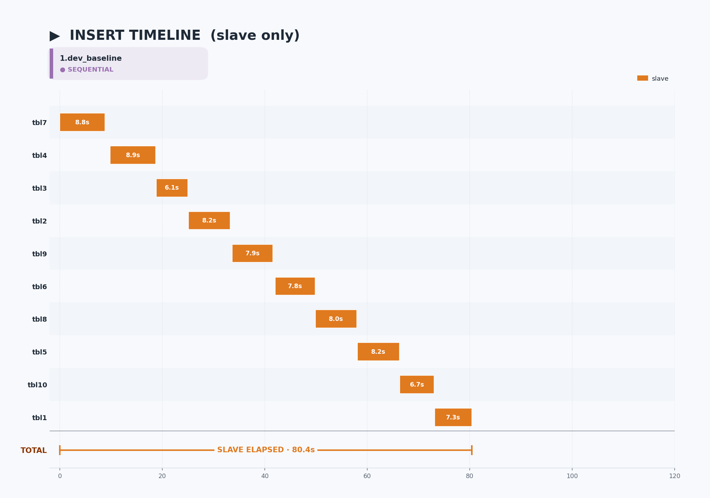

#### Update
*config: dwb=default · buffer=default · (no extra tuning)*
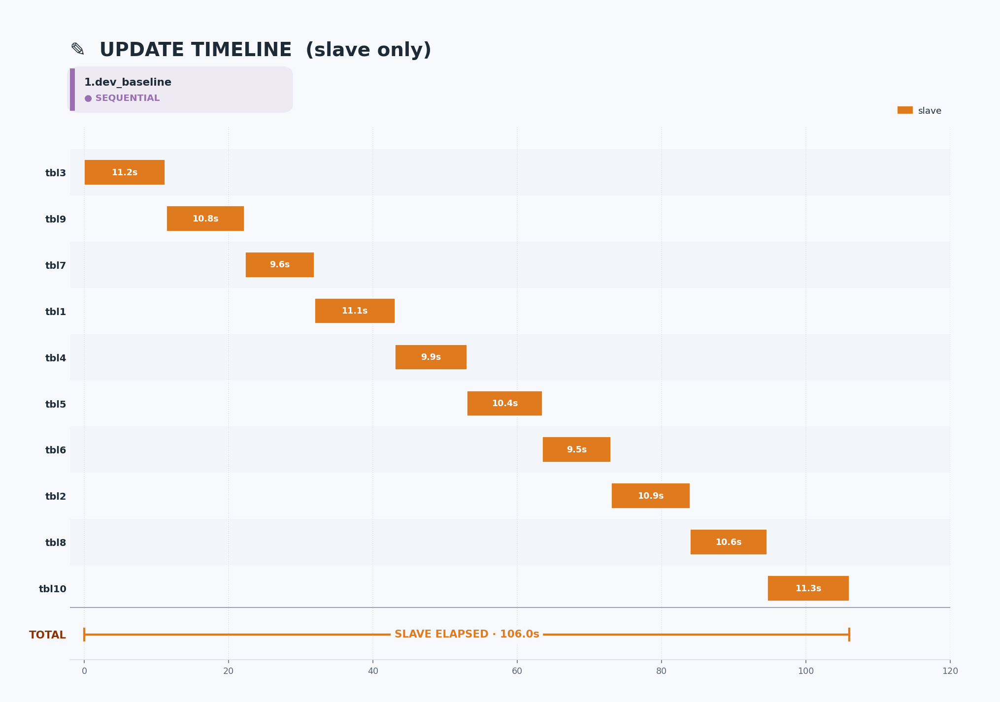

> Raw data: [`1.dev_baseline/1.dev_baseline.md`](1.dev_baseline/1.dev_baseline.md)

---

### 2.dev_tuned

**Config:** dwb=0, data_buffer=5G

#### Insert
*config: dwb=0 · buffer=5G · full tuning*
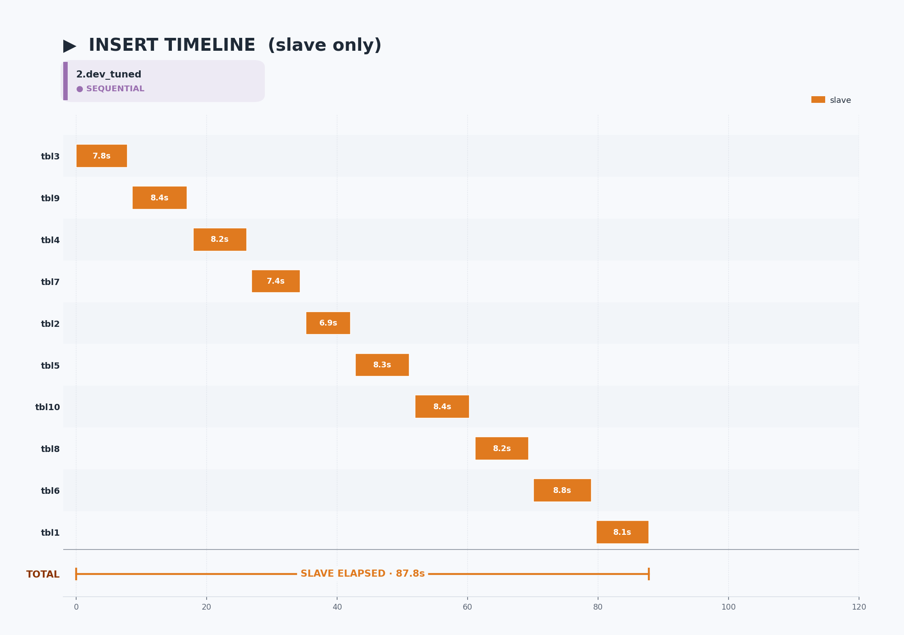

#### Update
*config: dwb=0 · buffer=5G · full tuning*
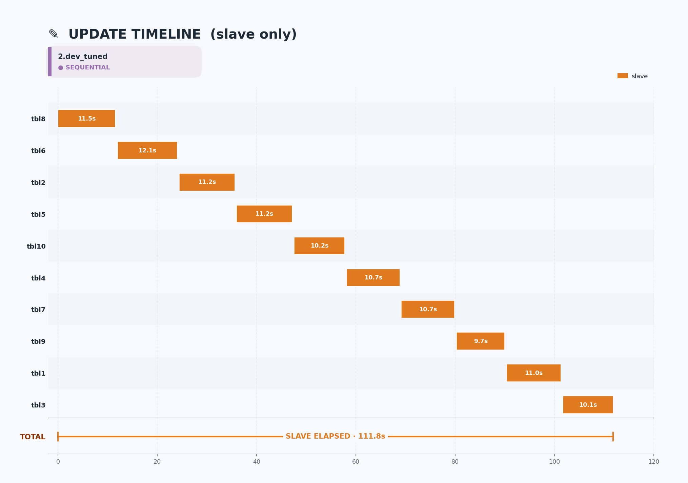

> Raw data: [`2.dev_tuned/2.dev_tuned.md`](2.dev_tuned/2.dev_tuned.md)

---

### 3.poc_buf5g_dwb1

**Config:** dwb=1, data_buffer=5G

#### Insert
*config: dwb=1 · buffer=5G · full tuning*
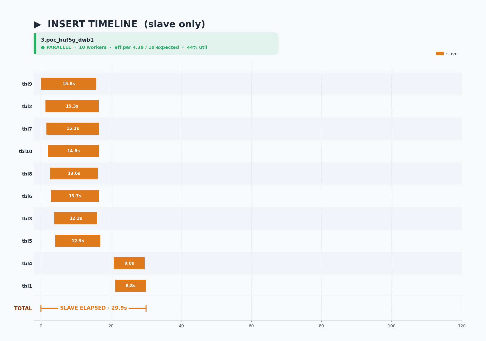

#### Update
*config: dwb=1 · buffer=5G · full tuning*
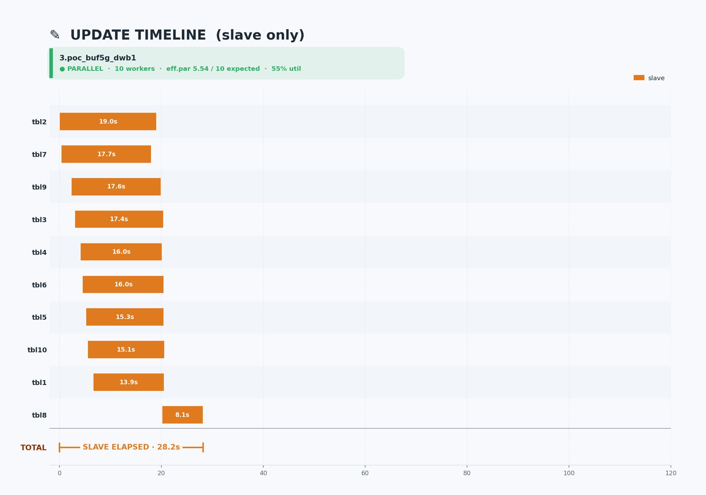

> Raw data: [`3.poc_buf5g_dwb1/3.poc_buf5g_dwb1.md`](3.poc_buf5g_dwb1/3.poc_buf5g_dwb1.md)

---

### 4.poc_bufdef_dwb0

**Config:** dwb=0, data_buffer=default(512MB)

#### Insert
*config: dwb=0 · buffer=default(512MB) · full tuning*
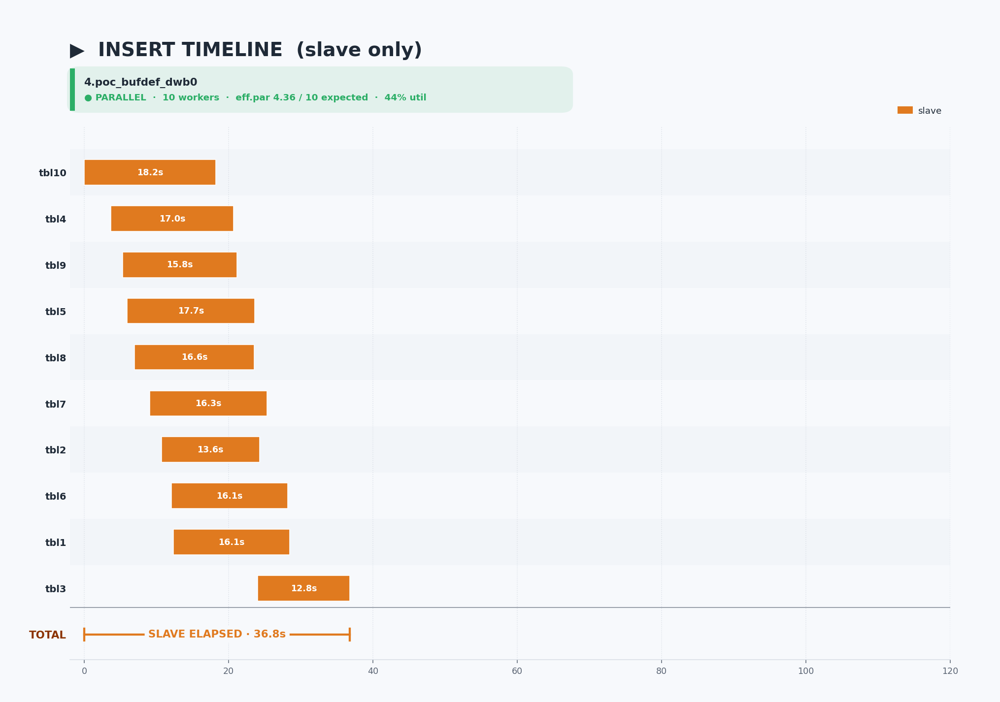

#### Update
*config: dwb=0 · buffer=default(512MB) · full tuning*
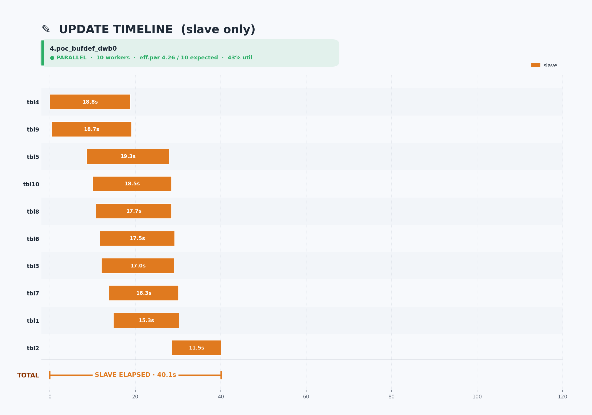

> Raw data: [`4.poc_bufdef_dwb0/4.poc_bufdef_dwb0.md`](4.poc_bufdef_dwb0/4.poc_bufdef_dwb0.md)

---

### 5.poc_bufdef_dwb1

**Config:** dwb=1, data_buffer=default(512MB)

#### Insert
*config: dwb=1 · buffer=default(512MB) · full tuning*
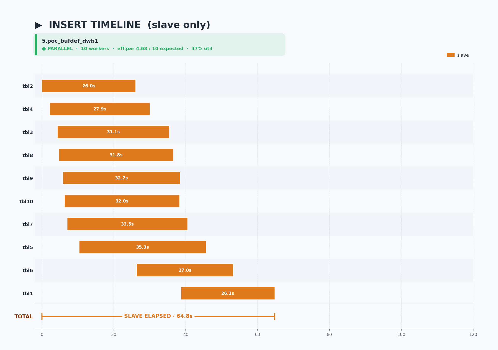

#### Update
*config: dwb=1 · buffer=default(512MB) · full tuning*
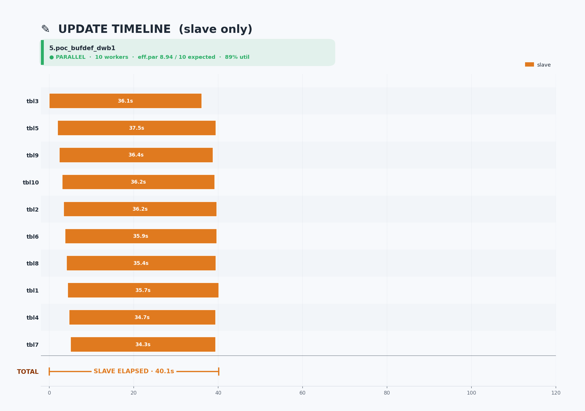

> Raw data: [`5.poc_bufdef_dwb1/5.poc_bufdef_dwb1.md`](5.poc_bufdef_dwb1/5.poc_bufdef_dwb1.md)

---

### 6.poc_buf5g_dwb0

**Config:** dwb=0, data_buffer=5G

#### Insert
*config: dwb=0 · buffer=5G · full tuning*
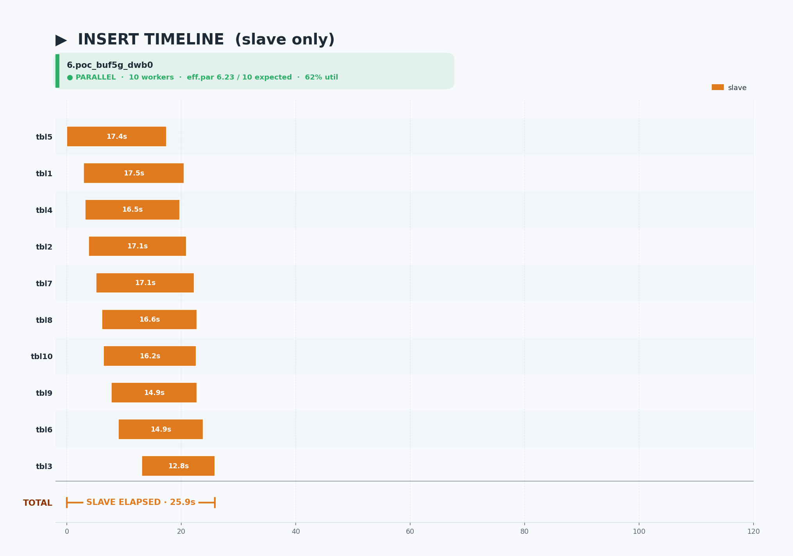

#### Update
*config: dwb=0 · buffer=5G · full tuning*
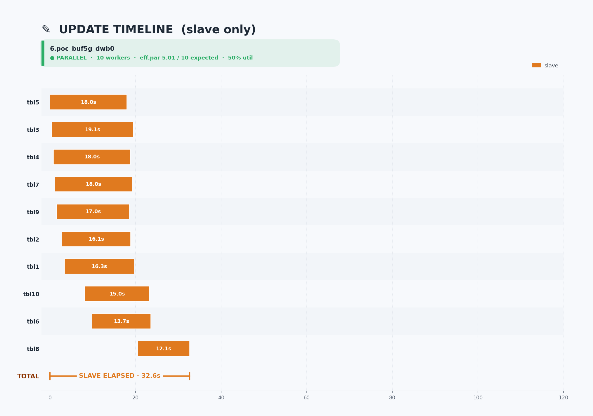

> Raw data: [`6.poc_buf5g_dwb0/6.poc_buf5g_dwb0.md`](6.poc_buf5g_dwb0/6.poc_buf5g_dwb0.md)

---

### 7.poc_baseline

**Config:** default (addvoldb 100G만)

#### Insert
*config: dwb=default(POC=1) · buffer=default · (no extra tuning)*
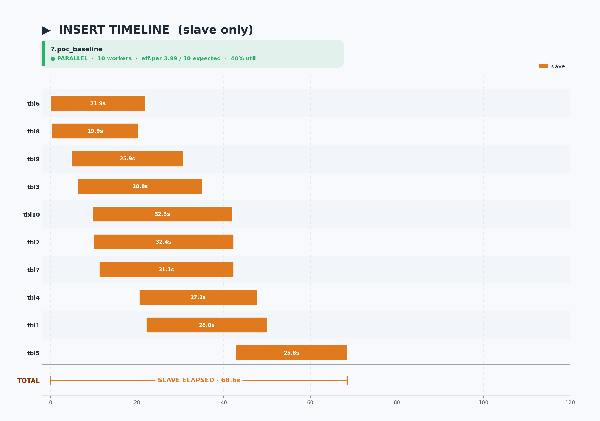

#### Update
*config: dwb=default(POC=1) · buffer=default · (no extra tuning)*
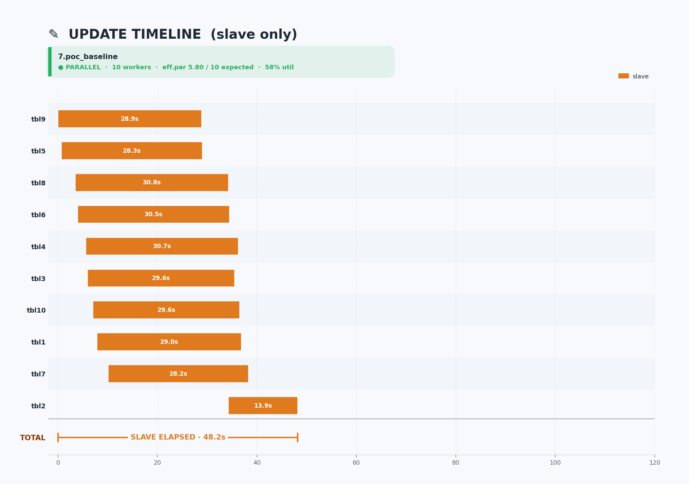

> Raw data: [`7.poc_baseline/7.poc_baseline.md`](7.poc_baseline/7.poc_baseline.md)