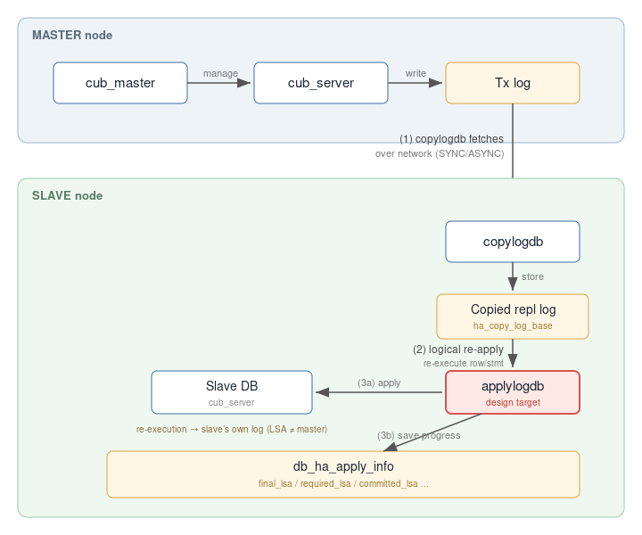
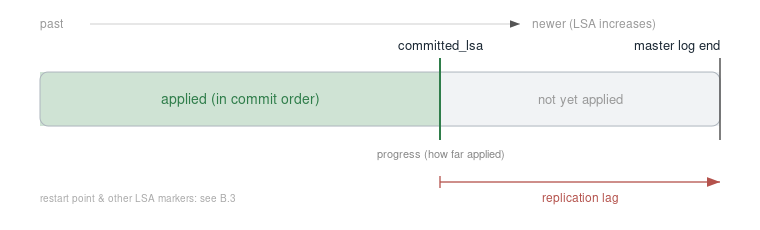
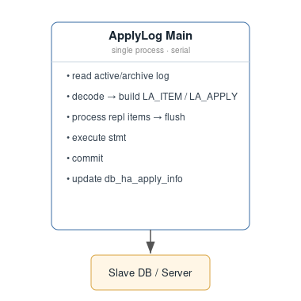
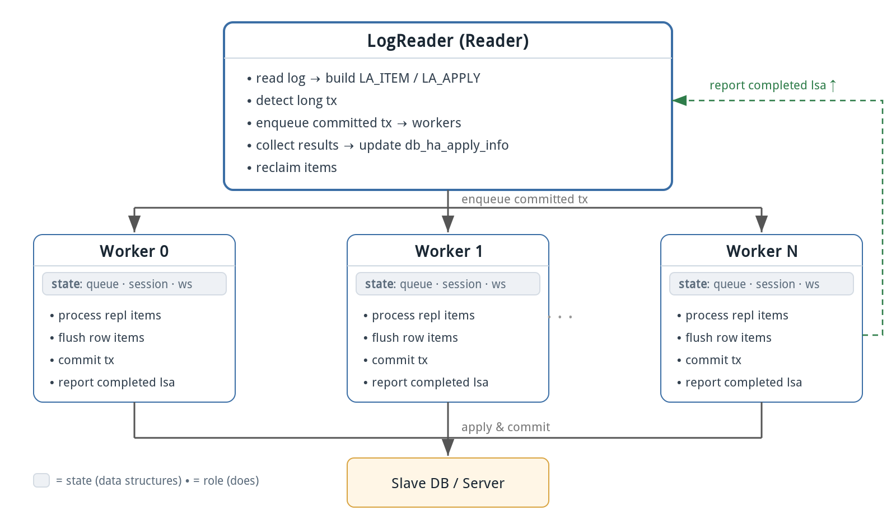
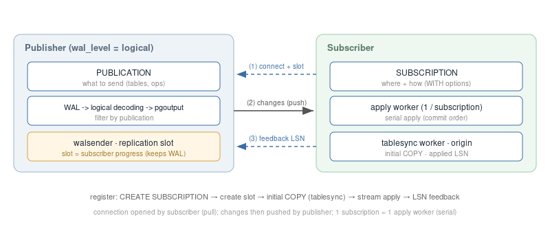
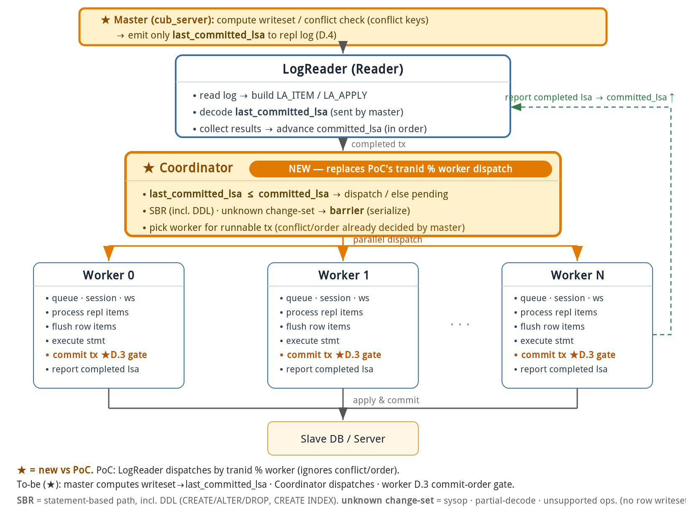

# 병렬 applylogdb 코디네이터 설계 보고서

이 문서는 parallel `applylogdb` PoC 이후 실제 구현으로 넘어가기 위한 병렬화 컨셉을 정리한 **설계 보고서**다. 상세 자료구조나 API가 아니라, 어떤 책임을 새 모듈로 분리할지와 트랜잭션 간 충돌·순서를 어떻게 다룰지에 초점을 둔다. 발표·학습 자료로 함께 쓰며, 흐름은 *CUBRID 현재 복제 → 로지컬 복제와 병렬화의 관계 → PoC로 본 가능성 → 다른 DBMS는 어떻게 하는가 → 그래서 우리 코디네이터 설계 → 마스터가 의존성을 정하는 방식(1차 COMMIT_ORDER·확장 WRITESET) → 정확성 시나리오 → 재시작 문제* 순이다. 벤더별 더 깊은 근거는 같은 폴더의 조사 문서(`reference/{base,mysql,pgsql}/`, `coordinator_design_mapping_from_vendors.md`, `cubrid_special_table_scenarios.md`)에 있고, 외부 출처 링크는 문서 끝 **참고문헌**에 모았다.

> **한눈 요약.** CUBRID의 applylogdb는 로지컬(행 재실행) 복제이고, 로지컬이기 때문에 병렬 적용이 의미가 있다. PoC는 트랜잭션을 `tranid % worker`로 단순 분배해 병렬화의 *가능성*(반영 시간 약 3.4배 단축)을 보였지만, 트랜잭션 간 의존성은 일부러 다루지 않았다. 정식 병렬화를 위해 MySQL·PostgreSQL·EDB PGD를 조사한 결과, "병렬 실행과 commit 순서 보존을 분리하고, 마스터가 준 의존성으로 coordinator가 분배"하는 **MySQL 모델**이 CUBRID 구조와 가장 잘 맞았다. 그 의존성을 정하는 방식은 둘인데(MySQL의 COMMIT_ORDER↔WRITESET), **1차 설계는 더 단순하고 FK가 자동으로 안전해지는 COMMIT_ORDER**를 택한다 — 마스터가 트랜잭션마다 `commit_seq`와 `dependency_seq`를 내려보내고, 슬레이브 코디네이터는 `dependency_seq <= slave_committed_seq` 조건으로 분배한다(병렬도는 마스터 동시성만큼). 행 단위로 더 넓게 병렬화하는 WRITESET(`(class,PK)` 충돌)은 같은 `commit_seq`/`dependency_seq` 인터페이스 위에서 마스터 계산만 갈아끼우는 **향후 확장**으로 둔다. 그리고 병렬 실행과 별개로 디스크 확정(durable) commit은 마스터 순서로 강제해야 하며(외부 일관성·빈틈 없는 복구), 그래야 재시작 시 정합성 문제도 막힌다.

---

# Act A. CUBRID 복제 현황과 로지컬 복제

## A.1 현재 CUBRID HA 복제는 어떻게 도는가



CUBRID HA 노드는 마스터 프로세스(`cub_master`), 데이터베이스 서버(`cub_server`), 그리고 복제를 담당하는 두 프로세스 **`copylogdb`** 와 **`applylogdb`** 로 구성된다 [C1]. 복제는 두 단계로 이루어진다. 먼저 슬레이브의 `copylogdb`가 마스터 서버에 트랜잭션 로그를 요청해 받아 로컬에 복사해 둔다(저장 위치는 `ha_copy_log_base`, 동기 방식은 `ha_copy_sync_mode`의 SYNC/ASYNC로 설정). 그다음 `applylogdb`가 그 복사된 로그를 읽어 슬레이브 DB에 실제로 반영하고, 어디까지 반영했는지를 내부 카탈로그 `db_ha_apply_info`에 기록한다 [C1].

복사와 반영을 굳이 다른 프로세스로 나눈 이유는, 반영이 느려지더라도 로그를 받아두는 일은 계속할 수 있게 하여 반영 지연이 마스터의 트랜잭션 진행에 영향을 주지 않도록 하기 위함이다 [C1]. 이 문서가 손대려는 부분은 이 가운데 **applylogdb의 반영(apply) 단계**다.



복제가 "어디까지 따라왔는지"는 결국 로그 상의 위치(LSA)로 표현된다. 위 그림처럼 복제 로그를 LSA 순서(왼쪽=과거 → 오른쪽=최신)로 늘어놓으면, `applylogdb`가 **마스터와 같은 순서로 반영을 끝낸 지점**이 진도이고(이를 `committed_lsa`라 부른다), 그 지점과 **마스터 로그의 끝** 사이의 간격이 곧 **복제 지연(lag)** 이다. 병렬화로 줄이려는 것이 바로 이 간격이다. 재시작 기준점·읽기 커서·수신 위치처럼 더 세분된 LSA 표지들은 진도 관리와 재시작을 논할 때 다시 필요하므로 B.4에서 정리한다.

용어를 미리 맞춰 두면, 복제 로그(repl log)는 마스터가 "무엇이 바뀌었는지"를 남긴 기록이고, **LSA**(Log Sequence Address)는 그 로그 안의 위치를 가리키는 번호표다. 정확히는 **로그 페이지 id(`pageid`)와 페이지 내 오프셋(`offset`)** 으로 이루어진다(`log_lsa.hpp`: pageid 48bit + offset 16bit) — 즉 "몇 번 로그 페이지의 몇 바이트 지점"이라는 뜻이지 파일 번호가 아니다. "어디까지 처리했는지"를 이 LSA로 표현하며, 역할로는 MySQL의 binlog position(파일명+오프셋)·PostgreSQL의 LSN(WAL 바이트 위치)에 대응한다(좌표의 granularity는 서로 다르다). CUBRID에서 **class**는 테이블을 가리키는 말이라, 이후 예시의 `TblA`는 곧 class A다. 그리고 이 문서가 새로 도입하려는 **코디네이터**는 워커 앞단에서 "이 트랜잭션을 지금 보내도 되는가(충돌·순서)"를 판단해 분배하는 계층이다. 마지막으로 **committed_lsa**는 "어디까지 순서대로 반영을 끝냈는가"를 가리키는 진도이고, **순서 정리**는 병렬로 끝난 결과를 commit 순서대로 줄 세워 이 진도를 전진시키는 단계를 말한다.

## A.2 applylogdb는 로지컬(행 재실행) 복제다

**어떻게 도는가 (개념).** applylogdb의 워커는 슬레이브에 **DB 클라이언트로 접속해 마스터의 변경을 행/문장 단위로 다시 실행**한다. 물리 페이지를 바이트째 복사하는 것도, SQL 문장을 그대로 재실행하는 것도 아닌 **중간 형태**다 — 마스터가 만든 *변경된 행 이미지*를 서버 내부 경로(locator)로 직접 반영한다. 재실행 방식이라 **슬레이브는 자기 로그를 새로 생성**하고, 그래서 **슬레이브의 LSA와 마스터의 LSA는 별개 값**이 된다.

이 적용 경로에서 **설계를 좌우하는 성질**이 셋 있다.

- **PK 기반 복제** — 복제 로그 항목은 `class + PK + operation`만 담는다. 그래서 복제 대상 테이블엔 PK가 필수이고, 충돌 판단 키로 `(class, PK)`를 항상 쓸 수 있다.
- **FK 검사는 applier가 아니라 슬레이브 서버가 한다** — applier는 변경을 모아 서버에 넘길 뿐이고, FK는 서버의 force 경로 안에서 검사된다. 따라서 **자식을 부모보다 먼저 적용하면 서버 FK 검사에 걸려 복제가 멈춘다**(이 점이 뒤 설계의 핵심이다).
- **변경은 모았다가 한꺼번에 flush** — 워커별 리스트에 쌓아 두고 일괄 반영한다.

그리고 **실패 처리**는 — 마스터에서 트랜잭션이 abort되면 그 트랜잭션의 복제 항목을 비우고, apply 에러는 재시도하다 그래도 안 되면 `fail_counter`를 올린다.

**코드 근거** (`feature/parallel_applylogdb_poc` 기준, [C2])

| 동작 / 성질 | 함수 · 위치 |
|---|---|
| 행/문장 재실행 (로지컬) | `la_apply_insert/update/delete/statement_log` (`log_applier.c:897-902`), 워커 세션 `:1720~` |
| 변경 수집 → 일괄 flush | `la_repl_add_object`(`:7589`) → `locator_repl_flush_all`(`:7470`) |
| PK 기반 (로그 = class+PK+op) | `la_make_repl_item:5708~`, 마스터 측 `repl_log_insert`(PK 인덱스에서만) |
| FK = 슬레이브 서버가 검사 | `xlocator_repl_force` → `locator_insert_force(…, dont_check_fk=false)` → `locator_check_foreign_key` (`locator_sr.c:7029,5198`) |
| 실패 처리 | abort: `LOG_ABORT → la_free_repl_items_by_tranid` / 재시도: `la_retry_on_error`+`LA_SLEEP`(`:8841-8849`) / `fail_counter`(`:7703`) |

## A.3 물리 복제 vs 로지컬 복제

복제 방식은 크게 둘로 나뉜다. **물리 복제**는 로그(WAL이나 페이지 변경)를 그대로 복사해 재생하고, **논리 복제**는 변경을 행 단위로 다시 실행한다. 흔히 물리가 "레코드당 비용이 싸서 빠르다"고 하지만, 항상 그런 것은 아니다. 물리 재생은 보통 단일 스레드로 동작해(예: PostgreSQL의 startup process) 멀티코어로 바쁜 마스터를 못 따라가 지연이 쌓일 수 있고, 클러스터를 통째로·같은 버전끼리·읽기 전용으로만 복제할 수 있어 경직되어 있다. 반면 논리 복제는 레코드당 비용(파싱·인덱스·제약 처리)이 더 들지만, 일부 테이블만 선택해 복제하거나 버전이 다른 서버·이기종으로 복제하고, 복제본에서도 쓰기를 허용하는 등 유연하다 [B1][B4].

## A.4 왜 논리복제만 병렬화를 지원하는가

여기서 말하는 "지원"은 **복제 적용 단계에서 여러 워커가 독립 작업을 나눠 처리하는 기능**을 뜻한다. 물리 복제도 내부 구현에 따라 일부 I/O나 복구 처리를 병렬화할 수는 있지만, 복제 스트림 자체는 LSN 순서의 페이지 변경을 그대로 재생하는 성격이 강하다. 한 페이지에 대한 변경 순서, 체크포인트·redo 규칙, 스토리지 내부 불변식을 깨지 않아야 하므로, 적용자가 임의로 트랜잭션을 떼어 여러 워커에 나누기 어렵다(PostgreSQL도 parallel recovery는 아직 제안 단계다 [P-rec]).

반면 논리복제는 적용 단위가 트랜잭션·행·문장처럼 **데이터베이스 의미를 가진 단위**다. 그래서 "이 트랜잭션이 앞선 트랜잭션과 같은 행을 건드리는가", "commit 순서를 어디까지 보존해야 하는가" 같은 의존성을 메타데이터로 표현하고, 독립인 작업만 여러 워커에 dispatch할 수 있다. MySQL의 멀티스레드 복제는 `last_committed`/writeset으로 이 의존성을 전달하고, PostgreSQL의 parallel apply와 EDB PGD의 Parallel Apply도 논리 변경 스트림 위에서 동작한다.

따라서 병렬 적용 기능이 논리복제 계열에 집중되는 이유는 "논리복제만 이론적으로 병렬화가 가능해서"가 아니라, **논리복제는 병렬화에 필요한 독립성 판단 단위를 노출하기 때문**이다. CUBRID의 `applylogdb`도 로그를 읽어 행/문장 단위 변경을 재실행하는 논리복제 성격이 있으므로, 같은 방식으로 트랜잭션 의존성을 계산하고 병렬 적용을 설계할 수 있다 — 이것이 이 프로젝트의 출발점이다(상세는 `reference/base/physical_vs_logical_replication.md`).

---

# Act B. PoC 설계·구현과 결과

## B.1 병렬화의 필요성

먼저 왜 병렬화가 필요한지부터 짚자. 마스터는 여러 클라이언트가 멀티코어로 동시에 쓰지만, 슬레이브의 applylogdb 반영은 사실상 직렬이라 마스터를 못 따라가 **복제 지연(lag)** 이 쌓인다. lag이 커지면 두 가지가 곤란하다 — 마스터 장애로 슬레이브가 승격될 때 뒤처진 만큼 **데이터가 유실되고(failover RPO)**, 슬레이브를 읽기용으로 쓰면 **오래된 데이터**를 보게 된다. 그래서 슬레이브도 멀티코어를 활용해 병렬로 따라잡아야 한다 — 그것이 이 작업의 목적이다.

## B.2 PoC의 모듈 구조와 develop 대비 변경점

PoC는 develop의 **단일 처리 구조(AS-IS)** 를 **LogReader + 워커 풀(TO-BE)** 로 바꾼다(구조도는 `2.design/poc_design.md`).

**develop (AS-IS) — 단일 프로세스가 읽기·적용·commit·진도 갱신을 직렬로 수행**



**PoC (TO-BE) — LogReader가 읽기·분배·순서 정리를, 워커 풀이 병렬 적용을 분담**



PoC의 구조는 별도 설계 문서 `2.design/poc_design.md`에 **LogReader와 ApplyWorker** 두 모듈로 정의되어 있다. LogReader는 active/archive 로그에서 복제 로그를 읽어 `LA_ITEM`을 만들고 트랜잭션 단위로 `LA_APPLY`를 구성하다가, commit 로그를 만나면 그 트랜잭션을 확정해 워커 큐에 넣는다. 그리고 워커들의 완료 결과를 수집해 **commit LSA 순서대로** 전역 완료를 판정하고 `committed_lsa`와 `db_ha_apply_info`를 갱신하며 다 쓴 항목을 정리한다. ApplyWorker는 설정된 개수만큼 생성되어 각자 작업 큐·워커 로컬 workspace·슬레이브 서버 세션을 갖고, 받은 트랜잭션을 적용·flush·commit한 뒤 완료 LSA를 LogReader에 보고한다. 즉 이 PoC 구조에서 우리가 말하는 "코디네이터"와 "순서 정리"는 새로운 모듈이 아니라 **LogReader가 이미 맡고 있는 책임**이다 — 코디네이터는 LogReader가 워커 큐에 넣는 그 enqueue 판단(현재 `tranid % worker`)을 충돌·순서 판단으로 바꾸는 것이고, 순서 정리는 LogReader의 결과 수집·committed_lsa 갱신 부분이다.

develop(오리지널)과 PoC를 비교하면, PoC는 `log_applier.c`에 약 3,900줄을 더했는데 대부분이 워커·dispatch·retire 구조와 측정 계측이다. **핵심 정합성 메커니즘(LSA 관리, 재시작 멱등 skip, FK 검사, 복제 로그 형식)은 develop과 동일**하다 — develop은 단일 직렬 함수 `la_apply_commit_list`로 적용하던 것을 PoC가 워커 경로로 옮겼을 뿐 판정 조건은 같다 [C2]. 설계 문서(poc_design.md)와 실제 코드 사이에는 몇 가지 차이가 있다. 설계는 "insert 연산만"(§29)을 대상으로 했지만 코드는 **INSERT와 UPDATE를 모두** 지원하며(`la_is_supported_poc_item`; DELETE는 함수만 있고 실제로는 미지원), 설계에 없던 측정 계측(`la_Debug_진도`)과 병목 측정용 제약(일부 워커만 flush하는 `LA_APPLY_WORKER_REPL_ACTIVE_COUNT`, apply_info 갱신을 건너뛰는 `LA_SKIP_READER_COMMIT_APPLY_INFO`)이 들어가 있다. 이 측정용 제약들은 정식 구현에서는 제거 대상이다. 반대로 설계가 명시적으로 PoC 범위에서 제외한 것도 있는데, 바로 §32·34의 **"트랜잭션 간 의존성 판별, 병렬 스케줄링, 정교한 오류 복구"** 다. 즉 현재 PoC가 의존성을 안 보고 `tranid % worker`로만 분배하는 것은 설계대로이며, **우리 코디네이터는 PoC가 의도적으로 비워 둔 바로 그 자리를 채우는 다음 단계**다.

## B.3 PoC 결과 — 병렬화의 가능성

같은 설정(buffer 5G, dwb=0)에서 순차 적용과 병렬 적용을 비교했을 때, 병렬화로 슬레이브 전체 반영 시간이 약 3.4배 단축되고 복제 지연(lag)이 4~6배 줄었다. 다만 워커 하나가 단일 테이블을 처리하는 시간 자체는 1.5~2배 늘었는데(insert 기준 8.05초 → 16.10초), 이는 병목이 네트워크가 아니라 **슬레이브에서 실제로 변경을 적용하는 on-CPU 로직**(로그 생성의 prior_lsa, lock, page/space 할당)에 있기 때문이다. 이는 insert/update 콜체인 분석으로 확인했다(상세는 `final_report.md`). 요컨대 **병렬화의 효과 자체는 분명하다**는 것이 PoC의 결론이다. 다만 PoC는 의존성을 보지 않고 단순 분배만 하므로, 자연히 다음 질문이 따라온다 — *제대로 된(충돌·순서를 지키는) 병렬화는 어떻게 해야 하는가?*

## B.4 진도 관리에 쓰이는 LSA들

이 질문에 답하기 전에, applylogdb가 진도를 추적하는 데 쓰는 LSA들을 정리해 두면 뒤의 순서 정리·재시작 논의가 쉬워진다 [C2]. 마스터 로그의 끝을 가리키는 `append_lsa`·`eof_lsa`는 복제 지연 계산에 쓰인다(`append_lsa − committed_lsa`가 대략 lag이다). applier의 진행을 나타내는 핵심 값은 넷이다. `final_lsa`는 마지막으로 읽어 처리한 위치(읽기 커서)이고, `required_lsa`는 "아직 끝나지 않은 가장 오래된 트랜잭션의 시작" 즉 **재시작 시 다시 읽기 시작할 지점(low-water mark)** 으로 `la_find_required_lsa`가 진행 중 트랜잭션들의 최저 start_lsa로 계산한다(`:4078`). `committed_lsa`는 마지막으로 반영을 끝낸 commit 로그의 위치이고 `committed_rep_lsa`는 마지막으로 반영한 데이터 변경 로그의 위치인데, 둘 다 순서 정리(retire) 단계에서 갱신된다(`:2082`). 이 값들은 `db_ha_apply_info` 카탈로그에 영속되어 재시작 시 `la_get_last_ha_applied_info`로 로드되며, 정상 상태의 진도선은 `required_lsa ≤ committed_lsa ≤ final_lsa ≤ append_lsa`다.

## B.5 현재 PoC의 병렬화 방식과 한계

현재 PoC는 commit 레코드를 만나면 `worker_idx = tranid % LA_APPLY_WORKER_COUNT`로 워커를 고른다. 구현이 단순하다는 장점이 있지만 두 가지 문제가 있다. 하나는 서로 관련 있는(같은 데이터를 건드리는) 트랜잭션이 우연히 다른 워커에 배정되어 동시에 실행될 수 있다는 점이고 — 이러면 복제 결과가 원본의 실행 순서와 달라질 수 있어 가장 큰 문제다 — 다른 하나는 서로 독립인 트랜잭션이 같은 워커에 쏠려 병렬 효과를 못 내는 경우다. 결국 단순한 워커 선택기로는 부족하고, 트랜잭션 간 **충돌과 순서를 먼저 판단하는 코디네이터**가 필요하다(Act D).

---

# Act C. 다른 DBMS는 병렬화를 어떻게 하는가

정식 병렬화를 설계하기 위해 논리 복제의 병렬 적용을 제공하는 세 DBMS를 조사했다. 결론부터 말하면 PostgreSQL과 EDB PGD는 우리 상황에 직접 모델로는 맞지 않아 탈락했고, MySQL이 가장 가까웠다. 벤더↔CUBRID 매핑은 `coordinator_design_mapping_from_vendors.md`에, 벤더별 상세는 `reference/{mysql,pgsql}/`에 있다.

## C.1 PostgreSQL — 탈락

PostgreSQL 논리 복제는 **publish/subscribe(발행/구독)** 모델이다. publisher는 "어떤 테이블의 어떤 변경을 내보낼지"를 `PUBLICATION`으로 정의하고, subscriber는 "그것을 어디서 어떻게 받아 적용할지"를 `SUBSCRIPTION`으로 정의한다(둘은 객체이고, publisher/subscriber는 노드의 역할이다). publisher가 WAL을 logical decoding(`pgoutput`)해 변경 스트림을 만들면, subscriber가 연 연결 위로 그 스트림이 흘러 apply worker가 로컬에 적용한다 [P1].



> *PostgreSQL 공식 문서(§29.9 Architecture, §29.2 Subscription [P1])의 서술을 도식화한 것이다 — 공식 문서는 텍스트 전용이라 원본 그림은 없다. 각 요소(walsender·logical decoding·pgoutput·replication slot·tablesync·apply worker·origin)와 "초기 스냅샷 COPY → 연속 스트리밍 → 동일 순서 적용"은 모두 해당 문서 서술과 일치한다.*

그림의 각 컴포넌트는 다음과 같다 [P1].

| 컴포넌트 | 노드 | 설명 |
|---|---|---|
| **PUBLICATION** | publisher | "어떤 테이블의 어떤 연산을 보낼지" 정의한 **명세 객체**(설정 시 생성). 보낼 때 pgoutput이 이 기준으로 필터한다 |
| **WAL → logical decoding → pgoutput** | publisher | 트랜잭션 로그(WAL)를 logical decoding으로 해석하고, 기본 출력 플러그인 **pgoutput**이 PUBLICATION 기준으로 변경을 논리 스트림으로 변환·필터한다 |
| **walsender · replication slot** | publisher | **walsender**는 그 스트림을 subscriber로 전송하는 프로세스. **slot**은 "이 구독이 어디까지 받았나"를 보존해 아직 안 받은 WAL이 지워지지 않게 한다 |
| **SUBSCRIPTION** | subscriber | "어느 publisher의 어떤 publication을, 어떻게(WITH 옵션) 받을지" 정의한 **명세 객체**(설정 시 생성) |
| **apply worker** | subscriber | 받은 변경 스트림을 로컬에 적용하는 워커. **구독당 1개**, publisher의 **commit 순서대로 직렬** 적용 |
| **tablesync worker · origin** | subscriber | **tablesync**는 구독 시작 시 기존 데이터를 COPY로 초기 동기화하는(테이블별·일시적) 워커. **origin**은 어디까지 적용했는지(LSN)를 기록해 재시작 시 이어 적용한다 |

그림의 화살표 **①②③가 실제 동작 순서**다(좌→우 배치는 위치일 뿐, PUBLICATION·SUBSCRIPTION은 설정 시 만드는 정의라 이 순서에 들지 않는다) [P1].

- **① connect + slot** — `CREATE SUBSCRIPTION` 시 subscriber가 publisher에 접속해 **replication slot을 생성**한다(이어 tablesync worker가 기존 데이터를 초기 COPY).
- **② changes** — publisher가 변경을 **push**한다: WAL → logical decoding → pgoutput(PUBLICATION 필터) → walsender.
- **③ feedback** — apply worker가 적용 후 **적용 LSN을 feedback**으로 보내(origin 기록) publisher의 slot을 전진시킨다.

여기서는 **복제·병렬에 직접 닿는 핵심 옵션만** 명시한다(전체 옵션 카탈로그·기본값·등록 lifecycle은 `reference/pgsql/logical_replication_pubsub_and_options.md`).

| 옵션 | 위치 | 기본값 | 개념 |
|---|---|---|---|
| `FOR TABLE` / `FOR ALL TABLES` + `WITH (publish=…)` | PUBLICATION | publish=4연산 전부 | 무엇을(어떤 테이블·DML) 보낼지 |
| `copy_data` | SUBSCRIPTION | `true` | 시작 시 기존 데이터를 초기 COPY할지 |
| `streaming` | SUBSCRIPTION | `parallel` | 진행 중 대형 tx 처리 — **병렬과 직결**(`off`/`on`/`parallel`) |

> 그 외 `connect`·`create_slot`·`slot_name`·`binary`·`synchronous_commit`·`two_phase`·`origin`·`disable_on_error`(SUBSCRIPTION)와 `FOR TABLES IN SCHEMA`·행 필터·열 목록·`publish_via_partition_root`·`publish_generated_columns`(PUBLICATION)는 접속·슬롯·내구성·필터 등 세부라 여기선 생략한다 — 전체는 reference.

위 WITH 옵션이 "구독 단위"라면, 논리 복제 자체를 켜고 병렬도를 정하는 건 **서버 구성(GUC)** 이다(한쪽 노드에만 적용). *GUC(Grand Unified Configuration)는 PostgreSQL이 서버 설정 파라미터를 부르는 용어다 — `postgresql.conf`/`ALTER SYSTEM`으로 바꾸는 그 설정값들로, CUBRID의 시스템 파라미터(`cubrid.conf`)에 해당한다.* 우선 publisher는 **`wal_level`** 이 핵심인데, 값에 따라 가능한 복제가 갈린다.

| `wal_level` | 가능한 것 |
|---|---|
| `minimal` | crash recovery만. 스트리밍 복제·logical decoding **불가** |
| `replica`(기본) | 아카이빙 + **물리** 스트리밍 복제 + standby 읽기. logical decoding **불가** |
| `logical` | `replica`의 모든 것 + **logical decoding(논리 복제)** 가능 |

→ 논리 복제는 publisher가 **`wal_level=logical`** 이어야 성립한다. 다만 **병렬도 자체는 `wal_level`이 아니라** subscriber의 GUC가 정한다.

subscriber 쪽 GUC는 다음과 같다(기본값은 reference §8).

| subscriber GUC | 의미 |
|---|---|
| `max_logical_replication_workers` | 논리 복제 워커 풀. **leader apply·tablesync·parallel apply 워커가 전부 여기서 나옴** → 작으면 복제가 막히거나 직렬로 떨어짐(가장 영향 큼) |
| `max_worker_processes` | 배경 프로세스 총량(위 풀의 상위). 최소 `max_logical_replication_workers + 1`(확장·병렬쿼리도 이 풀 사용) |
| `max_active_replication_origins` | 추적 가능한 replication origin 수. 구독 수 + 테이블 동기화 여유 이상 |
| `max_sync_workers_per_subscription` | **초기 데이터 COPY(tablesync) 병렬도** |
| `max_parallel_apply_workers_per_subscription` | `streaming=parallel`일 때 **진행 중 대형 tx 병렬 적용 워커 수** |
| `wal_receiver_timeout` | 수신 측 비활성 연결 종료 시간 |
| `wal_receiver_status_interval` | 진도 보고(feedback) 최소 주기 |
| `wal_retrieve_retry_interval` | WAL 재수집 재시도 간격 |
| (구독 옵션) `synchronous_commit` | apply 워커 commit 내구성/지연. 기본 `off`라 apply가 빠름(처리량 레버) |

**publisher가 `logical`이 아니면 `CREATE SUBSCRIPTION`은 에러난다.** subscriber가 publisher에 logical 슬롯을 만드는 단계에서 publisher의 `walsender`가 `wal_level < logical`을 검사해 `ERROR: logical decoding requires "wal_level" >= "logical"`로 막기 때문이다(코드: `logical.c:120`·`walsender.c:1262`, reference §8 [5]). 이 검사 대상은 **publisher의 wal_level**이라, subscriber의 병렬 설정(`streaming=parallel`·워커 GUC)과는 무관하다 — 즉 같은 이유로 직렬로 설정해도 똑같이 실패한다.

**그래서 publisher가 `minimal`/`replica`면 subscriber 설정으로는 못 고친다.** 유일한 해법은 **publisher의 `wal_level=logical`로 올리고 재시작**하는 것이다(슬롯·decoding의 전제라 subscriber의 어떤 GUC도 우회 불가). `WITH (connect=false)`로 구독을 만들면 그 순간 에러만 미룰 뿐, 이후 슬롯 생성·enable에서 결국 같은 검사에 걸린다. (subscriber 자신의 `wal_level`은 *수신*과 무관하므로 `replica`여도 되고, 그 노드가 *재발행*까지 하는 캐스케이딩일 때만 `logical`이 필요하다.)

여기서 우리 관심은 **병렬성**인데, PostgreSQL의 병렬은 **"독립 트랜잭션 자동 병렬"이 아니다.** 전제: **한 구독(subscription) 안에서는 트랜잭션을 publisher commit 순서대로 직렬 적용**하고, 트랜잭션 일관성도 *그 구독 범위 안에서만* 보장된다 [P1]. MySQL처럼 트랜잭션 간 의존성을 계산해 독립 트랜잭션을 병렬 분배하지는 않는다. 병렬이 나오는 곳은 셋뿐이다.

- **① 초기 동기화(tablesync)** — 구독을 만들거나 새 테이블이 추가될 때, 기존 데이터를 `COPY`로 슬레이브에 채우는 **1회성 단계**다. 이때 테이블마다 별도의 **tablesync worker**가 붙어 여러 테이블을 동시에 복사한다(`max_sync_workers_per_subscription`, 기본 2). 복사가 끝나면 그 테이블은 정상 스트리밍 적용으로 핸드오프된다. 즉 **초기 적재의 병렬**이지, 운영 중 변경 스트림을 병렬 적용하는 게 아니다 [P1][P2].
- **② 대형 트랜잭션 streaming** — 보통은 트랜잭션이 commit돼야 변경을 보내지만, `streaming=parallel`이면 **commit 전 진행 중인 큰 트랜잭션을 조각내어 미리** 보낸다. 받는 쪽에서 **leader apply worker**가 그 조각을 **parallel apply worker**에게 넘겨 적용하고, commit 시점에 leader가 그 워커의 완료를 기다려 순서를 맞춘다(PostgreSQL 16에서 비기본 도입, 18부터 기본). 그러나 이는 어디까지나 **하나의 큰 트랜잭션을 쪼개 빨리 적용**하는 것이지, 서로 다른 트랜잭션을 의존성 기준으로 병렬화하는 게 아니다 [P3][P4][P5].
- **③ 다중 구독(subscription splitting)** — 한 subscriber 노드에 `SUBSCRIPTION`을 여러 개 만들면 **구독마다 leader apply worker가 1개씩** 붙어 구독끼리 동시에 적용된다. 운영자가 테이블을 구독 A·B·C로 나눠 두면 그만큼 워커가 병렬로 돈다 — PG에서 "여러 트랜잭션을 동시에 처리"에 가장 가까운 현실적 수단이다. 단 의존성/순서 판단을 시스템이 해 주는 게 아니라 **운영자가 테이블을 어느 구독에 둘지로 수동 분배**하는 것이고, 구독 간 발행 객체(테이블)가 겹치면 이중 적용되므로 안 된다. 무엇보다 아래 ③의 함정이 따른다 [P6].

→ 셋 다 "독립 트랜잭션 자동 병렬 + 전역 순서 보존"은 아니므로, 우리 목표엔 **직접 모델로 부적합**하다.

**③의 함정 — 의존 테이블은 같은 구독에.** 트랜잭션 일관성이 *한 구독 안에서만* 보장되므로, 구독을 쪼개면 구독끼리는 독립적으로 진행해 **cross-subscription 순서·원자성이 깨진다**(한 트랜잭션이 두 구독의 테이블을 함께 바꾸면 한쪽만 적용된 중간 상태가 보일 수 있다). 특히 FK로 엮인 테이블을 다른 구독에 두면 위험한데, 공식 문서도 "TRUNCATE 대상이 같은 구독에 없는 테이블과 FK로 엮이면 적용이 실패한다"고 명시한다 [P6]. → **FK·함께 변경되는 테이블은 같은 구독에 묶어 직렬화**하고, 구독 분할은 서로 독립인 테이블 그룹 사이에만 한다(cross-subscription 깨짐 재현은 `reference/pgsql/repro_cross_subscription_atomicity.md`). 이 "병렬 단위를 잘못 자르면 무엇이 깨지나"는 우리 코디네이터가 class/트랜잭션 경계를 자를 때의 반면교사다.

(Publisher/Subscriber 역할·구독 등록 과정·`CREATE PUBLICATION/SUBSCRIPTION` 옵션별 동작은 `reference/pgsql/logical_replication_pubsub_and_options.md`에 정리했다.)

## C.2 EDB PGD — 탈락(단, 한 측면은 선례)

EDB PGD(구 BDR)는 상용 멀티마스터 제품으로, 구독당 여러 writer를 두는 Parallel Apply를 제공한다(`bdr.writers_per_subscription` 기본 2, 최대 8) [E1]. 각 writer는 자기 트랜잭션의 최종 commit이 origin의 commit 순서를 위반하지 않도록 보장하고, 같은 행(tuple)을 쓰려는 선행 트랜잭션이 있으면 그것이 commit될 때까지 대기시켜 순서를 예방한다. 그리고도 순서가 어긋나면 에러를 내고 롤백하는 backstop을 둔다 — 즉 순수한 낙관적 방식이 아니라 "선행 tuple 대기로 예방 + 위반 시 롤백" 혼합이다 [E1][E2]. PGD를 전체 모델로 채택하지 않은 이유는 세 가지다. 토폴로지가 멀티마스터라(노드 간 충돌 해소·합의가 필요하다) 단방향 master-slave인 CUBRID HA에는 과하고 맞지 않으며, 상용 폐쇄 제품이라 내부를 청사진으로 삼기 어렵고, 구조 자체는 뒤에 볼 MySQL이 CUBRID와 더 잘 맞는다 [E3]. 다만 "의존성·충돌 판단을 apply 측에서 한다"는 한 가지 측면만은 CUBRID(코디네이터가 슬레이브 측에서 판단)와 닮아 선례로 참고할 만하다(상세는 `reference/pgsql/edb_pgd_parallel_apply.md`).

## C.3 MySQL — 가장 유사하여 채택

MySQL은 CUBRID 병렬 applylogdb 설계와 가장 잘 맞는 선례다. 이유는 단순하다. **의존성 판단은 source가 미리 계산해 로그에 싣고, replica coordinator는 그 값을 보고 워커에 분배하며, 최종 commit 순서는 별도 게이트로 보존한다.** 이 세 축이 CUBRID의 D.5(마스터 의존성 계산)·D.6(코디네이터 분배)·D.4/G.2(commit 순서 보존·재시작 정합)과 1:1로 대응한다.

### C.3.1 전체 구조 — binlog, relay log, coordinator

MySQL 복제는 source가 변경을 binary log에 기록하고, replica의 I/O 스레드가 이를 **relay log**로 받아 둔 뒤, 병렬 적용 시 **coordinator 스레드가 relay log를 순서대로 읽어 워커 스레드에 배정**하는 구조다 [M1]. relay log는 수신과 적용을 분리하는 replica 로컬 버퍼다. 별도 복제 전용 논리 포맷이 아니라 source binary log와 같은 이벤트 포맷을 쓰며, `mysqlbinlog`로 읽을 수 있다. 차이는 relay log 앞머리에 붙는 replica-local format description, source 위치를 가리키는 rotate, source format description 같은 bookkeeping 이벤트이고, 이후 실제 데이터 이벤트는 source binary log와 같은 `Log_event` 포맷으로 기록된다 [M12].

구조를 그림으로 보면 다음과 같다(조사 문서 `reference/mysql/01.replication_overview.md`에서 가져옴).

```text
SOURCE (원본)
    트랜잭션 커밋
        │  변경을 binary log에 기록
        ▼
    binary log  ◄─❶ 의존성 계산: WRITESET
        │            8.0: binlog_transaction_dependency_tracking으로 모드 선택
        │            8.4+: 변수 제거, 서버 내부 WRITESET 동작
        │            → last_committed·sequence_number 를 이벤트에 기록 (= "병렬 가능 여부")
        │  dump thread 가 binlog 이벤트를 전송
        ▼
  ┄┄┄┄ 네트워크 (서버 경계) ┄┄┄┄
        │
        ▼
REPLICA (복제본)
    ① I/O (receiver) thread          ← binlog 이벤트 수신
        │  relay log 에 기록
        ▼
    relay log                        ← 수신 버퍼 (받기와 적용을 분리)
        │  읽어서 적용
        ▼
    ② SQL thread (단일)
       또는  coordinator → worker × N  ◄─❷ 병렬 분배: LOGICAL_CLOCK
                                            (8.4: replica_parallel_type=LOGICAL_CLOCK 기본,
                                             9.5+: replica_parallel_type 제거)
                                            (worker 수 = replica_parallel_workers)
        │  트랜잭션 적용
        ▼  ◄─❸ 커밋 순서 강제: replica_preserve_commit_order (SPCO)
        │       병렬 적용해도 commit은 source 순서대로
        ▼
    replica 데이터

  ❶ source가 "병렬 가능 여부" 결정 │ ❷ replica가 병렬 실행 │ ❸ replica가 commit 순서 보존
```

그림의 흐름 **❶(의존성 계산) → ❷(병렬 분배) → ❸(commit 순서 보존)** 이 핵심이고, 이는 우리 설계와 1:1로 대응한다 — **❶ = D.5(마스터 의존성 계산), ❷ = D.6(코디네이터 분배), ❸ = D.4(commit 순서 보존, 재시작은 G.2).** 아래에서 셋을 차례로 본다.

### C.3.2 의존성 토큰 — `sequence_number`와 `last_committed`

source는 트랜잭션마다 `sequence_number`(binlog 안의 논리 순번)와 `last_committed`(이 트랜잭션이 기다려야 하는 가장 최근 선행 트랜잭션 = dependency watermark)를 binlog에 적는다 [M2][M4].

여기서 두 값은 모두 **트랜잭션 단위** 값이다. `sequence_number`는 개별 row 변경이나 SQL 문장 번호가 아니라, binlog 파일 안에서 트랜잭션마다 1, 2, 3... 증가하는 논리 순번이다. 한 트랜잭션 안에 여러 row event가 있어도 `sequence_number`는 하나만 붙는다. 반면 `last_committed`는 그 트랜잭션이 기다려야 하는 **마지막 선행 충돌 트랜잭션의 `sequence_number`**다. 즉 `sequence_number`가 더 크다고 해서 앞의 모든 트랜잭션을 기다리는 것이 아니라, 실제 대기 범위는 `last_committed`가 정한다 [M2][M13].

AWS Database Blog의 `mysqlbinlog` 단순 예시는 이 관계를 잘 보여 준다 [M13].

```text
Tx(seq=2346): last_committed=2345
Tx(seq=2347): last_committed=2346
Tx(seq=2348): last_committed=2346
Tx(seq=2349): last_committed=2346
Tx(seq=2350): last_committed=2348
Tx(seq=2351): last_committed=2345
```

이 예시에서 `Tx(seq=2347)`, `Tx(seq=2348)`, `Tx(seq=2349)`는 모두 `2346`까지만 기다리면 되므로 서로 병렬 실행 후보가 된다. `Tx(seq=2350)`은 `2348`까지 기다려야 하므로 이 묶음과 완전히 독립은 아니다. 반면 `Tx(seq=2351)`은 기록 순서는 뒤지만 `last_committed=2345`이므로 `2346~2350`을 반드시 기다릴 필요가 없다. replica coordinator가 `Tx(seq=2351)`까지 읽었고 `2345`까지 완료되어 있으며 워커가 비어 있다면, `Tx(seq=2351)`은 `Tx(seq=2346)`과도 병렬 실행될 수 있다. 핵심은 `sequence_number`가 **기록/commit 순서**이고, `last_committed`가 **실제 대기해야 하는 dependency watermark**라는 점이다.

### C.3.3 source의 의존성 계산 — COMMIT_ORDER와 WRITESET

| 값 | 버전 상태 |
|---|---|
| `COMMIT_ORDER` | 8.0에서 선택 가능했고 기본값. 8.4+에서는 제거됨. |
| `WRITESET` | 8.0에서는 선택값. 8.4+에서는 선택지가 아니라 source 내부 기본 동작. |
| `WRITESET_SESSION` | 8.0에서 선택 가능. 8.4+에서는 제거됨. |

현재 기준의 핵심은 **source가 항상 WRITESET 방식으로 의존성 정보를 만든다**는 점이다. MySQL 8.4.0 릴리즈 노트는 `binlog_transaction_dependency_tracking` 변수가 제거됐고, multithreaded replica 사용 시 source `mysqld`가 항상 writeset으로 binary log 의존성 정보를 생성한다고 명시한다 [M9]. 따라서 `COMMIT_ORDER`/`WRITESET_SESSION`은 현재 설계 설명의 대상이 아니라 과거 8.0 선택지로만 표시한다.

`last_committed`(병렬 watermark)를 *타이밍으로 채우면* **COMMIT_ORDER**(단순·baseline·원본 동시성에 묶여 좁음), *행 키 충돌로 채우면* **WRITESET**(정밀·원본 commit 순서와 무관하게 병렬)이다. MySQL 8.0의 사용자 설정 관점에서는 둘이 택1 모드였고, WRITESET 모드 내부에서는 commit-order floor를 함께 고려해 정확성 하한을 유지하면서 행 충돌 기준으로 병렬 폭을 넓힌다. CUBRID는 1차로 COMMIT_ORDER식(commit 순서 기반)을 택해 단순함·FK 안전을 얻고(결정 근거 D.3), 행 단위로 더 넓히는 `(class,PK)` WRITESET은 같은 `commit_seq`/`dependency_seq` 인터페이스 위의 향후 확장(D.5)으로 둔다. 원리 상세는 `reference/mysql/03`, 코드는 `reference/mysql/04` §5.1·§5.3에 정리했다.

같은 `last_committed` 토큰을 *무슨 기준으로 채우느냐*에 따른 차이는 다음과 같다.

| | COMMIT_ORDER | WRITESET |
|---|---|---|
| 독립 기준 | 마스터에서 **commit 구간이 겹친**(동시 진행) 트랜잭션 — *타이밍* | **바뀐 행 키가 안 겹치는** 트랜잭션 — *데이터* |
| 병렬 상한 | **마스터 동시성만큼** | 데이터 독립성만큼 — *마스터 타이밍을 초과*해 병렬 가능 |
| FK·제약 | commit 순서를 그대로 의존성으로 쓰므로 **자동 안전**(부모→자식 순서 보존) | FK 부모·unique 키를 **writeset에 넣어야** 안전 |
| 비용 | commit 클럭 스냅샷 1개 — **거의 없음** | 행 해시·history 맵·키 추출·용량 관리 |
| 약점 | 마스터가 직렬로 commit하면 **슬레이브도 직렬**(독립이어도 병렬 손해) | 구현 복잡, 같은 부모 참조 자식끼리 과직렬화 등 |

**대비 예시.** `T1: UPDATE a(10)` 다음 `T2: UPDATE b(20)` — 행은 안 겹치지만 마스터에서 *겹치지 않고 차례로* commit됐다고 하자.
- **COMMIT_ORDER**: T2는 "T1이 이미 commit된 뒤 시작" → `last_committed=T1` → **T1 뒤로 직렬**(독립인데 병렬 손해).
- **WRITESET**: `{a:10}`·`{b:20}` 충돌 없음 → T2 `last_committed=0` → **병렬**.

반대로 둘이 *같은 행*을 바꾸면 마스터 락이 이미 직렬화하므로, COMMIT_ORDER는 그 순서를 그대로 보존해 안전하다(WRITESET도 충돌로 직렬). → 정리하면 **COMMIT_ORDER는 항상 안전하지만 마스터 동시성에 묶이고, WRITESET은 그 상한을 넘겨 더 병렬화하되 복잡하고 FK 주입이 필요하다.**

WRITESET이 `last_committed`를 만드는 규칙은 단순하다. 트랜잭션의 `last_committed` = **내가 바꾼 행 키를 직전에 건드린 트랜잭션의 `seq` 중 최댓값**(겹침 없으면 floor=0)이다. source가 행 키(writeset)를 history와 대조해 이 값을 계산한다.

```text
seq  바꾼 행(writeset)   겹치는 선행   last_committed
 1   {a:10}              -            0
 2   {b:20}              -            0
 3   {a:10}              seq1         1
 4   {c:30}              -            0
 5   {b:20}              seq2         2
```

`seq 1·2·4`는 건드린 행이 안 겹쳐 `last_committed=0` → 서로 병렬. `seq3`은 `a:10`을 `seq1`과 공유 → `last_committed=1`(seq1 뒤로 직렬). `seq5`는 `b:20`을 `seq2`와 공유 → `2`. 즉 **충돌 판단의 입력은 writeset(행 키)이고, 출력은 `last_committed` 하나**다. (CUBRID가 v2 WRITESET으로 갈 때 `(class,PK)`가 이 행 키 역할 — D.5 향후 확장.)

새 커밋이 *시스템 첫 해시부터 전부* 비교하는 건 아니다. source는 최근 행 해시만 담는 **history 맵**(`m_writeset_history`)을 두고, 찾는 해시가 거기 없으면 **floor(`m_writeset_history_start`)** 로 떨어진다(그 이전 이력은 버려졌으니 "floor에 의존"으로 보수 처리). history는 **`binlog_transaction_dependency_history_size`(기본 25000개 행 해시)** 까지만 보관하고, 그 용량을 넘기면 **현재 트랜잭션 계산에 쓴 뒤 통째로 clear**하면서 floor를 현재 `seq`로 끌어올린다. 즉 *오래된 해시는 버려지고*, 버려진 행과 충돌하는 트랜잭션은 floor에 의존하게 되어 **항상 안전한 방향(과직렬)으로만** 보수화된다(`rpl_trx_tracking.cc:283-324`).

이 점이 중요하다 — **`binlog_transaction_dependency_history_size`는 정확성 노브가 아니라 병렬성↔메모리 노브**다. 작게 잡으면 clear가 잦아 floor 의존이 늘어 그만큼 **과직렬(병렬↓)**되지만, *순서가 꼬이거나 충돌을 놓치는 일은 없다.* floor가 항상 *버려진 모든 키의 최종 commit 위치 이상*이라, 비워진 행과 충돌하는 트랜잭션도 floor까지는 기다려 — 실제 선행보다 *더* 기다리지 *덜* 기다리지 않기 때문이다. 단 이 안전성은 **floor 불변식(`floor ≥ pruned된 모든 키의 최종 commit 위치`)**이 지켜질 때만 성립한다. MySQL은 clear 시 floor를 현재 `seq`로 올려 이를 보장하며, CUBRID가 v2에서 `commit_seq`를 클럭으로 쓸 때도 이 불변식을 반드시 유지해야 한다(어기면 과직렬이 아니라 *진짜 순서 위반* — D.5 v2 검증 포인트).

여기서 핵심은 **write set 자체는 binlog에 실리지 않는다**는 점이다 — source가 `last_committed` 계산에만 쓰는 내부 입력이고, replica엔 결과(`sequence_number`/`last_committed`)만 전달된다 [M3]. CUBRID도 동일하게 계산 입력은 마스터 내부에 머물고, slave에는 결과 토큰인 `commit_seq`/`dependency_seq`만 전달된다(D.5).

### C.3.4 group commit은 어디에 영향을 주는가

MySQL binlog에는 `Group A` 같은 라벨이 직접 남지 않는다. 대신 각 트랜잭션의 GTID/Anonymous GTID 이벤트에 `last_committed`와 `sequence_number`가 찍히고, 같은 commit parent를 공유하는 연속 트랜잭션들을 보고 "이 트랜잭션들은 같은 그룹 뒤에서 병렬 apply 가능한 후보"라고 해석한다. 예를 들어 이미 완료된 마지막 트랜잭션이 `seq=100`이고, 그 뒤 binlog group commit pipeline에 `Tx101~Tx103`이 거의 동시에 들어와 하나의 batch로 처리되면, 이 batch의 commit parent는 `100`이 된다.

```text
Group A 이전 완료 경계: seq=100

Group A에 함께 들어온 tx:
  Tx(seq=101): last_committed=100
  Tx(seq=102): last_committed=100
  Tx(seq=103): last_committed=100

다음 Group B:
  Tx(seq=104): last_committed=103
  Tx(seq=105): last_committed=103
```

핵심은 MySQL이 "일정 개수마다" 강제로 `last_committed`를 올리는 것이 아니라는 점이다. **binlog group commit pipeline에 같은 시점에 모인 트랜잭션 묶음(batch)이 있고, 그 묶음 이전의 완료 경계가 commit parent가 되어 `last_committed`로 기록된다.** batch 크기는 고정 개수가 아니라 부하, commit 도착 타이밍, `binlog_group_commit_sync_delay`, `binlog_group_commit_sync_no_delay_count`, fsync 타이밍 등에 영향을 받는다.

다만 **binary log group commit은 현재 병렬 복제의 필수 요소가 아니다.** group commit을 기준으로 의존성을 보는 건 과거 `COMMIT_ORDER` 모드뿐이었고, `WRITESET`은 의존성을 **바뀐 행/키 충돌**로 판단해 *마스터에서의 commit 시점·순서와 무관하게* 독립 여부를 정하므로(WL#9556 — "no longer dependent on any particular execution order on the master") group commit과 **무관**하다 [M5]. `sequence_number`는 flush 진입 순서로 단조 부여될 뿐이고, writeset 충돌 계산은 바뀐 행 키만 본다. 즉 **group commit은 COMMIT_ORDER 성분에만 병렬도를 키우고, WRITESET 성분에는 영향이 없다**(9.7.0 코드: prepare 스냅샷 `binlog.cc:2537`, flush step `:2390`, commit 전진 `:7572`; writeset 충돌 `rpl_trx_tracking.cc:290-317`; 상세 `reference/mysql/04` §5.1·§6).

### C.3.5 replica 병렬 분배 — LOGICAL_CLOCK

replica의 coordinator는 relay log를 순서대로 읽어, 트랜잭션의 `last_committed` 이하가 모두 끝났으면 워커에 병렬로 보낸다(워커 수 = `replica_parallel_workers`) [M2][M4]. MySQL 8.4 LTS에서는 `replica_parallel_type`의 유효값으로 `DATABASE`와 `LOGICAL_CLOCK`이 남아 있지만, 기본값은 `LOGICAL_CLOCK`이고 변수 자체와 `DATABASE` 방식은 deprecated이며 향후 `LOGICAL_CLOCK`만 남을 예정이라고 문서화되어 있다 [M10]. 실제로 MySQL 9.5.0 릴리즈 노트는 `replica_parallel_type` 변수가 제거됐다고 명시한다 [M11]. 따라서 최신 9.5+ 기준 설명은 **LOGICAL_CLOCK만 남은 구조**로 보면 된다.

| 값 | 버전 상태 |
|---|---|
| `LOGICAL_CLOCK` | 8.0.27+ 기본. 9.5+에서는 `replica_parallel_type` 제거 후 사실상 유일한 병렬 분배 방식. |
| `DATABASE` | 스키마 단위 병렬. `replica_parallel_type` 변수가 8.0.29부터 deprecated되어 8.4까지 잔존, 9.5.0에서 변수 제거와 함께 선택 불가. |

### C.3.6 commit 순서 보존 — SPCO

병렬로 실행한 트랜잭션의 최종 commit 순서는 `replica_preserve_commit_order`(SPCO, 8.0.27부터 기본 ON, LOGICAL_CLOCK 전제)가 source 순서로 강제한다. 워커들이 동시에 실행해도 commit만큼은 원본 순서대로 외부에 보여, 뒤 트랜잭션이 앞보다 먼저 보이는 "gap"이 방지된다 [M2][M6].

SPCO는 단순히 진도 표시만 순서대로 맞추는 게 아니라, 워커가 **물리적으로 commit하기 직전에 자기 차례가 올 때까지 대기**시켜 durable commit 자체를 source 순서로 직렬화한다(코드상 `Commit_order_manager`가 책임지며, ordered_commit의 첫 단계에서 차례 대기로 진입한다 — `sql/rpl_replica_commit_order_manager.h`, `sql/binlog.cc`의 ordered_commit) [M7].

MySQL이 여기까지 하는 이유는 두 가지다. 첫째, replica가 **source에 존재한 적 없는 중간 상태를 외부에 노출하지 않게** 하기 위해서다. 뒤 트랜잭션이 앞보다 먼저 보이는 gap이 생기면 read scale-out에서 일관성이 깨지며, 이것이 이 기능의 원 설계 동기다("the slave database can be in a state that never existed on the master") [M8]. 둘째, **크래시 복구 좌표가 gap-free여야 유효**하기 때문이다. commit이 순서대로면 단일 복구 위치 앞은 전부 적용 완료가 보장되지만, out-of-order commit은 그 위치 뒤에 이미 durable한 트랜잭션을 남겨 복구를 어긋나게 한다(매뉴얼이 multithreaded replica의 gap을 복구 실패 요인으로 명시) [M6]. **이 둘째 이유가 바로 CUBRID에서 Act G가 다루는 재시작 정합 문제와 정확히 같은 동기**다. MySQL은 commit 순서를 진도층이 아니라 물리 commit 단계에서 강제함으로써 그 문제를 애초에 만들지 않는다.

### C.3.7 버전 연혁과 혼동 방지

병렬 복제 의존성 추적은 `DATABASE` 단위 병렬에서 시작해, 5.7.2의 `LOGICAL_CLOCK` v1에서는 group commit 묶음이 사실상 병렬의 전제였고, 5.7.6의 v2에서 lock interval 기반으로 바뀌며 group commit 의존이 끊겼다. 8.0.1에서 `binlog_transaction_dependency_tracking`이 생기며 기본값은 `COMMIT_ORDER`였고 `WRITESET`은 사용자가 선택하는 옵션이었지만, 8.0.35/8.2.0에서 deprecated, 8.4.0에서 제거되면서 source 의존성 계산은 항상 `WRITESET` 동작이 됐다. replica 쪽은 `replica_parallel_type`이 8.0.29에서 deprecated된 뒤 8.4까지 잔존했고, 9.5.0에서 변수가 제거되며 `LOGICAL_CLOCK`만 남는 방향이 완료됐다 [M10][M11].

| 시점 | 병렬 복제 의존성 추적 의미 |
|---|---|
| 5.6 | 스키마(`DATABASE`) 단위 병렬. logical clock/commit order 방식 아님. |
| 5.7.2 | `LOGICAL_CLOCK` v1 도입. 같은 group commit 묶음만 병렬 가능. |
| 5.7.6 | logical clock v2. lock interval 기반으로 group commit 필수 조건 해소. |
| 8.0.1 | `binlog_transaction_dependency_tracking` 도입. `COMMIT_ORDER`가 8.0 기본, `WRITESET`은 옵션. |
| 8.0.35 / 8.2.0 | `binlog_transaction_dependency_tracking` deprecated. |
| 8.4.0 | `binlog_transaction_dependency_tracking` 제거. source가 항상 `WRITESET` 방식으로 binary log 의존성 정보 생성. replica 쪽 `DATABASE`는 deprecated 잔존값. |
| 9.5.0+ | `replica_parallel_type` 제거. replica 병렬 분배는 `LOGICAL_CLOCK`만 남는 방향으로 정리됨. |

> **혼동 주의 (예전 조사 교정).** ① **COMMIT_ORDER와 WRITESET은 *동시 기준이 아니라 택1 모드*** 였다(예전 노트가 "충돌 없음"+"같이 commit"을 동시 조건처럼 적었으나 실제론 8.0의 모드 선택). 8.4+는 WRITESET 내부 동작. ② **group commit은 ON/OFF가 아니라 항상 동작하는 binlog 배칭**이고, COMMIT_ORDER에서만 병렬 폭을 좌우했다(WRITESET은 무관). ③ **`innodb_flush_log_at_trx_commit`(내구성)은 병렬화 메커니즘이 아니다** — commit마다의 redo flush/fsync 빈도(0/1/2)를 정하는 *내구성* 설정으로, 병렬 판단과 무관하다. 다만 완화하면 apply가 빨라져 *복제 지연(lag)* 을 크게 줄이는 **별개 레버**라 병렬 파라미터와 자주 혼동된다(JFG 실측: CPU-bound에선 내구성 완화가 병렬화보다 효과가 컸음 — `reference/mysql/13`). ④ **Logical Clock ≠ GTID** — 병렬을 정하는 logical clock은 binlog의 `(last_committed, sequence_number)` 쌍이고 GTID는 별개의 전역 ID다(binlog 한 줄에 `Anonymous_GTID`와 `last_committed`/`sequence_number`가 따로 찍힘). 병렬 기준도 "같은 Logical Clock 값"이 아니라 **"같은 `last_committed`"** 다. 상세·binlog 예시는 `reference/mysql/03`.

### C.3.8 CUBRID 설계로 가져올 결론

MySQL은 **"의존성 판단(분배)"과 "commit 순서 보존(집행)"을 분리**하고, 그 의존성을 **source가 미리 계산해 내려보낸다.** 이 구조가 CUBRID의 "마스터 의존성 계산(D.5)·코디네이터 분배(D.6) ↔ commit 순서 보존(D.4, 재시작 정합은 G.2)"과 1:1로 대응한다. 따라서 우리는 MySQL 모델(병렬 실행과 commit 순서 보존의 분리, `last_committed` 기반 LOGICAL_CLOCK 분배, SPCO식 durable commit 순서 강제)을 차용한다. 다만 1차 CUBRID 설계의 의존성 계산은 MySQL 최신 WRITESET을 바로 구현하지 않고, 더 단순하고 FK가 자동 안전한 COMMIT_ORDER식 `commit_seq`/`dependency_seq`부터 적용한다. WRITESET(`(class,PK)` 충돌)은 같은 복제 메타 인터페이스 위의 향후 확장으로 둔다(정식 설계는 D.2~D.6).

---

# Act D. CUBRID 병렬화 설계 — 코디네이터

## D.1 전체 모듈 설계 — 각 모듈의 역할과 책임

PoC는 가장 단순한 방식으로 병렬화했다 — commit 시점에 `tranid % worker_count`로 트랜잭션을 워커에 기계적으로 분배할 뿐, 의존성은 보지 않는다(B.5). 정식 컨셉에서는 바로 이 분배 지점을 **코디네이터**가 맡는다. 코디네이터는 HA 병렬 복제에서 **트랜잭션 간 충돌과 순서를 책임지는 모듈**로, "이 트랜잭션을 지금 병렬로 보내도 되는가, 선행이 끝날 때까지 기다려야 하는가, 보낸다면 어느 워커로 보내는가"를 정한다. (의존성(`dependency_seq`)의 *계산* 자체는 마스터가 맡고 — D.5 — 코디네이터는 마스터가 내려준 `dependency_seq`를 근거로 *분배*를 결정한다 — D.6.) 중요한 점은 이것이 **새로운 거대 모듈이 아니라는** 것이다 — 현재 LogReader가 이미 commit 시점에 워커를 고르는 그 한 지점(`tranid % worker_count`)을 충돌·순서 판단으로 바꾸는 것이고, 코디네이터와 순서 정리는 LogReader가 이미 가진 책임이다(B.2). 전체 흐름은 다음과 같다.



각 모듈의 책임은 다음과 같다.

| 모듈 | 입력 | 하는 일 | 안 하는 일 | 출력 |
|---|---|---|---|---|
| **리더**(LogReader) | 복제 로그 | tx별 apply list 구성 + 마스터가 실어준 **`commit_seq`/`dependency_seq` 디코드** | 충돌 계산 | 완성된 tx를 코디네이터로 |
| **코디네이터** | 완성된 tx | **`dependency_seq ≤ slave_committed_seq`** 면 실행, 아니면 대기; 워커 선택; DDL 등은 barrier | 적용·commit | 워커 큐 배정 |
| **워커** | 배정된 tx | 적용·flush·**commit(D.4 차례 게이트)** | 충돌·순서 판단 | 결과 반환 |
| **순서 정리**(리더) | 워커 결과 | commit 순서대로 `committed_lsa`·apply info 전진 | — | 진도 갱신 |

핵심은 **충돌·의존 계산을 슬레이브가 하지 않는다**는 점이다 — 마스터가 `dependency_seq`로 미리 답을 줬으므로(D.5), 코디네이터는 "그 watermark가 진도(`slave_committed_seq`)에 도달했나"만 보고 분배한다. 워커는 적용·commit만, 충돌 판단은 하지 않는다.

### commit 순서를 지켜도 병렬인 이유 (순서 보존 ≠ 순차 실행)

여기서 자연스럽게 드는 의문 하나를 짚고 가자. **"commit 순서를 지킬 거면 결국 순차 적용과 뭐가 다른가? 병렬로 한 의미가 없지 않나?"** 답은 **"실행"과 "commit 순서 보존"이 서로 다른 층**이라는 데 있다. 비유하면 여러 일꾼이 **일은 동시에 하되**(병렬 적용), "완료 도장"은 **접수 순서대로** 찍는 것이다. 무거운 부분인 적용(실행)은 워커들이 동시에 처리하고, 상대적으로 가벼운 commit과 진도(`committed_lsa`)만 마스터의 commit 순서대로(연속 구간으로) 맞춘다 — 그러면 병렬 적용의 이득(여러 워커가 동시에 슬레이브 CPU·I/O를 쓰는 것)은 그대로 얻으면서, 외부에서 슬레이브를 보면 항상 마스터와 같은 순서로만 보인다. **"순서를 지킨다"가 "전부 직렬"을 뜻하지는 않는다**는 것이 핵심이다. 직렬이 강제되는 것은 FK·같은 행처럼 순서가 실제로 중요한 쌍뿐이고, 그 외 대다수 독립 트랜잭션은 온전히 병렬로 흐른다. 이 "병렬 실행 ↔ commit 순서 보존 분리"는 곧 MySQL이 `LOGICAL_CLOCK`(병렬 판단)과 `replica_preserve_commit_order`(순서 보존)를 분리한 구조와 같으며(C.3), CUBRID에서는 그 역할이 각각 코디네이터 분배와 순서 정리 단계로 나뉜다.

## D.2 코디네이터 추가 이유 — 슬레이브측 분배·대기 게이트

충돌을 누가 *계산*하느냐와, 그 계산 결과로 트랜잭션을 *언제 어느 워커에 보낼지*를 누가 *집행*하느냐는 다른 문제다. 충돌·의존의 계산은 마스터에 맡기더라도(왜 그런지는 D.3), 슬레이브에는 여전히 **"이 트랜잭션을 지금 보내도 되는가, 선행이 끝날 때까지 대기시킬 것인가, 보낸다면 어느 워커로 보낼 것인가"를 런타임에 판단해 분배하는 주체**가 있어야 한다. 이 분배·대기 판단은 마스터가 대신 해 줄 수 없다 — 슬레이브의 병렬 진도(`slave_committed_seq`)와 워커 가용 상태는 슬레이브만 알기 때문이다. 그래서 워커 앞단에 이 일을 전담하는 모듈, **코디네이터**를 둔다.

PoC는 이 자리를 가장 단순하게 메웠다 — commit 시점에 `tranid % worker_count`로 워커를 기계적으로 고를 뿐(B.5), 의존성 판단도 대기도 없다. 정식 설계의 코디네이터는 같은 자리(LogReader의 enqueue 지점)에서 두 가지를 더 한다.

- **의존성 게이트(대기큐).** 마스터가 실어 보낸 `dependency_seq`가 슬레이브 진도(`slave_committed_seq`)에 아직 도달하지 않은 트랜잭션은 워커로 보내지 않고 대기큐에 잡아 둔다. 진도가 전진하면 풀어 분배한다(분배 규칙 자체는 D.6).
- **워커 선택과 barrier.** 보낼 수 있는 트랜잭션을 워커에 배정하고, DDL처럼 의존성을 계산할 수 없는 것은 전체 직렬(barrier)로 돌린다.

즉 코디네이터는 **새로운 거대 모듈이 아니다** — 현재 LogReader가 commit 시점에 워커를 고르는 그 한 지점을 "마스터가 준 의존성 결과(`dependency_seq`)에 따른 분배·대기"로 바꾸는 것이고, 의존성 *계산* 자체는 마스터로 넘긴다. 그렇다면 왜 그 계산을 슬레이브가 아니라 마스터가 해야 하는가 — 다음 절이 그 경위다.

## D.3 의존성을 누가·어떻게 정할 것인가 — COMMIT_ORDER 결정

코디네이터가 분배에 쓰는 `dependency_seq`를 **누가**(슬레이브냐 마스터냐) 그리고 **어떤 방식으로**(commit 순서냐 행 충돌이냐) 정할지가 이 설계의 핵심 결정이다. 두 갈래를 차례로 좁혔다.

### (1) 누가 — 슬레이브 자체 판단은 안 된다
먼저 **슬레이브가 스스로 충돌을 판단하는 안**을 고려했다(복제 로그 포맷 무변경, 같은 class면 직렬·아니면 병렬). 두 약점이 있다. 하나는 **병렬성**(약점 A) — 행까지 안 보니 *같은 class·다른 행*도 충돌로 오판해 한 class에 변경이 몰리면 사실상 순차. 다른 하나가 치명적이다(약점 B, correctness) — **applier는 FK를 모른다.** 복제 로그 항목(`la_make_repl_item`)은 class·PK·operation만 담고 FK 관계는 서버 카탈로그(`SM_CLASS`)에만 있어(A.2), 부모/자식을 "독립"으로 오판해 자식을 먼저 적용하면 서버 FK 검사에 걸려 그 자식 행이 *조용히 skip*된다(silent divergence, F.1). 게다가 FK 검사는 자식 INSERT **시점**에 일어나, 자식이 적용되는 순간 이미 부모가 commit돼 보여야 한다. → **슬레이브 단독으로는 못 푼다. 의존성은 마스터의 commit 순서(또는 마스터 계산)가 줘야 한다.** (Phase 1=class / Phase 2=정밀로 단계를 나눠도 Phase 1만으론 약점 B를 못 풀어 실익이 없다.)

### (2) 어떻게 — COMMIT_ORDER vs WRITESET, 그리고 1차 선택
마스터가 `dependency_seq`를 정하는 방식은 둘이다(C.3와 같은 축).

- **COMMIT_ORDER (타이밍).** 마스터 commit 순서를 그대로 의존성으로 쓴다 — 트랜잭션은 "내가 commit에 진입할 때 이미 commit돼 있던 마지막 트랜잭션"의 `commit_seq`를 `dependency_seq`로 받는다. 행 키를 비교하지 않는다.
- **WRITESET (데이터).** `(class, PK)` 행 충돌로 `dependency_seq`를 더 낮춰, 마스터 타이밍을 넘어 행 단위까지 병렬화한다.

**1차 설계는 COMMIT_ORDER를 택한다.** 근거는 다음과 같다.

1. **FK가 자동으로 안전해진다.** 마스터에서 자식은 부모가 commit된 *뒤에* commit되므로 `자식.dependency_seq ≥ 부모.commit_seq`가 자동 성립 → 슬레이브는 FK를 몰라도 자식을 부모 뒤로만 분배한다. 약점 B(silent skip)가 **FK 키 주입 없이** 사라진다. (WRITESET은 같은 효과를 내려고 자식 writeset에 부모 키를 일부러 심어야 한다.)
2. **항상 정확하다.** 마스터 commit 순서는 유효한 직렬화라, 이를 의존성 하한으로 쓰면 lost-update·unique·FK가 전부 자동 보존된다(정확성=commit 순서가 보장 — MySQL과 동일, C.3).
3. **구현이 가볍다.** 마스터는 commit 진입 시 "지금까지 commit된 마지막 `commit_seq`"를 스냅샷해 `dependency_seq`로 싣고, 자기 순서인 `commit_seq`를 함께 싣는다 — 행 해시·writeset history·FK/unique 키 수집이 **전부 불필요**. 슬레이브 코디네이터(D.2/D.6)는 그대로 재사용.
4. **목적에 충분하다.** parallel applylogdb의 1차 목적은 *마스터를 못 따라가는 lag 해소*다. COMMIT_ORDER는 슬레이브를 **마스터 동시성만큼** 병렬화하므로 "따라잡기"에는 충분하다.

**치르는 비용**은 병렬도가 **마스터 동시성에 묶인다**는 점이다 — 마스터가 거의 직렬로 commit한 구간은 슬레이브도 그만큼만 병렬이고, 데이터가 독립인데 타이밍이 안 겹쳤으면 직렬이 된다. 이 상한을 넘어(백로그를 마스터보다 빨리) 따라잡아야 할 때가 WRITESET의 자리다.

**그래서 확장 전략은 "인터페이스는 공용, 정책만 교체"다.** 마스터가 commit-order로 계산하든 writeset으로 계산하든 슬레이브로 가는 토큰은 `commit_seq`와 `dependency_seq`로 같다. 1차는 COMMIT_ORDER, 행 단위 병렬이 필요해지면 `dependency_seq` 계산 정책만 WRITESET으로 바꾼다(D.5의 "향후 확장"). *주의 — 그 중간인 "class 단위 writeset"은 피한다: writeset 프레임(history·FK 주입)을 거의 다 지으면서 병렬은 class에 묶여, COMMIT_ORDER보다 단순하지도 (class,PK)보다 병렬적이지도 않은 dominated middle이다.* 옮겨가는 것은 *의존 판단*이지 *집행*이 아니다 — 슬레이브의 commit 순서 보존은 어느 방식이든 그대로 필요하다(D.4).

## D.4 commit 순서 보존이 필요한 이유 (외부 일관성 · 빈틈 없는 복구)

병렬로 실행해도 디스크 확정 commit은 **마스터 commit 순서대로** 직렬화해야 한다(이유: lost-update 방지 ②, 빈틈 없는 진도·복구 ③ — D.3). 이 일은 한 모듈이 아니라 **세 모듈이 분담**한다:

| 하는 일 | 담당 | 이유 |
|---|---|---|
| (a) 순서 결정 — 순번 확인 | **코디네이터** | source가 복제 메타에 실은 `commit_seq` 순서. 리더가 읽고 코디네이터가 분배·commit gate에 넘김 |
| (b) commit 직렬화 집행 — "내 차례 전엔 디스크 확정 commit 금지" | **워커** ★ | commit이 *물리적으로 일어나는 곳*이 워커. 차례 대기는 commit하는 그 스레드에서만 걸 수 있다 |
| (c) 진도 전진 — `slave_committed_seq` 및 `committed_lsa` 연속 구간 갱신 | **리더(순서 정리)** | `slave_committed_seq`는 분배 기준, `committed_lsa`는 기존 apply-info/restart 기준 |

집행(b)은 **워커의 디스크 확정 commit 직전 게이트**로 구현한다(MySQL `Commit_order_manager`가 워커 commit 경로에서 도는 것과 동일):
```text
워커 commit 경로:
  ① 등록      — 내 commit_seq를 순서 큐에 등록
  ② 차례 대기 — 내 앞 순번이 전부 디스크 확정 commit될 때까지 대기 (HOL)
  ③ commit    — 디스크 확정 commit 실행
  ④ grant     — 다음 순번 워커를 깨움 + slave_committed_seq/committed_lsa 전진(리더)
```
이 게이트가 보장하는 **빈틈 없는 `slave_committed_seq`**가 곧 D.5·D.6의 `dependency_seq` 비교 전제이자(둘은 한 쌍), **재시작 정합**(병렬 부작용인 out-of-order 디스크 확정 commit이 watermark skip을 빠져나가 중복되는 문제 방지)의 근거다 — 재시작 측면 상세는 G.2.

여기서 중요한 전제는 `slave_committed_seq`가 단순히 "어떤 워커 하나가 끝낸 최신 seq"가 아니라 **중간 빈틈 없이 디스크 확정 commit 이 완료된 연속 구간 의 끝**이어야 한다는 점이다. 그래야 D.6의 코디네이터가 `dependency_seq`를 기존 `slave_committed_seq`와 비교하는 것만으로도, 그 이전 의존 commit 들이 모두 끝났다고 믿을 수 있다.

## D.5 마스터가 `commit_seq`와 `dependency_seq`를 정하는 법 — 1차 COMMIT_ORDER

판단을 마스터로 옮기면, 마스터가 트랜잭션마다 `commit_seq`와 `dependency_seq`를 계산해 복제 로그에 실어 보낸다. `commit_seq`는 마스터 commit 순서를 나타내는 단조 증가 번호이고, `dependency_seq`는 이 트랜잭션이 반드시 기다려야 하는 마지막 선행 commit의 `commit_seq`다. 권위 있는 단일 출처(마스터)가 계산하므로 마스터/슬레이브 인덱스·collation·스키마 버전 차이로 판단이 어긋날 위험도 없다.

이렇게 명시적 commit clock을 두는 이유는 코드 기준으로 LSA 이름이 혼동을 만들기 때문이다. CUBRID 마스터에는 트랜잭션 속성으로 저장된 `commit_lsa` 필드가 없고, 현재 코드의 `commit_lsa`는 `LOG_COMMIT` append 후 out parameter로 얻는 **LOG_COMMIT record 위치**다. 또한 `LOG_REPL_RECORD.lsa`는 복제 로그 자체의 LSA가 아니라 insert/update 원본 DML log LSA다. 따라서 복제 병렬화의 순서 좌표는 LSA를 재해석하지 않고 `commit_seq`로 분리한다.

복제 메타는 트랜잭션 단위로 다음 값을 가진다.

```text
LOG_REPL_COMMIT_CLOCK {
  commit_seq       // 마스터 commit 순서
  dependency_seq   // 적용 전에 완료되어야 하는 마지막 commit_seq
}
```

### COMMIT_ORDER 계산 (1차)
- 마스터는 "지금까지 디스크 확정 commit된 마지막 `commit_seq`"를 가리키는 **전역 watermark** 하나를 둔다.
- 트랜잭션이 **commit에 진입할 때** 그 watermark를 스냅샷한 값이 그 트랜잭션의 `dependency_seq`다 — *"내가 commit을 시작할 때 이미 끝나 있던 마지막 선행"*.
- commit log append 순서에 맞춰 새 `commit_seq`를 부여한다.
- commit이 디스크 확정 완료되면 watermark를 자기 `commit_seq`로 전진시킨다(다음 트랜잭션 스냅샷에 반영).
- **행 키 비교도, writeset history도 없다.** commit 클럭 스냅샷 하나가 전부다.

병렬도는 **마스터의 commit 동시성만큼**이다 — 마스터에서 commit 구간이 겹친(함께 in-flight였던) 트랜잭션끼리 같은 스냅샷을 받아 슬레이브에서 병렬 실행된다.

> **(핵심) 왜 겹친 트랜잭션을 병렬화해도 정확한가.** "commit 구간이 겹쳤다"는 사실 자체가 **두 트랜잭션이 같은 행을 건드리지 않았다는 증거**다 — 만약 충돌했다면 마스터의 행 락 때문에 하나가 다른 하나의 commit을 기다려야 했고, 그러면 commit 구간이 애초에 겹칠 수 없다. 따라서 COMMIT_ORDER의 병렬화는 휴리스틱이 아니라 **마스터 락 직렬화에 근거한 정확성 보장(theorem)**이고, 슬레이브는 행·FK·unique를 전혀 몰라도 안전하게 병렬화할 수 있다. 뒤집으면, 마스터가 직렬로 commit한 구간(겹침 없음)은 독립 트랜잭션이라도 병렬화 단서가 없어 직렬로 남는다 — **병렬도의 상한이 곧 마스터 commit 동시성**인 이유이며, 그 상한을 넘어 행 단위로 더 병렬화하는 것이 v2 WRITESET의 몫이다(D.5 향후 확장). *단 병렬화의 기준은 "commit 진입 시 watermark 스냅샷"이지 flush group 자체가 아니다 — group commit은 그 스냅샷이 같아지는 창을 넓히는 간접 효과만 가진다(아래 group commit 노트·`:480` 동일 취지).*

그리고 **FK가 자동으로 안전하다**(상세 D.6): 자식은 부모 commit 뒤에 commit되므로 `자식.dependency_seq ≥ 부모.commit_seq`가 저절로 성립한다 — 마스터가 FK를 따로 표시하지 않아도 슬레이브가 자식을 부모 뒤로만 분배한다.

여기서 MySQL의 `sequence_number`/`last_committed`를 CUBRID 필드에 단순 1:1로 대응시키면 오해가 생긴다. 두 DBMS 모두 "의존성 계산"과 "병렬 분배"를 위해 순서 좌표가 필요하지만, **어느 단계에서 무엇을 쓰는지**가 다르다.

| 단계 | MySQL | CUBRID 설계 |
|---|---|---|
| 마스터 의존성 계산 | `sequence_number`와 writeset/history로 `last_committed` 계산 | 1차 COMMIT_ORDER는 전역 committed-watermark(`commit_seq`) 스냅샷으로 `dependency_seq` 계산. v2 WRITESET은 키→마지막 `commit_seq` history로 계산 |
| 복제 로그로 전달 | `sequence_number` + `last_committed` | **새로 추가하는 값은 `commit_seq` + `dependency_seq`** |
| 슬레이브 병렬 분배 | `last_committed`가 완료됐는지 보고 worker dispatch | `T.dependency_seq ≤ slave_committed_seq`만 보고 worker dispatch. 슬레이브는 충돌을 재계산하지 않음 |
| 디스크 확정 commit 순서 게이트 | source 순서대로 commit하도록 SPCO가 대기 | 워커가 `commit_seq` 순서대로 디스크 확정 commit(D.4) |

즉 CUBRID에서도 MySQL의 `sequence_number`에 해당하는 값이 필요하고, 그 역할을 `commit_seq`가 맡는다. 차이는 MySQL 이름을 그대로 쓰지 않고, CUBRID 복제 메타 안에서 `commit_seq`/`dependency_seq`로 명확히 분리한다는 점이다.

`dependency_seq` watermark 비교가 의도대로 도는지는 시나리오로 확인된다:
```text
commit 순서:
  T1(seq=1, dep=0)
  T2(seq=2, dep=0, T1과 겹쳐 commit)
  T3(seq=3, dep=2, T2 commit 뒤 commit 진입)

T1이 느려 미적용일 때:
  T2: dep=0 <= slave_committed_seq(0) → 참 → T1과 병렬
  T3: dep=2 <= slave_committed_seq(0) → 거짓 → T1·T2 완료까지 대기
```

> **group commit(flush group)을 계산 기준으로 쓰지 말 것.** group commit은 여러 commit log를 한 번에 fsync하는 내구성 배칭일 뿐 의존성 기준이 아니다. `dependency_seq`는 "commit 진입 시 스냅샷한 committed-watermark"(1차) 또는 "writeset 충돌"(v2)로 정하고, flush group 여부와는 무관하다(C.3 group commit 절과 동일 취지).

### 마스터 측 구현 지점 (1차 COMMIT_ORDER)
| 무엇 | 어디 |
|---|---|
| 전역 committed-watermark | commit 직렬화 구간 `log_append_repl_info_and_commit_log`의 `prior_lsa_mutex`(분석서 A.4)에서 `dependency_seq` 스냅샷·`commit_seq` 부여·watermark 전진 |
| 싣는 곳 | `commit_seq` + `dependency_seq`를 commit 복제 레코드 **페이로드**에 → 디스크 헤더 불변, 슬레이브 디코드만 추가 |
| 신규 자료구조 | 마스터 전역 `next_commit_seq`, `durable_commit_seq` (writeset history·키 수집·FK 표시 전부 불필요) |

#### 일반 예시

```text
복제 메타
────────────────────────────────────────────
T1: commit_seq=1, dependency_seq=0
T2: commit_seq=2, dependency_seq=0
T3: commit_seq=3, dependency_seq=0

T4: commit_seq=4, dependency_seq=2   // T2 이후 필요
T5: commit_seq=5, dependency_seq=2   // T2 이후 필요

T6: commit_seq=6, dependency_seq=1   // T1 이후 필요
T7: commit_seq=7, dependency_seq=0   // 독립
```

```text
의존성 그림
────────────────────────────────────────────

dep=0 ──┬── T1(seq1) ──┬── T6(seq6)
        │
        ├── T2(seq2) ──┬── T4(seq4)
        │              └── T5(seq5)
        │
        ├── T3(seq3)
        │
        └── T7(seq7)
```

```text
타임라인
──────────────────────────────────────────────────────────────

time 0        time 1        time 2        time 3        time 4        time 5        time 6        time 7
│             │             │             │             │             │             │             │
├─ W1: T1 ───────────────── done ──────── W1: T6 ─────────────────── done
│
├─ W2: T2 ─────────────────────────────── done ──────── W2: T4 ─────────────────────────────── done
│
├─ W3: T3 ─── done ──────────────────────────────────── W3: T5 ─────────────── done
│
└─ W4: T7 ───────────────────── done

slave_committed_seq:
  time 0: 0
  time 1: T3 done, seq1 빈틈 -> 0 유지
  time 2: T1 done -> 1, T6 dispatch 가능
  time 3: T7 done, seq2 빈틈 -> 1 유지
  time 4: T2 done, T3 already done -> 3, T4/T5 dispatch 가능
  time 5: T6 done, seq4 빈틈 -> 3 유지
  time 6: T5 done, seq4 빈틈 -> 3 유지
  time 7: T4 done -> seq4,5,6,7 연속 완료 -> 7
```

#### group commit 예시

group commit batch 자체를 메타로 기록하지 않는다. 다만 group commit으로 flush가 지연되면 `durable_commit_seq`가 같은 값에 머무르고, 그 사이 commit에 들어온 트랜잭션들이 같은 `dependency_seq`를 받는다. 그 결과 같은 batch처럼 병렬 dispatch 가능한 묶음이 생긴다.

```text
복제 메타
────────────────────────────
이미 완료: seq=10

G1:
  T11  seq=11  dep=10
  T12  seq=12  dep=10
  T13  seq=13  dep=10

G2:
  T14  seq=14  dep=13
  T15  seq=15  dep=13
  T16  seq=16  dep=13
```

```text
의존성 그림
────────────────────────────

seq10 완료
   │
   ├── T11(seq11, dep10)
   ├── T12(seq12, dep10)
   └── T13(seq13, dep10)
          │
          ▼
       seq13 완료
          │
          ├── T14(seq14, dep13)
          ├── T15(seq15, dep13)
          └── T16(seq16, dep13)
```

```text
타임라인, worker=3
────────────────────────────────────────────
time 0        time 1        time 2        time 3
│             │             │             │
├─ W1: T11 ─────────────── done ───────── W1: T14 ─── done
│
├─ W2: T12 ─── done ───────────────────── W2: T15 ───────── done
│
└─ W3: T13 ───────────────── done ─────── W3: T16 ─── done

slave_committed_seq:
  time 0: 10, G1 dispatch 가능, G2는 dep=13이라 대기
  time 1: T12 done, seq11 빈틈 -> 10 유지
  time 2: T11 done, T13 done -> seq11,12,13 연속 완료 -> 13, G2 dispatch 가능
  time 3: T14 done, T16 done, T15 미완료 -> 14
  time 4: T15 done -> seq15,16 연속 완료 -> 16
```

핵심은 group id가 아니라 `dependency_seq`다. group commit은 `dependency_seq` snapshot 폭을 넓히는 간접 효과만 가지며, 같은 flush batch라는 사실 자체를 충돌 없음의 근거로 사용하지 않는다.

### 향후 확장(v2) — WRITESET 정밀화 (행 단위 병렬)
마스터 동시성을 넘어 *행 단위*로 더 병렬화해야 할 때(예: 백로그를 마스터보다 빨리 재생) **같은 `commit_seq`/`dependency_seq` 인터페이스 위에서 마스터 계산만 writeset으로 교체**한다. 슬레이브·로그 포맷·commit 게이트는 그대로다(MySQL WRITESET+LOGICAL_CLOCK 차용, C.3).

**conflict key = `(class, PK)`(+ 모든 unique 키)**, **writeset(tx) = `{ 바꾼 (class,PK) }` ∪ `{ 참조한 FK 부모 (class,PK) }`**. 부모 키를 자식 writeset에만 더해(비대칭) cross-table FK를 "writeset 겹침"으로 번역하면, 슬레이브는 FK를 몰라도 부모→자식 순서를 지킨다(부모 키가 없으면 자식이 부모와 안 겹쳐 silent skip). `dependency_seq`는 내 writeset 각 키를 마지막으로 쓴 `commit_seq`의 최댓값(겹침 없으면 baseline)이고, 마스터는 `키 → 마지막 commit_seq` history 맵을 둔다.

**v2의 한계·결정 포인트**

| 항목 | 내용 / 완화 |
|---|---|
| FK 과직렬화 | 같은 부모 참조 자식 둘이 부모 키 공유로 서로 직렬(MySQL Bug#111146). 완화: write/fk-read 태그 |
| 보조 unique | `(class,PK)`만으론 *같은 class·다른 PK·같은 unique 값* 충돌을 못 잡음 → writeset에 unique 키 포함 |
| cascade FK | 서버가 자식까지 바꾼 변경이 `repl_records[]`에 남으면 커버, 아니면 별도 처리(확인 항목) |
| DDL/sysop | writeset 계산 불가 → barrier(전체 직렬) |
| history 크기 | 상한 N; 넘으면 prune된 키는 baseline 의존(과직렬=안전). MySQL `binlog_transaction_dependency_history_size`(기본 25000) 대응 |

**v2 마스터 구현 지점**: writeset 원천 `tdes->repl_records[]`(바꾼 `(class,PK)` 이미 담김, 분석서 A.3), FK 부모 키는 `locator_check_foreign_key`에서 수집, 전역 `writeset_history`(키→commit_seq, 상한 N) 추가. 전체 표는 분석서 부록 A.7·A.8.

## D.6 슬레이브 코디네이터의 병렬 방법 — LOGICAL_CLOCK

여기서부터는 **슬레이브의 병렬화 집행**이다. 충돌·의존성 판단은 D.5에서 마스터가 끝내고, 슬레이브 코디네이터는 그 결과 토큰인 `dependency_seq`를 현재 진도와 비교해 "지금 워커에 보내도 되는가"만 결정한다.

슬레이브 코디네이터는 마스터가 실어 보낸 `dependency_seq`만 보고 분배한다:
```text
트랜잭션 T 분배 가능  ⇔  T.dependency_seq ≤ slave_committed_seq
```
슬레이브는 여기서 충돌을 다시 계산하지 않는다. 마스터가 `dependency_seq`로 "이 트랜잭션이 반드시 기다려야 하는 마지막 선행 commit"을 이미 계산해 보냈기 때문이다. 코디네이터는 오직 그 값이 슬레이브의 빈틈 없는 진도(`slave_committed_seq`)에 도달했는지만 집행한다.

| 조건 | 의미 | 동작 |
|---|---|---|
| `T.dependency_seq ≤ slave_committed_seq` | T가 반드시 기다려야 하는 마지막 선행 commit 이 이미 디스크 확정 commit 됨 | 워커 dispatch 가능 |
| `T.dependency_seq > slave_committed_seq` | 필요한 선행 commit 이 아직 끝나지 않음 | pending queue 에서 대기 |

이 조건은 "마스터 commit 순서 전체를 모두 기다리라"는 뜻이 아니다. 예를 들어 `T3.dependency_seq = T1.commit_seq` 라면 `T2`가 아직 실행 중이어도 `T1`까지만 끝난 상태에서 `T3`는 dispatch 가능하다. `T3`가 반드시 기다려야 하는 것은 `T1`이고, `T2`와는 logical dependency 가 없기 때문이다.

워커가 commit 완료를 보고하면 `slave_committed_seq`가 전진하고 pending 트랜잭션을 재평가한다. logical clock은 "누가 병렬 가능"을, **D.4(워커 commit 순서 강제)**은 "디스크 확정 commit 진도를 빈틈 없는 로 유지"를 담당해 한 쌍으로 맞물린다(MySQL LOGICAL_CLOCK ↔ SPCO 분리와 동일).

**FK가 자동으로 풀린다 (silent-skip 근본 해결).** COMMIT_ORDER에서 자식은 부모가 commit된 *뒤에* commit되므로 `자식.dependency_seq ≥ 부모.commit_seq`가 저절로 성립한다 → 슬레이브가 **자식을 부모 commit 이후에만 분배** → 자식 FK 검사가 commit된 부모를 본다 → **조용한 누락(F.1)이 원천적으로 안 생긴다.** applier가 FK를 못 가린다는 D.3의 한계를 **마스터의 commit 순서가 그대로 메운다** — FK 키 주입조차 필요 없다(그건 v2 writeset의 방식, D.5).

---

# Act F. 정확성 시나리오

이 절은 설계가 실제로 안전한지와 병렬성을 얼마나 살리는지를 다시 점검한다. 기준은 세 단계다.

1. **마스터 계산(D.5)** — 마스터가 각 트랜잭션에 `commit_seq`와 `dependency_seq`를 정확히 붙이는가.
2. **슬레이브 분배(D.6)** — 코디네이터가 `dependency_seq ≤ slave_committed_seq` 조건만으로 dispatch해도 되는가.
3. **디스크 확정 commit 게이트(D.4)** — 워커가 병렬 실행하더라도 최종 commit과 `slave_committed_seq`가 빈틈 없이 유지되는가.

핵심 결론은 이렇다. **1차 COMMIT_ORDER는 정확성 측면에서는 보수적으로 안전하다.** 슬레이브가 FK·unique·상속 관계를 몰라도, 마스터 commit 순서에서 이미 직렬화된 의존성을 `dependency_seq`가 보존하기 때문이다. 대신 병렬성은 **마스터에서 실제로 겹쳐 commit된 구간만큼**으로 제한된다. 마스터가 직렬로 commit한 독립 트랜잭션까지 슬레이브에서 다시 병렬화하려면 v2 WRITESET이 필요하다.

## F.1 안전성의 전제 — 어떤 값이 무엇을 보장하는가

이 설계에서 정확성을 만드는 값은 하나가 아니라 역할이 나뉜 세 값이다.

| 값 | 누가 만드나 | 역할 |
|---|---|---|
| `commit_seq` | 마스터 | 마스터 commit 순서를 나타내는 트랜잭션 단위 순번 |
| `dependency_seq` | 마스터 | 이 트랜잭션이 반드시 기다려야 하는 마지막 선행 commit. 슬레이브 분배의 유일한 의존성 토큰 |
| `slave_committed_seq` | 슬레이브 리더/순서 정리 | 슬레이브에서 중간 빈틈 없이 디스크 확정 commit된 연속 구간의 끝 |

따라서 correctness 조건은 다음처럼 정리된다.

```text
dispatch 안전 조건:
  T.dependency_seq <= slave_committed_seq

의미:
  T가 반드시 기다려야 하는 선행 commit은 슬레이브에서 이미 디스크 확정 commit됐다.
```

여기서 중요한 점은 슬레이브가 **충돌을 다시 계산하지 않는다**는 것이다. 슬레이브는 class·PK·FK·unique를 보고 판단하지 않고, 마스터가 내려준 `dependency_seq`를 `slave_committed_seq`와 비교한다. 이 비교가 안전하려면 `slave_committed_seq`가 빈틈 없이 이어져야 한다. 그래서 D.4의 디스크 확정 commit 게이트가 필수다.

## F.2 FK 시나리오 — silent skip을 막는 방식

FK는 이 설계가 왜 슬레이브 자체 판단이 아니라 마스터 계산을 필요로 하는지 보여 주는 대표 시나리오다. 서버가 FK를 검사하므로(A.2), 자식이 부모보다 먼저 적용되면 applier가 아니라 슬레이브 서버의 force 경로에서 FK 위반이 난다. 현재 코드 경로에서는 이것이 조용한 누락(silent skip)으로 이어질 수 있어 복제 정합성을 깬다.

```text
master:
  T1 commit INSERT orders(100)
  T2 commit INSERT order_items(100, FK -> orders)

잘못된 슬레이브 병렬화:
  T2를 T1보다 먼저 적용
  -> orders(100)이 아직 없음
  -> FK 위반
  -> 자식 행 누락 또는 복제 실패
```

1차 COMMIT_ORDER에서는 이 문제가 자동으로 닫힌다.

```text
마스터:
  T1이 먼저 commit 완료
  T2가 그 뒤 commit 진입
  -> T2.dependency_seq >= T1.commit_seq

슬레이브:
  T1이 디스크 확정 commit되어 slave_committed_seq가 T1.commit_seq 이상이 되기 전까지
  T2는 dispatch 불가
```

즉 FK 안전성은 슬레이브가 FK 관계를 알아서 생기는 것이 아니다. **부모 commit 뒤에 자식 commit이 가능했던 마스터의 순서가 `dependency_seq`로 전달되고, 슬레이브가 그 토큰을 집행해서 생긴다.**

## F.3 같은 행·unique·상속 unique — commit 순서가 덮는 위험

1차 COMMIT_ORDER는 행 키를 비교하지 않지만, correctness를 잃지 않는다. 이유는 마스터에서 실제 충돌이 이미 lock·constraint·index 경로를 통해 유효한 commit 순서로 직렬화되기 때문이다.

| 시나리오 | 마스터에서 일어나는 일 | 슬레이브에서 안전한 이유 |
|---|---|---|
| 같은 행 update/delete | 같은 행 write-write는 마스터 lock으로 직렬화 | 뒤 트랜잭션의 `dependency_seq`가 앞 commit 이후를 가리켜 뒤로 밀림 |
| PK/unique 재사용 | unique 검사와 index 변경이 마스터 순서에서 성립 | 슬레이브가 같은 순서로 dispatch/commit하므로 중간에 다른 unique 상태를 만들지 않음 |
| FK 부모→자식 | 자식은 commit된 부모를 기준으로 FK 통과 | 자식 `dependency_seq`가 부모 commit 이후라 부모 디스크 확정 전 dispatch 불가 |
| 상속 공유 unique | superclass/subclass가 공유 unique 인덱스로 충돌 | 마스터에서 공유 index 충돌이 commit 순서에 반영되고, COMMIT_ORDER가 그 순서를 보존 |

이 표의 공통점은 **슬레이브가 위험을 식별하지 않는다는 점**이다. 1차 설계에서는 applier가 FK·상속·unique의 세부 구조를 알 필요가 없다. 마스터가 만든 commit-order 의존성이 더 보수적인 경계로 작동하기 때문이다.

다만 이 안전성은 `dependency_seq` 계산이 올바르다는 전제 위에 있다. 특히 COMMIT_ORDER에서 전역 watermark는 "이미 디스크 확정 commit된 마지막 commit"이어야 한다. 아직 디스크 확정되지 않은 commit을 완료된 것으로 잘못 포함하면 슬레이브가 필요한 선행을 기다리지 않을 수 있고, 반대로 너무 낮게 잡으면 correctness는 유지되지만 병렬성만 줄어든다.

## F.4 dispatch와 commit 게이트가 분리되어야 하는 이유

`dependency_seq` 조건은 **워커에 보내도 되는가**를 결정한다. 이것만으로 디스크 확정 commit 순서까지 보장되는 것은 아니다. 같은 `dependency_seq`를 가진 트랜잭션들은 동시에 실행될 수 있고, 뒤 `commit_seq`를 가진 트랜잭션이 먼저 실행을 끝낼 수 있다.

```text
commit 순서:
  T1(seq=1, dep=0)
  T2(seq=2, dep=0)

분배:
  둘 다 dep=0 <= slave_committed_seq 이므로 병렬 dispatch 가능

실행:
  T2가 먼저 apply 완료 가능

commit:
  디스크 확정 commit은 commit_seq 기준으로 T1 -> T2 순서 강제
```

이 분리가 핵심이다.

- **분배 게이트(D.6)** 는 의존성이 만족된 트랜잭션을 워커로 보내 병렬성을 만든다.
- **commit 게이트(D.4)** 는 디스크 확정 commit과 `slave_committed_seq`/`committed_lsa`를 source commit 순서의 빈틈 없는 연속 구간으로 유지한다.

commit 게이트가 없으면 F의 correctness 일부는 여전히 맞을 수 있어도, G의 재시작 정합이 깨진다. 뒤 트랜잭션이 먼저 디스크 확정 commit된 뒤 crash가 나면 단일 watermark skip으로는 중복 재적용을 구분할 수 없기 때문이다(G.1).

## F.5 병렬성은 얼마나 살아나는가

1차 COMMIT_ORDER의 병렬성 상한은 명확하다. **마스터에서 commit 구간이 겹쳤던 트랜잭션만 슬레이브에서 병렬 후보가 된다.**

```text
마스터에서 겹쳐 commit:
  T1(dep=0), T2(dep=0), T3(dep=0)
  -> 슬레이브에서 seq=0 이후 모두 dispatch 가능

마스터에서 직렬 commit:
  T1(seq=1, dep=0), T2(seq=2, dep=1), T3(seq=3, dep=2)
  -> 슬레이브도 T1 -> T2 -> T3 순서로만 dispatch
```

따라서 기대 병렬성은 workload에 따라 달라진다.

| workload | 1차 COMMIT_ORDER 병렬성 |
|---|---|
| 여러 클라이언트가 동시에 commit하는 OLTP | 마스터 동시성만큼 살아남. 워커를 늘릴 실익 있음 |
| 단일 클라이언트 또는 commit이 거의 직렬인 부하 | 거의 순차. 데이터가 독립이어도 COMMIT_ORDER는 병렬화하지 못함 |
| 긴 단일 트랜잭션 | 한 트랜잭션은 한 워커가 처리하므로 내부 병렬성 없음. 뒤 트랜잭션의 commit도 HOL 대기 가능 |
| 백로그를 마스터보다 더 빠르게 재생해야 하는 상황 | COMMIT_ORDER 상한에 막힐 수 있음. v2 WRITESET 필요 |

즉 1차 설계는 PoC가 보여 준 "슬레이브 적용이 병목이고 마스터는 동시 쓰기 부하"인 상황에는 효과가 있다. 반면 마스터에서 이미 직렬로 생성된 로그를 슬레이브에서 데이터 독립성만 보고 더 넓게 병렬화하는 능력은 없다. 그 역할은 v2 WRITESET이다.

## F.6 남은 허점과 검증 포인트

현재 설계에서 correctness상 가장 중요한 허점 후보는 다음이다.

| 항목 | 위험 | 판단 |
|---|---|---|
| `dependency_seq` watermark 갱신 시점 | 디스크 확정 전 commit을 완료된 것으로 watermark에 포함하면 선행 대기가 빠질 수 있음 | 마스터 구현에서 "디스크 확정 commit 완료 후 전진" 불변식 필요 |
| `slave_committed_seq` 의미 혼동 | 워커 하나가 끝낸 최신 seq로 갱신하면 빈틈이 생김 | D.4 commit 게이트와 순서 정리로 빈틈 없는 연속 구간만 전진해야 함 |
| DDL/스키마 변경 | row-level 의존성 토큰으로 의미를 표현하기 어려움 | barrier 처리 필요. DDL 앞뒤 트랜잭션은 전체 직렬화 |
| long transaction | 한 워커를 오래 점유하고 뒤 commit의 HOL 대기 유발 | correctness 문제는 아니지만 병렬성 저하. 별도 streaming/chunking 없이는 한계 |
| v2 WRITESET history prune | floor 불변식이 깨지면 충돌을 놓칠 수 있음 | floor는 prune된 모든 키의 마지막 commit 이상이어야 함. 작게 잡으면 과직렬은 가능하나 순서 위반은 금지 |
| v2 FK/unique/상속 키 누락 | COMMIT_ORDER와 달리 writeset이 의존성을 직접 표현해야 함 | FK 부모 키, 모든 unique 키, 상속 공유 index 키를 writeset에 포함해야 함 |

정리하면, **1차 COMMIT_ORDER의 correctness 허점은 알고리즘보다 구현 불변식에 있다.** 마스터 watermark와 슬레이브 `slave_committed_seq`가 정확히 "디스크 확정 완료된 연속 구간"를 뜻하면 안전하다. 반대로 이 둘 중 하나라도 느슨해지면 `dependency_seq` 비교가 거짓 안전을 만들 수 있다.

## F.7 결론

1차 COMMIT_ORDER 설계는 올바르게 구현되면 보수적으로 안전하다. 슬레이브가 FK·unique·상속 관계를 몰라도 되는 것이 장점이고, 새로 로그에 싣는 메타도 `commit_seq`와 `dependency_seq`로 단순하다. 대신 병렬성은 마스터 commit 동시성에 묶인다. 따라서 1차 목표는 **마스터 동시 쓰기 부하를 슬레이브가 따라잡게 하는 것**이고, **마스터에서 직렬로 쌓인 독립 트랜잭션까지 재병렬화하는 것**은 v2 WRITESET의 목표로 분리하는 것이 맞다.

---

# Act G. 재시작 시 문제

## G.1 재시작 기준 — 기존 빈틈 없는 진도 모델 유지

applylogdb는 논리 재실행 방식이라 재시작하면 `required_lsa`(LWM)부터 로그를 다시 읽어 적용한다. 이미 적용한 것을 또 적용해 중복이 생기는 것을 막기 위해, 코드에는 두 단계의 멱등(idempotent) skip이 있다 [C2]. 기동 시점의 기존 LSA 진도를 baseline(`last_committed_lsa`)으로 잡아 두고, 읽은 `LOG_COMMIT` record 위치가 baseline 이하면 그 트랜잭션을 통째로 건너뛰며(`:8754`), 항목 단위로도 baseline보다 새 것(`item.lsa > last_committed_rep_lsa`)만 적용한다(`:8775`). 이 조건은 develop과 PoC가 동일하다.

정식 병렬 설계에서도 재시작 기준은 이 모델을 유지한다. 차이는 운영 중 적용이 병렬이라는 점뿐이고, **디스크 확정 commit 자체는 D.4의 worker commit gate가 source commit 순서대로 보장**한다. 따라서 crash 시점에 영속화된 `committed_lsa`는 develop과 마찬가지로 "그 LSA까지는 중간 빈틈 없이 디스크 확정 commit 완료"라는 의미를 유지한다.

```text
운영 중:
  worker들은 병렬 apply
  디스크 확정 commit 직전에는 source commit 순서대로 대기
  commit 완료 후 committed_lsa는 빈틈 없는 연속 구간으로만 전진

재시작:
  required_lsa부터 다시 읽음
  LOG_COMMIT record LSA <= persisted committed_lsa 인 트랜잭션은 skip
  그 뒤는 로그에서 다시 구성해 적용
```

즉 현재 설계에서는 병렬화를 이유로 applied-set, out-of-order window, 별도 worker별 진도를 영속화할 필요가 없다. 마지막으로 영속화된 빈틈 없는 `committed_lsa` 이후부터 기존 방식대로 다시 수행하면 된다.

## G.2 왜 out-of-order 재시작 문제가 남지 않는가

문제가 되는 경우는 worker가 독립적으로 디스크 확정 commit할 때다. 예를 들어 source commit 순서는 `T1 → T2`인데, worker 실행 시간이 달라 `T2`가 먼저 디스크 확정 commit되면 슬레이브 DB에는 `T2`가 들어갔지만 `committed_lsa`는 `T1` 이전에 머무를 수 있다. 이 상태에서 crash가 나면 단일 watermark만으로는 `T2`를 이미 적용했는지 알 수 없어 재적용 위험이 생긴다. 이것은 PoC처럼 worker가 독립 commit하는 구조에서 생기는 병렬화 고유 문제다.

정식 설계는 이 상태를 만들지 않는다.

```text
source commit 순서:
  T1(L1) -> T2(L2)

worker 실행:
  T2 apply가 먼저 끝날 수는 있음

worker commit:
  T2는 commit gate에서 T1 디스크 확정 commit 완료까지 대기
  T1 commit -> committed_lsa = L1
  T2 commit -> committed_lsa = L2
```

따라서 디스크 확정 commit된 뒤 트랜잭션이 앞 트랜잭션보다 먼저 DB에 남는 상태가 없다. crash가 어느 시점에 나도 영속화된 진도는 source commit 순서의 연속 구간이고, 그 이후 작업은 commit 전이면 롤백/미반영으로, commit 후면 그 앞 commit들도 이미 완료된 상태로 해석할 수 있다.

## G.3 develop에도 있던 crash window는 별도 문제

DB 반영 commit과 apply-info/진도 영속화 사이의 crash window는 병렬화 고유 문제가 아니다. develop의 직렬 applylogdb에서도 "데이터는 commit됐지만 진도 갱신 전에 crash"가 가능하다면 같은 종류의 재적용 위험이 있다. 이 영역은 기존 applylogdb의 재시작/멱등 모델이 이미 감당해야 하는 문제다.

따라서 이 설계에서는 다음처럼 경계를 둔다.

| 구분 | 병렬화 고유 문제인가 | 본 설계의 입장 |
|---|---|---|
| 뒤 트랜잭션이 앞 트랜잭션보다 먼저 디스크 확정 commit | 예 | commit gate로 원천 차단 |
| DB commit과 진도 영속화 사이 crash | 아니오. develop에도 있을 수 있음 | 기존 재시작/멱등 모델의 검증 항목 |
| dispatch됐지만 commit 전 crash | 아니오 | DB 트랜잭션이 abort/rollback되고 로그에서 재구성 |
| worker별 개별 진도 필요성 | commit 순서가 없으면 필요 | 본 설계에서는 불필요 |

즉 G의 결론은 "병렬화 때문에 새 applied-set을 만들어야 한다"가 아니다. **worker commit gate가 source 순서를 보장하므로, 재시작은 기존 단일 빈틈 없는 진도 모델을 유지한다**가 결론이다.

## G.4 구현에서 지켜야 할 불변식

재시작 설계를 단순하게 유지하려면 아래 불변식은 반드시 지켜야 한다.

| 불변식 | 이유 |
|---|---|
| worker는 디스크 확정 commit 직전 source commit 순서 게이트를 반드시 통과해야 한다 | out-of-order 디스크 확정 commit을 원천 차단 |
| `committed_lsa`는 디스크 확정 commit 완료된 연속 구간으로만 전진해야 한다 | D.6의 dispatch 조건과 재시작 skip의 기준 |
| crash 후 in-memory worker queue, pending queue, 로컬 대기 순번은 버린다 | 복구 기준은 메모리가 아니라 영속화된 진도와 로그 |
| 재시작 후 병렬 재적용은 선택 사항이다 | correctness는 직렬 재적용으로도 충분. 병렬 재적용 시에도 같은 gate를 다시 적용 |

정리하면, 정식 설계에서 재시작은 마지막으로 영속화된 `committed_lsa` 이후부터 다시 수행하면 된다. 병렬 실행 자체는 재시작 모델을 바꾸지 않는다. 재시작 모델을 바꾸는 것은 out-of-order 디스크 확정 commit인데, 본 설계는 그 상태를 만들지 않도록 worker commit gate를 둔다.

---

## 남은 설계 쟁점

1차 COMMIT_ORDER에서 남는 쟁점은 다음과 같다. 순서 대기 해제 기준은 1차에서는 워커 완료가 아니라 순서 정리 완료로 두는 것이 안전하다(병렬성은 줄지만 correctness 판단이 단순하다). 그 밖에 pending 작업이 너무 많아질 때 리더를 어떻게 멈출지, DDL 등 barrier 범위를 어디까지 잡을지, 그리고 G.4의 **디스크 확정 commit 순서 게이트 불변식**을 구현에서 절대 우회하지 않게 하는 것이 정식 구현의 필수 항목이다. v2 WRITESET으로 확장할 때의 쟁점(rename·재사용에 안전한 **class OID + PK**로 conflict key 잡기 — applier가 이미 `ws_oid()`로 OID 보유, unique·FK 키 수집, history 크기)은 같은 `commit_seq`/`dependency_seq` 인터페이스 위에서 마스터 계산만 바꾸므로 슬레이브 측 변경 없이 더해진다.

## 참고문헌

문서 내 코드 `file:line`은 CUBRID 로컬 소스([C2]) 기준이며, 벤더 사실의 1차 출처는 아래와 같다. 더 풍부한 인용은 `reference/{base,mysql,pgsql}/` 각 문서의 References 절에 있다.

**CUBRID**
- [C1] CUBRID HA — CUBRID 11.0 Manual. https://www.cubrid.org/manual/en/11.0/ha.html
- [C2] CUBRID 로컬 소스(`feature/parallel_applylogdb_poc` / `develop`): `src/transaction/log_applier.c`, `locator_sr.c`, `replication.c`, `src/object/schema_manager.c`, `work_space.c/h`; 설계 `2.design/poc_design.md`; 결과 `final_report.md`; 특수테이블 `cubrid_special_table_scenarios.md`

**물리 vs 논리 복제**
- [B1] PostgreSQL Docs — Different Replication Solutions. https://www.postgresql.org/docs/current/different-replication-solutions.html
- [B3] MySQL 8.0 Manual — The Binary Log / InnoDB Redo Log. https://dev.mysql.com/doc/refman/8.0/en/binary-log.html , https://dev.mysql.com/doc/refman/8.0/en/innodb-redo-log.html
- [B4] dbplus — Logical vs Physical Replication. https://dbplus.tech/en/2024/07/18/the-replication-dichotomy-logical-vs-physical-replication/
- [P-rec] PostgreSQL Wiki — Parallel Recovery(제안 단계). https://wiki.postgresql.org/wiki/Parallel_Recovery

**MySQL**
- [M1] MySQL 8.0 Manual — Replication Implementation / Replication Threads. https://dev.mysql.com/doc/refman/8.0/en/replication-implementation.html , https://dev.mysql.com/doc/refman/8.0/en/replication-threads.html
- [M2] MySQL 8.0 Manual — Replica Server Options and Variables(`replica_parallel_type`, `replica_parallel_workers`, `replica_preserve_commit_order`). https://dev.mysql.com/doc/refman/8.0/en/replication-options-replica.html
- [M3] MySQL 8.0 Manual — Binary Logging Options(`binlog_transaction_dependency_tracking`). https://dev.mysql.com/doc/refman/8.0/en/replication-options-binary-log.html
- [M4] MySQL WorkLog — WL#6813(MTS ordered commits/SPCO), WL#9556(writeset). https://dev.mysql.com/worklog/task/?id=6813 , https://dev.mysql.com/worklog/task/?id=9556
- [M5] MySQL Blog — Improving the Parallel Applier with Writeset-based Dependency Tracking. https://dev.mysql.com/blog-archive/improving-the-parallel-applier-with-writeset-based-dependency-tracking/
- [M6] MySQL 8.0 Manual — Replication and Transaction Inconsistencies(gap, gap-free 복구 좌표, low-water mark). https://dev.mysql.com/doc/refman/8.0/en/replication-features-transaction-inconsistencies.html
- [M7] MySQL 8.0.46 소스 — SPCO 구현: `sql/rpl_replica_commit_order_manager.{h,cc}`(Commit_order_manager 책임=워커 commit을 source 순서로), `sql/binlog.cc`(ordered_commit 첫 단계의 차례 대기), `sql/sys_vars.cc:4282`(기본 ON).
- [M8] Libing Song(Oracle). "Preserve Master's Commit Order on Slave"(기능 원 설계 동기 = source에 없던 중간 상태 비노출). MySQL Server Blog Archive, 2014. https://dev.mysql.com/blog-archive/preserve-masters-commit-order-on-slave/
- [M9] MySQL 8.4.0 Release Notes — `binlog_transaction_dependency_tracking` removed; source uses writesets internally for binary log dependency information. https://dev.mysql.com/doc/relnotes/mysql/8.4/en/news-8-4-0.html
- [M10] MySQL 8.4 Manual — `replica_parallel_type` valid values `DATABASE`/`LOGICAL_CLOCK`, default `LOGICAL_CLOCK`, deprecated; `LOGICAL_CLOCK` to be used exclusively later. https://dev.mysql.com/doc/refman/8.4/en/replication-options-replica.html
- [M11] MySQL 9.5.0 Release Notes — `replica_parallel_type` removed(WL#16019). https://dev.mysql.com/doc/relnotes/mysql/9.5/en/news-9-5-0.html
- [M12] MySQL 8.0 Manual — The Relay Log; relay log has the same format as binary log and can be read by `mysqlbinlog`. https://dev.mysql.com/doc/refman/8.0/en/relay-log.html ; local source/code analysis: `reference/mysql/02.binlog_vs_relaylog_format.md`
- [M13] AWS Database Blog — Overview and best practices of multithreaded replication in Amazon RDS for MySQL, Amazon RDS for MariaDB, and Amazon Aurora MySQL(`mysqlbinlog`의 `last_committed`/`sequence_number` 예시). https://aws.amazon.com/blogs/database/overview-and-best-practices-of-multithreaded-replication-in-amazon-rds-for-mysql-amazon-rds-for-mariadb-and-amazon-aurora-mysql/
- (초기 구축) Clone Plugin / GTID auto-positioning. https://dev.mysql.com/doc/refman/8.0/en/clone-plugin.html , https://dev.mysql.com/doc/refman/8.0/en/replication-gtids-auto-positioning.html

**PostgreSQL**
- [P1] PostgreSQL Docs — Logical Replication Architecture. https://www.postgresql.org/docs/current/logical-replication-architecture.html
- [P2] PostgreSQL Docs — Logical Replication Configuration Settings. https://www.postgresql.org/docs/current/logical-replication-config.html
- [P3] PostgreSQL Docs — CREATE SUBSCRIPTION(`streaming`). https://www.postgresql.org/docs/current/sql-createsubscription.html
- [P4] PostgreSQL Docs — Logical Streaming Replication Protocol. https://www.postgresql.org/docs/current/protocol-logical-replication.html
- [P5] Amit Kapila — Parallel Apply of Large Transactions(PG16 도입, PG18 기본). http://amitkapila16.blogspot.com/2025/09/parallel-apply-of-large-transactions.html
- [P6] PostgreSQL Docs — Logical Replication Conflicts / Restrictions. https://www.postgresql.org/docs/current/logical-replication-conflicts.html , https://www.postgresql.org/docs/current/logical-replication-restrictions.html

**EDB PGD**
- [E1] EDB PGD — Parallel Apply. https://www.enterprisedb.com/docs/pgd/latest/reference/parallelapply/
- [E2] EDB PGD — Transaction streaming. https://www.enterprisedb.com/docs/pgd/latest/reference/transaction-streaming/
- [E3] EDB PGD — Known issues and limitations. https://www.enterprisedb.com/docs/pgd/latest/known_issues/
