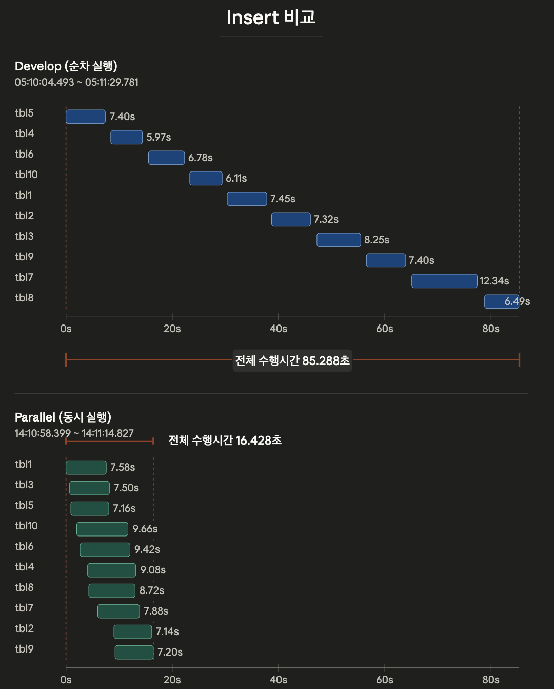
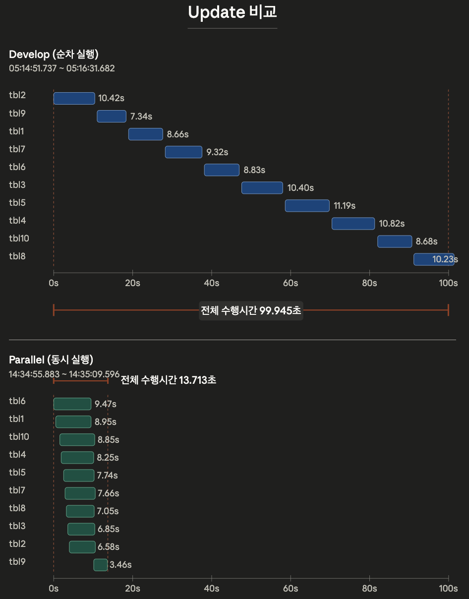

# Applylogdb 병렬화 PoC

> 최종 보고서 · 2026-06-04
> 근거: `2.design/poc_design.md`(설계), `7.final_test/report.md`(실험), 첨부 perf 콜체인/플레임그래프(병목 분석)

---

## I. 개요

### 1. PoC 목적

현재 `applylogdb`는 복제 로그를 **순차적으로** 처리한다. 이 방식은 다음 두 요인으로 슬레이브 반영 지연(lag)을 키운다.

1. **마스터 동시성에 비례한 지연 누적** — 마스터에서 다수 클라이언트가 병렬 작업을 수행하거나 병렬 연산 수가 증가할수록, 슬레이브에 모든 데이터가 반영되기까지의 지연이 커진다.
2. **flush 비용 집중** — 복제 과정에서 가장 큰 수행 시간을 차지하는 작업은 아이템을 슬레이브 서버로 **flush**하는 단계다.

본 PoC는 위 두 지연 요인을 **applylogdb의 병렬화**로 완화하여 복제 성능(특히 반영 지연)을 향상시키는 것을 목적으로 한다.

### 2. PoC 대상

- 마스터에서 **다량의 Insert 및 Update**
- **Long transaction** (주요 시나리오)
- 워크로드: **테이블 10개, 테이블당 10만 건**, 10만 건을 **하나의 트랜잭션**으로 처리(= long transaction)
- 그 외 시나리오(SBR 등)는 본 PoC 범위에서 제외

> 설계 문서 원안은 Insert 연산만 명시했으나, 본 PoC에서는 **Update 연산을 추가**하여 Insert/Update 두 워크로드 모두를 측정 대상으로 한다.

### 3. PoC 스펙 및 제약사항

병렬화의 기본 전제와 제약:

- **순서 완화**: 마스터의 커밋 순서와 슬레이브의 apply 완료 순서가 완전히 동일할 필요는 없다. dependency가 있는 작업에 대해서도 마스터 커밋 순서와 슬레이브 반영 순서를 (이번 PoC에서는) 고려하지 않는다.
- **커밋 단위 보장**: 커밋의 단위는 보장해야 하므로, PoC 대상 long transaction에서 commit은 **한 번만** 발생하도록 한다.
- **처리 단위 = transaction**: 마스터 복제 로그에서 하나의 commit 단위로 식별되는 작업을 transaction으로 보고, item이 아니라 **transaction 단위**로 병렬 처리한다.
- **범위 제외**: transaction 간 dependency 판별, 정교한 병렬 스케줄링, 정교한 오류 복구는 본 PoC 범위에서 제외한다.
- **구현 단순화**: PoC이므로 가장 간단한 구현을 우선하며, 일부 하드코딩·임시 주석을 허용한다.
- **전제 구조**: 향후 실제 구현에서도 복제 데이터는 마스터에서 **transaction boundary 기준**으로 묶여 전달되는 구조를 전제로 한다.

---

## II. 설계 및 구현

### 1. 모듈

병렬화를 위해 기존 단일 흐름을 **LogReader(Reader)** 와 **ApplyWorker(Worker)** 로 분리한다.

**LogReader**
- Active/Archive에서 복제 로그를 읽어 `LA_ITEM`을 생성하고 transaction 단위로 묶는다.
- commit log를 만나면 해당 transaction의 apply 단위를 확정하고 worker 작업 큐에 등록한다.
- long transaction은 전체 item list를 유지하지 않고 **anchor item(head) + log range metadata**만 유지한다.
- worker 완료 결과를 수집하고 **commit LSA 순서 기준**으로 전역 완료를 판정한다.
- 전역 완료가 확인된 transaction에 대해 `global committed_lsa`를 갱신하고 `_db_ha_apply_info` 갱신 및 reclaim을 수행한다.

**ApplyWorker**
- 전달받은 transaction을 슬레이브에 반영한다. 설정 파라미터(`ha_worker=[n]`)에 따라 N개 생성되어 병렬 apply를 수행한다.
- 각 worker는 **개별 작업 큐 / worker-local workspace / 슬레이브와 연결된 개별 세션**을 가진다.
- row item은 worker-local workspace에 적재 후 flush, statement/DDL은 슬레이브에 직접 실행한다.
- flush·commit을 worker 단위로 독립 수행하고, 성공 시 완료 상태와 `last_completed_lsa`를 LogReader에 보고한다.
- long transaction은 log range를 순차 재탐색하여 replication item을 재구성한 뒤 적재·flush·commit 한다.

### 2. 설계 (AS-IS → TO-BE)

**AS-IS**

```bash
+----------------------+
| ApplyLog Main        |
+----------------------+
| data                 |
| - LA_ITEM            |
| - LA_APPLY           |
| - final_lsa          |
| - committed_lsa      |
| - workspace          |
| function             |
| - read active/arv log|
| - decode log record  |
| - build LA_ITEM      |
| - build LA_APPLY     |
| - process repl items |
| - flush row items    |
| - execute stmt       |
|   directly           |
| - commit             |
| - update             |
|   _db_ha_apply_info  |
+----------+-----------+
           |
           v
    Slave DB / Server
```

**TO-BE**

```bash
     +----------------------------+
     |         LogReader          |
     +----------------------------+
     | data                       |
     | - LA_ITEM                  |
     | - LA_APPLY                 |
     | - final_lsa                |
     | - committed_lsa            |
     | function                   |
     | - read active/arv log      |
     | - build LA_ITEM            |
     | - build LA_APPLY           |
     | - detect long trans        |
     | - enqueue committed tx     |
     | - collect results          |
     | - update apply info        |
     | - reclaim items            |
     +-------------+--------------+
                   |
                   | enqueue committed tx
                   v

  +----------------------+  +----------------------+       +----------------------+
  |       Worker 0       |  |       Worker 1       |  ...  |       Worker N       |
  +----------------------+  +----------------------+       +----------------------+
  | data                 |  | data                 |       | data                 |
  | - queue              |  | - queue              |       | - queue              |
  | - session            |  | - session            |       | - session            |
  | - workspace          |  | - workspace          |       | - workspace          |
  | function             |  | function             |       | function             |
  | - process repl items |  | - process repl items |       | - process repl items |
  | - flush row items    |  | - flush row items    |       | - flush row items    |
  | - execute stmt       |  | - execute stmt       |       | - execute stmt       |
  |   directly           |  |   directly           |       |   directly           |
  | - commit             |  | - commit             |       | - commit             |
  | - report completed   |  | - report completed   |       | - report completed   |
  |   lsa                |  |   lsa                |       |   lsa                |
  +----------+-----------+  +----------+-----------+       +----------+-----------+
             |                         |                                |
             +-------------------------+--------------------------------+
                                       |
                                       v
                              Slave DB / Server
```

핵심 원칙:
- 처리 단위는 item이 아니라 **transaction**.
- 각 worker는 자기 흐름에서 **queue → flush → commit** 순서를 지킨다.
- `global committed_lsa`와 `_db_ha_apply_info`는 **LogReader가 단독 관리**한다.
- item reclaim은 worker가 아니라 **LogReader가 완료 결과 수집 후** 수행한다.
- long transaction은 head + log metadata만 유지하고 worker가 재구성한다.

### 3. 구현 요구사항

- LogReader는 로그에서 replication log를 읽어 `LA_ITEM`을 만들고 transaction 단위로 `LA_APPLY`를 구성하며, commit log를 만나면 committed transaction으로 확정해 worker queue에 등록한다.
- worker는 작업 큐에서 transaction을 꺼내 apply 상태를 참조하여 slave apply를 수행한다. insert item은 worker-local workspace에 추가하고, SBR item은 슬레이브에 직접 요청한다.
- **전역 변수 분리**: `ws_Repl_objs`, `ws_Repl_error_link`는 전역에서 제거하고 worker별로 분리한다. flush threshold·commit interval도 worker별 관리.
- flush·commit은 worker 단위로 수행하고, 완료 시 `last_completed_lsa`를 LogReader에 보고한다.
- LogReader는 worker 완료 결과를 수집해 `global committed_lsa`를 갱신하고 그 시점에 `_db_ha_apply_info`를 업데이트하며, 완료 확정 transaction의 item을 정리·reclaim 한다.
- long transaction은 LogReader가 head + log range metadata를 유지하고 worker가 재탐색하여 item을 재구성할 수 있어야 한다.
- worker 개수는 파라미터(`cubrid_ha.conf`의 `ha_worker=[n]`, default 1)로 설정 가능해야 한다.

> 변수 소유권은 **Reader-owned / Shared(lock) / Worker-local** 3분류로 정리됨(상세: `2.design/poc_design.md` 변수 정리). 핵심은 row decode scratch buffer·workspace·apply 통계·flush 상태를 worker-local로 분리하고, transaction registry(`repl_lists`, `LA_APPLY`, `committed_lsa`)는 lock으로 공유.

---

## III. 테스트

### 1. 실험 환경

- **토폴로지**: 마스터 1 + 슬레이브 1 (`cub_server testdb`)
- **워크로드**: 테이블 10개, 테이블당 10만 건. **`csql`로 부하를 생성**하며, 테이블당 10만 건 연산을 **하나의 트랜잭션으로 발생시킨 long transaction**(테이블당 commit 1회)이다. 10개 테이블이 **서로 다른 테이블**이므로 **트랜잭션 간 종속(dependency)이 없다** → 병렬 적용에 이상적인 조건. Insert / Update 각각 측정.
- **비교 축**: 동일 config에서 **develop(순차) vs POC(병렬)** 직접 비교
  - `#2 dev_tuned` = develop 빌드(순차 적용)
  - `#6 poc_buf5g_dwb0` = POC 빌드(병렬 적용)
- **공통 config** (두 실험 동일):

| 항목 | 값 |
|---|---|
| `double_write_buffer_size` | 0 |
| `data_buffer_size` | 5G |
| `log_buffer_size` | 5G |
| `log_volume_size` | 1G |
| `checkpoint_interval` | 30min (csql에서 checkpoint 수행) |
| `addvoldb` | 100G + temp |

> 지표 정의: `Slave/worker = Slave Sum / 10`(테이블당 평균 적용 시간), `Eff. Parallelism = Slave Sum / Slave Elapsed`(동시 활성 워커 수 근사), `Lag = 마스터 마지막 commit → 슬레이브 마지막 apply`.

### 2. 테스트 결과

**Insert**

| 지표 | #2 dev_tuned (순차) | #6 poc_buf5g_dwb0 (병렬) | 변화 |
|---|---:|---:|---|
| Master Elapsed (s) | 154.60 | 162.20 | ≈ 동일 |
| Slave Elapsed (s) | 87.80 | **25.85** | **3.4× 단축** |
| Slave/worker (s) | 8.05 | 16.10 | 2.0× 증가 |
| Eff. Parallelism | 0.92 | **6.23** | 순차 → 병렬 |
| Lag M→S (s) | 83.05 | **14.25** | **5.8× 단축** |



**Update**

| 지표 | #2 dev_tuned (순차) | #6 poc_buf5g_dwb0 (병렬) | 변화 |
|---|---:|---:|---|
| Master Elapsed (s) | 192.27 | 179.21 | ≈ 동일 |
| Slave Elapsed (s) | 111.84 | **32.59** | **3.4× 단축** |
| Slave/worker (s) | 10.85 | 16.32 | 1.5× 증가 |
| Eff. Parallelism | 0.97 | **5.01** | 순차 → 병렬 |
| Lag M→S (s) | 92.28 | **23.71** | **3.9× 단축** |



**관찰**
- **병렬화 확인**: develop은 `Eff. Parallelism ≈ 1`(순차 — 한 번에 한 테이블), POC는 약 **5–6 워커**가 동시 활성. 슬레이브 전체 반영 시간(Slave Elapsed)은 Insert·Update 모두 약 **3.4배 단축**, 복제 lag은 약 **4–6배 단축**.
- **마스터는 무관**: Master Elapsed는 빌드/설정과 무관(±6%) — 모든 성능 차이는 **슬레이브 applier 단계**에서 발생.
- (참고) 전체 7개 실험에서 `data_buffer_size=5G` + `addvoldb temp` 조합이 워커당 처리 속도·lag 모두 가장 우수했다(상세: `7.final_test/report.md`).

### 3. 특이사항

**병렬성은 확보됐으나, 단일 테이블(워커당) 복제 시간은 오히려 증가**

위 표에서 보이듯 전체 반영 시간은 크게 단축됐지만, **테이블 1개를 적용하는 시간(Slave/worker)은 순차 대비 늘었다**:
- Insert: 8.05s → 16.10s (**약 2배**)
- Update: 10.85s → 16.32s (**약 1.5배**)

즉 "여러 테이블을 동시에 처리해 전체는 빨라졌지만, 각 워커가 자기 테이블 하나를 처리하는 속도 자체는 느려진" trade-off가 나타난다.

**원인 분석 — 네트워크가 아니라 실제 apply 로직이 병목**

슬레이브 `cub_server`의 on-CPU perf를 측정한 결과, 수행 비중은 **네트워크 전송이 아니라 실질적인 Insert/Update 로직**에 집중되어 있었다. (복제 적용 경로 `slocator_repl_force→xlocator_repl_force→locator_insert_force/locator_update_force`가 on-CPU의 큰 분모를 차지) 측정한 콜체인/플레임그래프는 본 보고서에 **함께 첨부**한다.

- Insert: `slave_cub_server_insert_callchain.html` (또는 `slave_cub_server_insert_flame_full.svg`)
- Update: `slave_cub_server_update_callchain.html` (또는 `slave_cub_server_update_flame_full.svg`)

콜체인 기준 **병목 예상 지점**(상세는 위 첨부 파일):

- **Insert** (`locator_insert_force` → `heap_insert_logical` 86%) — 세 갈래:
  1. **free space 탐색/페이지 할당**: `heap_stats_find_best_page`(33.8%) → `heap_vpid_alloc`(23.1%) → `file_alloc`(18.2%)
  2. **lock 획득**: `lock_object`(20.9%) → `lock_internal_perform_lock_object` → lock-free hashmap(`lf_hash_insert_internal` 등 약 12%)
  3. **로그 생성**: `log_append_undoredo_crumbs`(27.8%) → `prior_lsa_alloc_and_copy_crumbs`/`prior_lsa_next_record_internal`(약 14–15%)
  - 부가: malloc 체인(`cub_alloc→__libc_malloc→_int_malloc→sysmalloc`)이 로그 레코드 복사에 반복 매달림.

- **Update** (`locator_update_force` → `heap_update_logical` 71.6%) — **로그 경로가 지배적**:
  1. **로그 생성/diff**: `heap_log_update_physical`(47.3%) → `log_append_undoredo_recdes/crumbs`(45%) → `prior_lsa_alloc_and_copy_crumbs`(39.1%), 그리고 update 고유의 `log_diff`(23.3%)
  2. **대상 row lock + escalation**: `locator_lock_and_get_object_with_evaluation`(23.0%) + `lock_escalate_if_needed`(8.5%) / `lock_remove_all_inst_locks`(8.3%)
  3. **페이지 compaction**: `spage_update`(15.1%) → `spage_update_record_after_compact`(13.0%) → `spage_compact`(8.5%)

- **공통**: `prior_lsa_*`(로그 레코드 생성) + malloc 체인이 insert·update 양쪽 모두 두껍다.

**병렬화 시 워커당 둔화의 추정 메커니즘**

위 병목 지점들은 대부분 **워커 간 공유 자원**에 닿아 있다 — `prior_lsa_next_record_internal`의 prior LSA append(mutex), lock 매니저의 lock-free hashmap, page buffer/`file_alloc`(공간 할당), 그리고 malloc(`_int_malloc`/`sysmalloc`). 워커 수가 늘면 이 공유 경로들에서 **경합(mutex 대기, 캐시·메모리 경합, 공간 할당 경합)** 이 증가하여, 전체 처리량은 늘어도 **개별 워커의 단일 테이블 처리 시간은 늘어나는** 것으로 추정된다.

> 후속 과제(설계 문서 TODO와 연결): 파일 동시 접근 시 I/O 병목, 캐시·버퍼 페이지 참조 시 lock 필요성 검토 → 위 공유 자원(prior LSA append, lock hashmap, page/space 할당, allocator) 경합 완화가 워커당 성능 회복의 핵심 지점이다.
