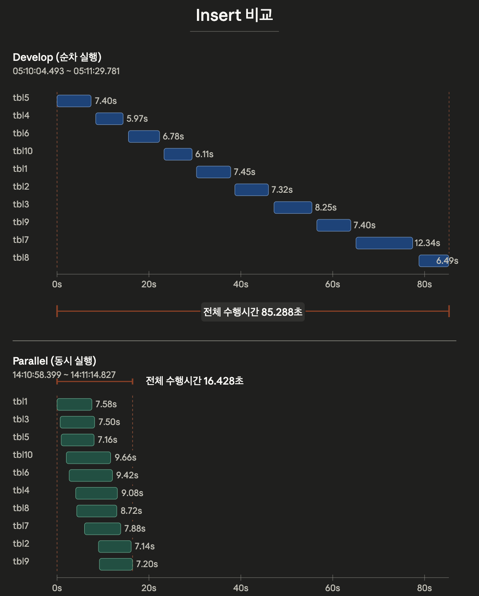
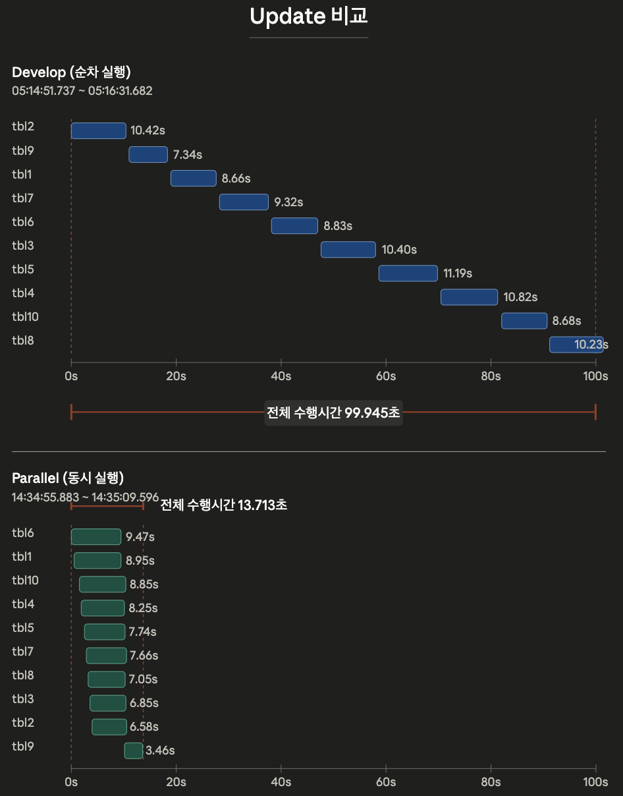

# Config 변경 — Develop vs Parallel 성능 비교 (Slave)

10-client 기준 INSERT / UPDATE 워크로드를 동일 조건으로 돌리고, **슬레이브(applier) 측 수행시간**만 비교한다.

---

## 변경한 Config

Develop / Parallel 두 빌드 모두 동일하게 적용한 측정 환경.

| 항목 | 값 | 비고 |
|---|---|---|
| `double_write_buffer_size` | 0 | DWB 비활성화 |
| `data_buffer_size` | 5G | |
| `log_buffer_size` | 5G | |
| `log_volume_size` | 1G | |
| `checkpoint_interval` | 30min | |
| 기본 데이터 볼륨 | 100GB | `addvoldb` 로 추가 |
| 템프 볼륨 | 512MB | `addvoldb` 로 추가 |
| 시작 전 체크포인트 | `;checkpoint` 실행 | `csql -u dba --sysadm` 접속 후 |

---

## 측정 방식 — Develop 재실험 사유

이전 develop 테스트는 다음 순서로 측정하고 있어 **duration 안에 commit 시간이 포함**되고, 직후 **불필요한 두 번째 commit** 까지 들어가 있었음. 이 때문에 `1.develop_profile/1.insert/` 및 `2.update/`의 10-client 결과는 비교 기준선으로 적합하지 않다고 판단하고, `3.new_client10_insert/` · `4.new_client10_update/` 로 재실험.

### Before (이전 develop 측정 순서)

```sql
-- 시작 타임스탬프 캡처
SELECT SYSDATETIME();

INSERT INTO tbl VALUES (1, ...);
INSERT INTO tbl VALUES (2, ...);
...
INSERT INTO tbl VALUES (100000, ...);

COMMIT;                       -- 1차 커밋

-- 종료 타임스탬프 캡처 (이미 commit 끝난 뒤)
SELECT SYSDATETIME();

COMMIT;                       -- 2차 커밋 (불필요/중복)
```

→ `duration = end_ts − start_ts` 에 **commit 시간이 포함**되고, 뒤의 2차 commit이 군더더기.

### After (재실험 — prepare-execute 1)

```sql
;autocommit off

-- 시작 타임스탬프 캡처
SELECT SYSDATETIME();

INSERT INTO tbl VALUES (1, ...);
INSERT INTO tbl VALUES (2, ...);
...
INSERT INTO tbl VALUES (100000, ...);

-- 종료 타임스탬프 캡처 (commit 직전)
SELECT SYSDATETIME();

COMMIT;                       -- 1회만
```

→ `duration` 은 순수 INSERT 구간만 포함, commit은 측정 밖에서 1회 수행.

> Parallel(`6.parallelization_profile/`) 측정도 동일한 prepare-execute 1 방식이라, 두 브랜치가 같은 정의의 duration으로 비교된다.

---

## INSERT (10 client) — Slave

### Develop

출처: `1.develop_profile/3.new_client10_insert/result.md`

| Table | Start | End | Duration (s) |
|---|---|---|---|
| tbl5  | 05:10:04.493 | 05:10:11.892 | 7.399  |
| tbl4  | 05:10:12.900 | 05:10:18.868 | 5.968  |
| tbl6  | 05:10:20.013 | 05:10:26.797 | 6.784  |
| tbl10 | 05:10:27.792 | 05:10:33.900 | 6.108  |
| tbl1  | 05:10:34.864 | 05:10:42.314 | 7.450  |
| tbl2  | 05:10:43.219 | 05:10:50.537 | 7.318  |
| tbl3  | 05:10:51.660 | 05:10:59.911 | 8.251  |
| tbl9  | 05:11:01.011 | 05:11:08.408 | 7.397  |
| tbl7  | 05:11:09.543 | 05:11:21.880 | 12.337 |
| tbl8  | 05:11:23.295 | 05:11:29.781 | 6.486  |
| all   | 05:10:04.493 | 05:11:29.781 | 85.288 |

### Parallel

출처: `6.parallelization_profile/1.insert_csql/result.md`

| Table | Start | End | Duration (s) |
|---|---|---|---|
| tbl1  | 14:10:58.399 | 14:11:05.981 | 7.582  |
| tbl3  | 14:10:59.075 | 14:11:06.579 | 7.504  |
| tbl5  | 14:10:59.295 | 14:11:06.452 | 7.157  |
| tbl10 | 14:11:00.411 | 14:11:10.075 | 9.664  |
| tbl6  | 14:11:01.028 | 14:11:10.447 | 9.419  |
| tbl4  | 14:11:02.440 | 14:11:11.518 | 9.078  |
| tbl8  | 14:11:02.676 | 14:11:11.400 | 8.724  |
| tbl7  | 14:11:04.364 | 14:11:12.246 | 7.882  |
| tbl2  | 14:11:07.405 | 14:11:14.542 | 7.137  |
| tbl9  | 14:11:07.626 | 14:11:14.827 | 7.201  |
| all   | 14:10:58.399 | 14:11:14.827 | 16.428 |



---

## UPDATE (10 client) — Slave

### Develop

출처: `1.develop_profile/4.new_client10_update/result.md`

| Table | Start | End | Duration (s) |
|---|---|---|---|
| tbl2  | 05:14:51.737 | 05:15:02.160 | 10.423 |
| tbl9  | 05:15:02.760 | 05:15:10.099 | 7.339  |
| tbl1  | 05:15:10.735 | 05:15:19.393 | 8.658  |
| tbl7  | 05:15:19.818 | 05:15:29.137 | 9.319  |
| tbl6  | 05:15:29.468 | 05:15:38.302 | 8.834  |
| tbl3  | 05:15:38.707 | 05:15:49.107 | 10.400 |
| tbl5  | 05:15:49.472 | 05:16:00.666 | 11.194 |
| tbl4  | 05:16:01.097 | 05:16:11.920 | 10.823 |
| tbl10 | 05:16:12.301 | 05:16:20.985 | 8.684  |
| tbl8  | 05:16:21.457 | 05:16:31.682 | 10.225 |
| all   | 05:14:51.737 | 05:16:31.682 | 99.945 |

### Parallel

출처: `6.parallelization_profile/2.update_csql/result.md`

| Table | Start | End | Duration (s) |
|---|---|---|---|
| tbl6  | 14:34:55.883 | 14:35:05.353 | 9.470  |
| tbl1  | 14:34:56.414 | 14:35:05.363 | 8.949  |
| tbl10 | 14:34:57.430 | 14:35:06.279 | 8.849  |
| tbl4  | 14:34:57.778 | 14:35:06.029 | 8.251  |
| tbl5  | 14:34:58.408 | 14:35:06.143 | 7.735  |
| tbl7  | 14:34:58.754 | 14:35:06.414 | 7.660  |
| tbl8  | 14:34:59.097 | 14:35:06.151 | 7.054  |
| tbl3  | 14:34:59.466 | 14:35:06.312 | 6.846  |
| tbl2  | 14:34:59.861 | 14:35:06.444 | 6.583  |
| tbl9  | 14:35:06.132 | 14:35:09.596 | 3.464  |
| all   | 14:34:55.883 | 14:35:09.596 | 13.713 |



---

## 요약 비교 (Slave 전체)

| 워크로드 | Develop (s) | Parallel (s) | 단축 시간 (s) | 개선율 | 속도 향상 |
|---|---|---|---|---|---|
| INSERT | 85.288 | 16.428 | 68.860 | 80.7% | 5.19× |
| UPDATE | 99.945 | 13.713 | 86.232 | 86.3% | 7.29× |
