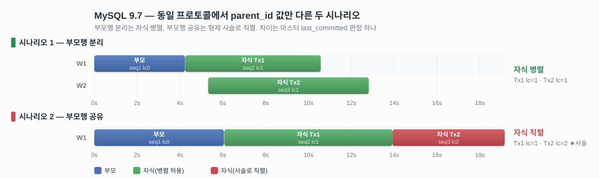

# MySQL 9.7 FK 병렬복제 실측 조사

> [!summary] 한 문단 요약
> MySQL 9.7 복제 환경에서 "같은 부모를 참조하는 자식 트랜잭션들(형제)이 병렬 적용되는가"를 실측 조사했다. 이 결과는 CUBRID writeset v2 FK 설계의 비교 기준이 된다. 결과: **자식들이 부모의 서로 다른 행을 참조하면 병렬, 같은 행을 참조하면 직렬로 강제**된다. 직렬의 원인은 마스터가 binlog에 기록하는 의존성 값(last_committed)이 형제끼리 사슬로 묶이기 때문이며, 이는 MySQL이 5년째 방치 중인 과직렬화 버그 #110071의 실체다.

## 1. 배경과 목적

MySQL 9.x의 writeset 기반 병렬복제를 분석하는 과정에서([[1. writeset_v2_자료조사]]), FK 의존성 처리 구조상 **같은 부모를 참조하는 자식 트랜잭션들이 서로 묶여 과직렬화될 것**이 예상됐다. 이력 맵은 해시마다 "그 해시를 마지막으로 남긴 트랜잭션" 하나만 기억한다. 부모는 폴백(fall back) 탓에 자기 키 해시를 이력에 남기지 못하고, 첫째 자식이 부모 키와 같은 모양의 FK 해시를 자기 이름으로 남긴다. 다음 자식이 같은 FK 해시로 이력을 조회하면 거기 적힌 것은 부모가 아니라 앞의 형제이므로, 의존이 형제에게 걸린다. 같은 증상이 버그 #110071(2023년 보고, 미해결)로 이미 보고돼 있다.

이 문서의 핵심 질문은 하나다: **같은 부모를 참조하는 자식 형제가 레플리카에서 병렬로 적용되는가, 직렬화되는가.** 직렬화가 확인되면 (1) 그 비용(형제가 얼마나 늦게 시작하는가)과 (2) FK 의존성 자체가 만드는 대기의 실제 크기(흔히 "부모-자식 텀"으로 오해되는 것의 정체)도 함께 측정한다. 앞의 질문이 결론이고, 뒤 둘은 그 비용과 측정 해석이다.

측정 대상 버전은 분석 기준 소스와 같은 **MySQL 9.x**(9.7.2)다. 버전이 중요한 이유는 8절에서 설명한다.
## 2. 용어

| 용어                      | 의미                                                                                        |
| ----------------------- | ----------------------------------------------------------------------------------------- |
| `sequence_number` (seq) | 마스터가 binlog 파일 안에서 트랜잭션에 매기는 순번                                                           |
| `last_committed` (lc)   | 마스터가 각 트랜잭션에 기록하는 의존성 값. "seq가 lc 이하인 트랜잭션이 모두 적용된 뒤에 나를 실행하라"는 뜻. 레플리카 병렬성은 이 값 하나로 결정된다 |
| writeset history        | 마스터 메모리의 해시 테이블. 키 해시 → 그 키를 마지막으로 쓴 트랜잭션의 seq. lc 계산에 사용                                 |
| lwm                     | 레플리카 SQL 스레드의 진행선. "여기까지의 seq는 모두 커밋 완료" 점수판. lc를 집행하는 쪽                                  |

역할 분담: **writeset history는 마스터에서 lc를 만들고, lwm은 레플리카에서 lc를 집행한다.** 해시는 레플리카로 전달되지 않는다.

## 3. 테스트 환경

- MySQL **9.7.2** 컨테이너 2대(podman): mysql-src(마스터) → mysql-rep(레플리카), GTID 자동복제
- 레플리카: `replica_parallel_workers=10`, `replica_parallel_type=LOGICAL_CLOCK`, `replica_preserve_commit_order=ON`
- 마스터: `binlog_transaction_dependency_history_size` 기본값 10,000,000 (9.7 기본. 8.x는 25,000이며 이 차이가 결과를 좌우한다. 8절 참조)
- 스키마: 부모 `tbl_ws1(id PK, c1..c10 VARCHAR(255))`, 자식 `tbl_ws2(id PK, parent_id INT FK→tbl_ws1.id, c1..c10, 보조인덱스 4개)`. 행당 payload 약 2.4KB

```text
┌─ tbl_ws1 (부모) ─────────┐       ┌─ tbl_ws2 (자식) ─────────────┐
│ id INT PK               │◄──FK──│ parent_id INT → tbl_ws1.id  │
│ c1..c10 VARCHAR(255)    │       │ id INT PK                   │
└─────────────────────────┘       │ c1..c10 VARCHAR(255)        │
  행당 payload ≈ 2.4KB            │ 보조 인덱스 4개              │
                                  └─────────────────────────────┘
```

## 4. 테스트 방법

### 4.1 워크로드

CUBRID ha_bench FK 벤치마크와 같은 구조를 MySQL SQL로 재현했다.

- 부모: 10만 행을 **1개 트랜잭션**으로 INSERT
- 자식: 10만 행을 **2개 트랜잭션**으로 분할 INSERT (Tx1 = id 1~50000, Tx2 = id 50001~100000)
- 마스터에서 부모 → 자식 Tx1 → 자식 Tx2 **순차 커밋** (Tx1이 완전히 커밋된 뒤 Tx2 시작)
- 트랜잭션마다 수동 GTID를 부여해 binlog·측정 로그에서 어느 트랜잭션인지 1:1 식별

### 4.2 적용 절차 — 쌓아 두고 한 번에 재생
전달 지연이나 도착 순서가 섞이면 병렬/직렬 판정이 흐려진다. 그래서 적용만 분리했다.

1. 레플리카 SQL 스레드를 멈춘다.
2. 마스터에서 부모·자식을 모두 커밋하고 relay log 수신 완료를 확인한다.
3. SQL 스레드를 한 번만 시작한다.

세 트랜잭션이 이미 도착한 상태에서 같은 시작점부터 적용되므로, **관측되는 병렬/직렬은 오직 lc 값으로만 결정된다.** (이 절차가 필요해진 이유인 측정 특이사항은 8절)

### 4.3 측정 계기와 신뢰 근거

4.1의 질문 세 가지(병렬 여부, 부모-자식 텀, 자식 간 텀)에 답하려면 두 값을 읽어야 한다. 마스터가 각 트랜잭션에 매긴 의존성 값(lc)과, 레플리카에서 각 트랜잭션이 실제로 적용된 시각이다. 아래 표는 그 값들을 어디서 읽었고 왜 믿을 수 있는지다.

| 측정         | 계기                                                                                                                           | 신뢰 근거                               |
| ---------- | ---------------------------------------------------------------------------------------------------------------------------- | ----------------------------------- |
| 마스터 의존성 판정 | binlog의 lc/seq를 mysqlbinlog로 직접 판독                                                                                           | binlog에 영구 기록된 값. 해석 개입 여지 없음       |
| 레플리카 적용 시각 | `performance_schema.replication_applier_status_by_worker`의 `LAST_APPLIED_TRANSACTION_START/END_APPLY_TIMESTAMP`와 `WORKER_ID` | 레플리카 서버 클럭으로 찍히는 값이라 폴링 주기와 무관하게 정확 |
| 코디네이터 동작   | `replication_applier_status_by_coordinator`의 START/END_BUFFER_TIMESTAMP                                                      | 트랜잭션 분배 시작/완료 시각. 대기 구간 검증에 사용      |

## 5. 테스트 시나리오

두 시나리오는 **자식 행의 parent_id 값 하나만** 다르다. 나머지(크기, 커밋 순서, 프로토콜, 인덱스)는 전부 동일하다.

| | 시나리오 1 — 부모행 분리 | 시나리오 2 — 부모행 공유 |
|---|---|---|
| 자식 행 i의 parent_id | i (자기 번호의 부모행) | 1 (전부 같은 부모행) |
| Tx1이 참조하는 부모행 | 1~50000 | 1 |
| Tx2가 참조하는 부모행 | 50001~100000 (Tx1과 겹침 없음) | 1 (Tx1과 완전 공유) |

시나리오 2가 실무의 전형이다. 예: 회원 1명(부모)에게 주문(자식)이 여러 트랜잭션으로 잇달아 들어오는 패턴.

## 6. 실험 결과

### 6.1 마스터의 의존성 판정 (binlog lc)

여기부터는 실측 결과다. 이 표는 4.3의 첫 번째 계기(mysqlbinlog 판독)로 읽은, 마스터가 실제로 binlog에 기록한 lc 값이다. 1절에서 예상한 형제 사슬이 값으로 그대로 나타났다.

| 트랜잭션          | 부모행 분리                   | 부모행 공유                   |
| ------------- | ------------------------ | ------------------------ |
| 부모 (seq1)     | lc=0                     | lc=0                     |
| 자식 Tx1 (seq2) | lc=1 (부모 뒤)              | lc=1 (부모 뒤)              |
| 자식 Tx2 (seq3) | **lc=1 (부모 뒤, Tx1과 무관)** | **lc=2 (Tx1 뒤) ← 형제 사슬** |

부모행 공유에서 Tx2가 형제 Tx1에 묶였다. 서로 다른 자식 행을 쓰므로 진짜 데이터 충돌은 없는데도 같은 부모행을 가리킨다는 이유만으로 직렬 의존이 생긴 것이다.

### 6.2 레플리카 적용 타임라인
아래 타임라인은 §4.2의 **사전 적재(preload) 프로토콜**로 측정한 값이다. 세 트랜잭션이 모두 relay log에 도착한 것을 확인한 뒤 SQL 스레드를 시작하므로, 마스터의 트랜잭션 생성 시간과 로그 전달 시간이 제거되고 스케줄러(lc)가 만드는 대기만 남는다. 전달을 제거하지 않은 자연 실행과의 차이는 6.4에서 다룬다.



| | 부모행 분리 | 부모행 공유 |
|---|---|---|
| 부모 | w1, 0.000 → 4.228s | w1, 0.000 → 6.052s |
| 자식 Tx1 | w1, 4.235 → 10.572s | w1, 6.071 → 13.919s |
| 자식 Tx2 | **w2, 5.315 → 12.814s** | **w1, 13.922 → 19.160s** |

이 타임라인이 뜻하는 병렬/직렬 판정과 원인 확정은 6.3에, 직렬을 만드는 내부 메커니즘은 7절에 있다.

### 6.3 자식의 병렬화 여부

- **부모행 분리: 병렬.** Tx1(w1)과 Tx2(w2)가 5.26초 동안 겹쳐 실행됐다.
- **부모행 공유: 직렬.** Tx2는 Tx1이 끝나야 시작했고 워커도 하나만 사용됐다. lc=2가 강제한 결과다.

이 두 결과를 묶으면 직렬화의 원인이 확정된다. 두 시나리오 모두 4.2의 같은 절차(트랜잭션을 미리 다 도착시켜 놓고 재생)로 측정했다. 시나리오 1(부모행 분리: 자식들이 서로 다른 부모 행을 참조)이 병렬이 됐으므로 레플리카 스케줄러는 형제를 병렬로 돌릴 능력이 있고 전달 지연도 없었다. 그런데 parent_id 값 하나만 다른 시나리오 2(부모행 공유: 자식들이 같은 부모 행을 참조)에서는 직렬이 됐다. 따라서 이 직렬은 스케줄러의 능력 부족도, 로그 전달 순서도 아닌 **writeset lc 사슬(6.1의 lc=2)이 만든 것**이다. 시나리오 1은 이 비교의 대조군이다.

### 6.4 부모-자식 간 텀

- 부모행 분리: 부모 적용 완료 후 **+0.007초**에 첫 자식 시작
- 부모행 공유: **+0.019초**

두 경우 모두 부모가 커밋 완료되는 즉시 자식이 dispatch된다. 즉 **FK 의존성 자체가 만드는 대기 비용은 수 ms 수준**이고, 벤치마크에서 흔히 보이는 수 초~수십 초의 부모-자식 텀은 의존성 대기가 아니라 마스터의 트랜잭션 생성 시간과 로그 전달 시간이다.

이를 직접 확인하기 위해 같은 부모행 분리 워크로드를 **사전 적재 없이 자연 실행(natural)**으로도 측정했다. 자연 실행은 평상시 복제 그대로, 마스터 커밋과 동시에 레플리카가 받아서 적용을 쫓아가는 방식이다.

| 항목 | 자연 실행 | 사전 적재 |
|---|---|---|
| 부모 적용 | 0.000 → 6.743초 | 0.000 → 4.228초 |
| 자식 Tx1 적용 | 15.421 → 21.910초 | 4.235 → 10.572초 |
| 자식 Tx2 적용 | 24.061 → 29.941초 | 5.315 → 12.814초 |
| **부모 완료 → 첫 자식 시작** | **+8.678초** | **+0.007초** |
| 자식 병렬성 | 직렬처럼 보임 (워커 1, 1 / 겹침 없음) | 병렬 (워커 1, 2 / 겹침 5.26초) |
| binlog lc | 부모 0, 자식 1, 1 | 동일 (부모 0, 자식 1, 1) |

두 실행의 lc 판정은 완전히 같다. 마스터의 의존성 판정은 커밋 시점에 binlog에 기록되므로 레플리카의 실행 방식과 무관하기 때문이다. 그런데 부모-자식 텀은 8.678초 대 0.007초로 갈린다. 자연 실행의 8.678초는 마스터가 50,000행 자식 트랜잭션을 실행하는 시간과, 커밋 시점에 일괄 기록된 대용량 binlog 페이로드가 레플리카 relay log로 전송되고 SQL 스레드가 파싱해 도달하는 시간이다.

자연 실행에서 특히 주의할 점: lc상 서로 독립인 두 자식(lc=1, 1)조차 **직렬로 실행됐다.** 페이로드가 순차적으로 도착하니 두 번째 자식을 병렬로 돌릴 기회 자체가 없었던 것이다. 즉 자연 실행만 보면 "전달 때문에 생긴 직렬"과 "의존성 사슬이 만든 직렬"(부모행 공유, lc=2)이 구별되지 않는다. 이 문서의 6.2~6.5가 사전 적재로 측정된 이유가 이것이다(특이사항 통제는 §8).

### 6.5 자식이 직렬화됐을 때 자식 간 텀

부모행 공유에서 Tx1 종료와 Tx2 시작 사이는 **+0.003초**다. 사이 공백은 없다. 직렬화의 실제 비용은 틈이 아니라 **Tx2가 Tx1의 적용 시간 전체(7.8초)만큼 늦게 시작하는 것**이다. 자식 완료 시각으로 비교하면 분리 12.8초 vs 공유 19.2초로 **+6.3초(+50%)** 손해이며, 형제가 N개면 이 지연은 앞선 형제 적용 시간의 합으로 누적된다.

## 7. 원인 — MySQL 소스 근거

MySQL 9.7 소스(mysql-server-9.7)에서 확인한 메커니즘이다. 호출 순서는 다음과 같다. 자식이 행을 쓸 때 `add_pke()`가 부모 참조키 해시를 자기 writeset에 넣는다(`handler.cc`/`rpl_injector.cc`에서 행마다 호출) → 커밋 시 `Transaction_dependency_tracker::get_dependency()`가 커밋순서 판정 위에 writeset 판정을 겹쳐 `commit_parent`를 정한다 → 이 값이 binlog에 `sequence_number`/`last_committed`(lc)로 기록된다 → 레플리카 스케줄러는 이 lc만 읽어 대기 여부를 정한다. ①~③이 마스터 쪽, ④가 레플리카 쪽이다.

**① 자식 트랜잭션은 부모 참조키 해시를 자기 writeset에 넣는다.**

**[코드 1] `add_pke` — FK 컬럼값으로 부모 키와 같은 해시를 조립 (sql/rpl_write_set_handler.cc:1081-1190)**
```cpp
// add_pke()는 행이 INSERT/UPDATE/DELETE될 때마다 호출된다. FK가 있는 테이블(자식 tbl_ws2)을
// 쓸 때 이 블록에 들어온다. table은 지금 쓰이는 자식 테이블, fk[]는 그 테이블의 FK 정의 배열.
if (!(thd->variables.option_bits & OPTION_NO_FOREIGN_KEY_CHECKS) &&
    table->s->foreign_keys > 0) {
  for (uint fk_number = 0; fk_number < table->s->foreign_keys; fk_number++) {
    // pke 문자열 = "부모쪽 유니크 인덱스명 <SEP> 부모 스키마명 <SEP> 부모 테이블명 <SEP> ..."
    pke.clear();
    pke.append(fk[fk_number].unique_constraint_name.str, ...);   // 부모 PK 인덱스 이름
    pke.append(fk[fk_number].referenced_table_db.str, ...);      // 부모 스키마
    pke.append(fk[fk_number].referenced_table_name.str, ...);    // 부모 테이블명
    for (/* FK 컬럼마다 */) {
      size_t length = field->make_sort_key(pk_value.get(), max_length);
      pke.append(pointer_cast<char *>(pk_value.get()), length);  // ★ 자식 행의 FK 컬럼 "값"
    }
    if (generate_hash_pke(pke, thd, ...)) return true;            // ★ 문자열을 해시해 자식 writeset에 추가
    writeset_hashes_added = true;
  }
}

if (table->s->foreign_key_parents > 0)
  ws_ctx->set_has_related_foreign_keys();  // ★ "나는 참조당하는 부모 테이블이다" 표시 → ②로 이어짐
```
`pke` 조립 규칙(인덱스명+스키마+테이블명+키값을 이어붙여 해시)은 부모가 자기 PK로 해시를 만들 때와 동일한 규칙이다([[1. writeset_v2_자료조사]] [코드 1] 참조). 그래서 자식이 FK 컬럼값으로 조립한 해시와, 그 값을 PK로 가진 부모 행이 스스로 만드는 해시는 문자열이 같아 같은 해시가 된다. 즉 자식은 "내가 참조하는 부모 행"과 값이 겹치는 해시를 자기 writeset에 넣는 것이지, 부모-자식을 구분하는 별도 표식을 넣는 게 아니다. 마지막 두 줄(`foreign_key_parents` 체크)은 별개 경로로, 부모 테이블 자신의 행을 쓸 때만 켜진다. 이 플래그가 커밋 시점에 ②의 분기 조건이 된다.

**② 부모 트랜잭션은 history를 통째로 비운다.**

**[코드 2] `Writeset_trx_dependency_tracker::get_dependency` — `can_use_writesets` 판정과 clear (sql/rpl_trx_tracking.cc:256-274, 321-324)**
```cpp
bool can_use_writesets =
    (writeset->size() != 0 || write_set_ctx->get_has_missing_keys() || ...) &&
    !is_create_table_as_query_block(thd) &&
    thd->variables.binlog_format == BINLOG_FORMAT_ROW &&
    !write_set_ctx->get_has_related_foreign_keys() &&   // ★ ①에서 세운 플래그. 부모 트랜잭션이면 false
    !write_set_ctx->was_write_set_limit_reached();

if (can_use_writesets) {
  // (③의 history 매칭 루프가 여기 안에 있다 — 부모는 이 블록 자체에 들어오지 못한다)
  ...
}

if (exceeds_capacity || !can_use_writesets) {
  m_writeset_history_start = sequence_number;
  m_writeset_history.clear();   // ★ 부모는 여기로 떨어져 history 전체를 비운다
}
```
부모 트랜잭션은 자기 행에 `foreign_key_parents>0` 플래그가 서 있으므로 `get_has_related_foreign_keys()`가 true이고, 따라서 `can_use_writesets`는 false다. `can_use_writesets`가 false면 ③의 매칭·삽입 루프를 담은 `if (can_use_writesets) {...}` 블록 자체에 들어가지 않으므로, 부모는 자기 PK 해시를 history에 **넣는 시도조차 하지 않는다.** 그 대신 바로 아래 `if (exceeds_capacity || !can_use_writesets)`로 떨어져 history를 통째로 clear한다. 부모-자식 순서 보장은 이 writeset 경로가 아니라 `Transaction_dependency_tracker::get_dependency`가 먼저 계산해 두는 commit-order 하한(§7 도입부 호출 순서의 첫 단계)이 담당하며, writeset은 그 값을 낮추는 역할만 한다(③).

**③ 형제 사슬이 생기는 지점.**

**[코드 3] `Writeset_trx_dependency_tracker::get_dependency` — history 매칭 루프 (sql/rpl_trx_tracking.cc:290-304, 317)**
```cpp
int64 last_parent = m_writeset_history_start;
for (uint64 hash : *writeset) {              // 지금 커밋하는 트랜잭션의 writeset(①의 FK 해시 포함)
  auto hst = m_writeset_history.find(hash);
  if (hst != m_writeset_history.end()) {
    if (hst->second > last_parent && hst->second < sequence_number)
      last_parent = hst->second;             // ★ 이 해시를 마지막으로 남긴 트랜잭션의 seq로 의존성을 올림
    hst->second = sequence_number;            // ★ 슬롯 주인을 "나"로 덮어쓴다
  } else {
    if (!exceeds_capacity)
      m_writeset_history.insert({hash, sequence_number});  // 처음 보는 해시는 새로 등록
  }
}
...
commit_parent = std::min(last_parent, commit_parent);  // (317) commit-order 판정과 min → 낮은 쪽 채택
```
부모행 공유 시나리오에서 자식 Tx1이 커밋되면서 공유 부모행의 FK 해시로 이 루프를 통과하고, 그 해시는 history에 없었으므로(부모는 ②에 의해 애초에 넣지 못했다) `insert`로 슬롯이 새로 등록된다. 이 슬롯의 값은 `Tx1.seq`다. 뒤이어 Tx2가 커밋되며 같은 FK 해시(같은 부모행을 참조하므로 문자열이 동일)로 `find()`를 하면 찾아지는 것은 부모가 아니라 Tx1이므로 `last_parent`가 `Tx1.seq`로 올라가고, `Tx2.commit_parent = Tx1.seq`가 된다. 이 값이 binlog에 lc로 그대로 기록된 것이 6.1의 `lc=2`다. `hst->second = sequence_number`로 슬롯을 매번 덮어쓰므로, 형제가 셋 이상이면 세 번째는 다시 두 번째에 묶이는 식으로 체인이 이어진다. 부모행 분리에서는 자식마다 참조하는 부모행이 달라 FK 해시 문자열 자체가 겹치지 않으므로 이 `find()`가 항상 실패하고, 사슬이 생기지 않는다.

**④ 레플리카는 lc만 본다.**

**[코드 4] `schedule_next_event` / `wait_for_last_committed_trx` — lc 하나로 대기 판정 (sql/rpl_mta_submode.cc:381-395, 205-248)**
```cpp
// schedule_next_event(): 코디네이터가 새 트랜잭션을 워커에 배분하기 직전에 호출
if (!is_new_group) {
  longlong lwm_estimate = estimate_lwm_timestamp();       // 지금까지 커밋 완료된 최대 seq(추정)
  if (!clock_leq(last_committed, lwm_estimate) && ...) {   // ★ lc <= lwm이 아니면(아직 안 끝났으면)
    wait_for_last_committed_trx(rli, last_committed);      // ★ 대기 진입. 테이블/FK는 인자로 넘어오지 않음
  }
  delegated_jobs++;
}

// wait_for_last_committed_trx(): 실제 대기 루프
if (!clock_leq(last_committed_arg, get_lwm_timestamp(rli, true))) {
  do {
    mysql_cond_wait(&rli->logical_clock_cond, &rli->mts_gaq_LOCK);
  } while (!clock_leq(last_committed_arg, estimate_lwm_timestamp()));  // ★ lwm이 lc를 따라잡을 때까지만 대기
}
```
두 함수 어디에도 테이블명·PK·FK를 확인하는 코드가 없다. 넘어오는 인자는 `last_committed`(lc)와 `lwm_estimate` 두 정수뿐이고, 대기 조건은 오직 `clock_leq(lc, lwm)`(lc가 lwm 이하인가)이다. 이 lc는 마스터가 ①~③에서 계산해 binlog에 새겨 보낸 값을 레플리카가 그대로 읽은 것이다. 따라서 부모행 공유 시나리오에서 Tx2가 직렬로 대기하는 것은 레플리카가 FK 의존을 다시 해석해서가 아니라, 마스터가 이미 `lc=Tx1.seq`로 확정해 보낸 값을 레플리카가 그대로 집행하기 때문이다. 직렬화 여부를 결정하는 지점은 전적으로 마스터의 ③이고, 레플리카는 그 판정을 실행할 뿐이다.

이 구조가 MySQL 버그 #110071(같은 부모를 참조하는 트랜잭션들의 과직렬화, 2023년 보고 후 미해결)의 실체이며, 본 실험은 이를 binlog 수치(lc=2)와 적용 타임라인 양쪽으로 재현한 것이다.

## 8. 특이사항 (측정 신뢰성)

동일 취지의 측정이 조건에 따라 정반대로 나올 수 있다. 본 실험에서 확인·통제한 측정 특이사항을 기록한다. **이 통제가 없으면 결과를 신뢰할 수 없다.**

| 특이사항 | 증상 | 원인 | 통제 |
|---|---|---|---|
| history 용량(버전) | 8.4에서는 부모행 공유도 lc가 낮게 나옴 | 8.x 기본 한도 25,000 초과 트랜잭션(5만 행 = 해시 10만 개)은 해시를 history에 넣지 못하고 clear함 (rpl_trx_tracking.cc:283-304) → 사슬 재료 소멸 | **9.7 사용** (기본 한도 10,000,000) |
| 동시 커밋 | 순차 대신 동시 커밋하면 사슬이 lc에 안 보임 | lc = min(writeset 판정, 커밋순서 판정)이라 동시 커밋의 낮은 커밋순서 값이 사슬을 가림 (:317) | 자식을 **순차 커밋** |
| SQL 스레드 재시작 | 부모행 분리(lc=1)인데도 직렬로 관측됨 | 레플리카 lwm은 SQL 스레드 세션 메모리라 재시작 시 리셋 (rpl_rli_pdb.cc:903). 이전 세션에서 적용된 부모의 완료를 새 세션이 증명하지 못해 보수 대기 | 부모까지 포함해 **모두 새 세션에서 적용** |
| 전달 지연 | 자연 흐름에서는 lc와 무관하게 직렬처럼 보임 | 트랜잭션당 122MB라 다음 트랜잭션 도착 전에 앞 적용이 끝남 | relay **선적재 후 SQL 스레드 시작** |

교차 검증: 통제를 모두 적용한 뒤에도 부모행 공유는 직렬로 남았다(진짜 의존). 부모행 분리만 병렬로 바뀌었다(측정 특이사항이었음). 이 대비가 "직렬의 원인은 lc 사슬뿐"임을 확정한다.

## 9. 한계

- 각 시나리오 1회 실행. 병렬/직렬 판정은 binlog lc(결정적 값)로 뒷받침되지만, 소요 시간 수치는 반복 통계가 아니다.
- 단일 부모-자식 테이블 쌍, 트랜잭션당 5만 행의 대형 트랜잭션 조건. 소형 다건 트랜잭션에서의 처리량 차이는 별도 측정 필요.
- CUBRID 측 "부모행 공유 형제 병렬"은 설계와 코드 구조로 확인된 것으로, 동일 시나리오의 CUBRID 실측은 후속 과제다.

## 10. 재현 방법

작업 디렉토리 `~/mysql_fk_bench/` (볼트 밖):
- `run97_preloadall.sh`: 본 실험 (두 시나리오 자동 실행. 스키마 생성 → SQL 스레드 정지 → 부모+자식 커밋 → relay 수신 확인 → SQL 스레드 시작 → 측정)
- `poller.sh`: performance_schema 폴링 → CSV
- 결과 원자료: `out/pa_PD_timeline.csv`(부모행 분리), `out/pa_PS_timeline.csv`(부모행 공유), binlog lc는 percona-server 컨테이너의 `mysqlbinlog --read-from-remote-server`로 추출

컨테이너: `podman run mysql:9.7` 2대, GTID 복제(repl 유저, `GET_SOURCE_PUBLIC_KEY=1`).

## 11. 부록 — 그림 원자료 타임라인 (§6.2 검증)

§6.2 타임라인 그림은 레플리카 performance_schema 폴링 CSV 두 개에서 파생했다: `pa_PD_timeline.csv`(부모행 분리), `pa_PS_timeline.csv`(부모행 공유). 각 트랜잭션(수동 GTID로 1:1 식별)의 적용 시작·종료를 `last_start`/`last_end`에서 읽고, 부모 시작을 0초로 잡아 상대시각으로 환산한 값이다.

| 시나리오 | 트랜잭션 | GTID(끝) | worker | 시작(s) | 종료(s) |
|---|---|---|---|---|---|
| 부모행 분리 | 부모 | …:1201 | 1 | 0.000 | 4.228 |
|  | 자식 Tx1 | …:1221 | 1 | 4.235 | 10.572 |
|  | 자식 Tx2 | …:1222 | 2 | 5.315 | 12.814 |
| 부모행 공유 | 부모 | …:1301 | 1 | 0.000 | 6.052 |
|  | 자식 Tx1 | …:1321 | 1 | 6.071 | 13.919 |
|  | 자식 Tx2 | …:1322 | 1 | 13.922 | 19.160 |

이 값은 §6.2 타임라인 표와 소수 셋째자리까지 일치한다. 원자료 CSV는 볼트 밖 `~/mysql_fk_bench/out/`에 보존한다(binlog.000006 포함, lc 값 재추출 가능).

## 관련 문서

- [[3. writeset_v2_POC_설계]] — CUBRID v2 설계 (REF 비게시, 형제 병렬)
- [[4. writeset_FK_병렬_적용_벤치마크_분석_2026-08-25]] — CUBRID 측 FK 벤치마크
- [[writeset_v2_FK_브랜치_변경분_코드리뷰]] — CUBRID 구현 상세
